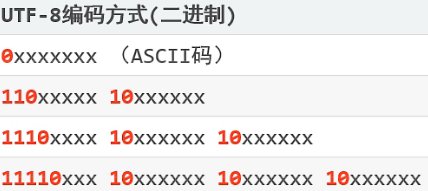

# 编解码

乱码：编码和解码字符集不一致；

# ASCII

包含：英文、符号；

- 使用<mark>1个字节</mark>存储一个字符

- <mark>首位是0</mark>

- 共存储<mark>128个字符</mark>

# GBK

汉字编码字符集，包含2w多个汉字，兼容ASCII字符集；

- 使用2个字节存放汉字；第一个字节的第一位必须是1；

- 1个字节存放ASCII码；

# Unicode

万国码，包含全世界所有文字、符号的字符集；

Unicode包含多种编码方式：UTF-32、UTF-16、UTF-8

- UTF-32：4个字节表示一个任意字符，编解码简单粗暴；占用内存、带宽；

- UTF-16

- UTF-8：

# UTF-8

Unicode字符集的一种编码方案，目前最常用；

编码方案：四个区分度（1、2、3、4字节）

- 英文、数字：占1个字节，兼容ASCII；首位为0；

- 汉字：占3个字节；第一个字节前4位：1110；

