# InnoDB

InnoDB是默认的事务型存储引擎

### InnoDB索引实现

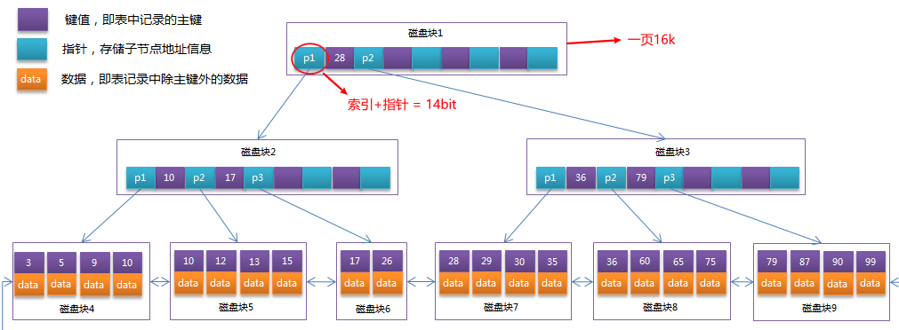

### 数据形式

使用InnoDB时，会将数据表分为.frm 和 .idb两个文件进行存储；

- .frm：定义表结构
- .idb：存储数据（B+树存储在这个文件，包括索引和叶子节点的data数据）

### 特点

- 支持事务，默认的事务隔离级别为**可重复读**，通过MVCC（并发版本控制）来实现的；
  
  遵循ACID

- 行级锁（共享锁，排他锁），可以支持更高的并发
  
  （仅仅在命中索引时，行锁生效，如果是全表扫描，依然会锁住整张表）；

- 支持外键；

- 存在缓冲管理，通过缓冲池，将索引和数据全部缓存起来，加快查询的速度；

# 对比MyISAM

- 存储空间：
  
  MyISAM内数据可被压缩，存储空间较小，并且仅缓存索引，不缓存数据，占用内存更小；
  
  InnoDB需要更多的存储空间和内存，会建立缓存池同时缓存索引和数据；

- 事务支持：
  
  MyISAM不支持事务，强调性能，执行速度块；
  
  InnoDB支持事务，具备ACID特性；

- 锁粒度：
  
  MyISAM表级锁；
  
  InnoDB行级锁；并发度更高；

- 外键
  
  MyISAM不支持；
  
  InnoDB支持；

# B、B+树区别

（1）

B树每个节点的value存储data，data没有指针；key存在一个指针，指向下一层；

B+树只有叶子节点存储data，data会指向相邻的data；

（2）

B树的data存的是数据地址，指向磁盘数据；

B+树的data存的是真实数据；

# MySql事务

## 事务特征—ACID

- **原子性**（atomicity）
  
  一个事务必须被视为一个不可分割的最小工作单元，整个事务中的所有操作要么全部提交成功，要么全部失败回滚，对于一个事务来说，不可能只执行其中的一部分操作，这就是事务的原子性；

- **一致性**（consistency）
  
  数据库总是从一个一致性的状态转换到另一个一致性的状态。

- **隔离性**（isolation）
  
  通常来说，一个事务所做的修改在最终提交以前，对其他事务是不可见的。

- **持久性**（durability）
  
  一旦事务提交，则其所做的修改会永久保存到数据库。

## 隔离级别

**隔离级别就是通过锁，来避免出现下面三个问题，而实现的**

脏读：一个事务对数据进行增删改，但并没有提交，另一个事务却能读到未提交的数据；

不可重复读：一事务对数据进行了更新或删除操作，另一事务中多次读取同一个数据，结果不一致；

幻读：第一个事务对一个表中的数据进行了修改，这种修改涉及到表中的全部数据行。同时，第二个事务也修改这个表中的数据，这种修改是向表中插入一行新数据。那么，以后就会发生操作第一个事务的用户发现表中还有没有修改的数据行，就好象发生了幻觉一样；

| 隔离级别                      | 级别      | 脏读  | 不可重复读 | 幻读  |
|:-------------------------:|:-------:|:---:|:-----:|:---:|
| **Read Uncomitted（读未提交）** | 无保证     | 存在  | 存在    | 存在  |
| **Read Comitted（读已提交）**   | 语句级     | 不存在 | 存在    | 存在  |
| **Repeatable Read（可重复读）** | 事务级     | 不存在 | 不存在   | 存在  |
| **Serializable（可串行化）**    | 最高级，效率低 | 不存在 | 不存在   | 不存在 |

读未提交：可以读到别的事务未提交的数据；（脏读）

读已提交：只能读到提交的数据；

# 锁

## 全局锁

全局锁就是对整个数据库实例加锁；

场景：

做**全库逻辑备份**，加全局锁，确保整个库只读；

弊端：

- 在主库备份，备份期间不能更新，业务停摆；
- 在从库备份，备份期间，不能执行主库同步来的bin log，主从同步会延迟；

所以常用备份方案：

- 在InnoDB的可重复读的隔离级别下开启事务；使用自带的工具mysqldump进行备份；

## 表级锁

MyISAM引擎使用表级锁，不支持行级锁；

分为：

- 读锁：`LOCK TABLE table_1 read;`

多个会话都可以进行读取；所有会话不可插入，更新；

- 写锁：`LOCK TABLE table_1 write;`

当前会话可以查询，更新，插入；其他会话查询，插入，更新都会阻塞；

解锁都为：`UNLOCK TABLES；`

## 行级锁

InnoDB引擎使用行级锁；

行锁优劣：

- 锁粒度最小了，并发度最高；
- 开销大，加锁慢；

其他会话，无法读取，修改当前行的数据；

## 死锁

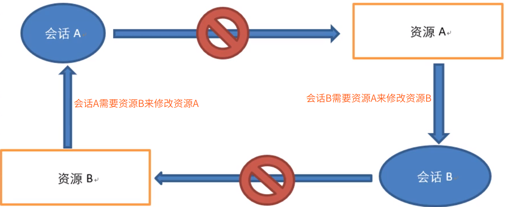

这样互相占用资源，并等待对方释放资源，产生死锁；

解决方式：

1. 设置超时时间，通过参数`innodb_lock_wait_timeout`（默认50s）来设置，超时自动退出；
   
   这个方式**不可取**，设置的时间，无法确定；
   
   如果设置很短，可能本来不是死锁的会话也被中断执行，就不可取；

2. 设置死锁检测，检测到死锁，自动回滚某一个事务，让其他事务继续执行；参数：`innodb_deadlock_detect设置为on`开启；
   
   一般采取此策略；但是，弊端是：每次会话，都检测死锁，定会**耗费性能**；

## 间隙锁

间隙锁是为了防止幻读；

符合条件，但并不存在的记录，为间隙；

如果范围为1-10，但是并没有第2条记录，在操作的时候，会同时把2给锁住，即无法插入2号记录；

## 悲观锁

在事务中，在不使用update的情况下，使用`for update`来排他锁；

```sql
select username from emp where id =3 for update;
-- 执行完上述语句，就自动锁定此行，直到commit提交完毕，才解锁此行；
```

### 锁表还是锁行？

缩表还是锁行，取决于查询是否使用where，明确了主键，

如果明确，所行，如果没有，就锁表；

## 乐观锁

version版本控制

步骤：

1. 先查询出当前修改的数据的version
   
   ```sql
   select (status,status,version) from t_goods where id=#{id}
   ```

2. 修改数据时，带上version的判断：
   
   ```sql
   update t_goods 
   set status=2,version=version+1
   where id=#{id} and version=#{version};
   ```

# Explain执行计划

```sql
-- 使用
Explain + SQL
```

分析执行计划：（重点看Type，key，Extra）

- id：表示此表的执行优先级
  
  - id相同，表的执行顺序依次从上往下；
    
    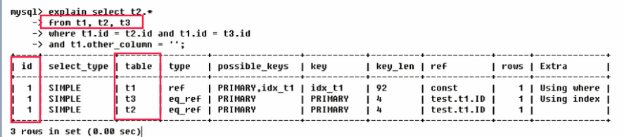
  
  - id不同，并且递增，id值越大执行优先级越高，越先被执行；
    
    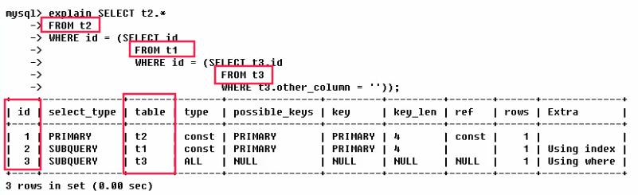

- select_type：读取一张表的操作类型
  
  - SIMPLE：简单SELECT查询，并且整个语句中的查询不包含<子查询>和<联合查询UNION>
  - PRIMARY：复杂查询中最外层查询，即PRIMARY
  - SUBQUERY：子查询
  - DERIVED：衍生，FROM后面跟的子查询；`select * from (select * from t1 where id = 1) d1`
  - UNION：联合查询
  - UNION RESULT：UNION合并的结果集；

- table：表示这一行操作，是哪一张表的

- **type**：表示此条查询的检索方式，看是否使用了索引（7种，下面是按照效率由高到低排列）
  
  - system：基本用不到，表示一张表，只有一条记录；
  
  - const：`where id = 1`指定的常量查询；（主键索引，走聚簇索引）
  
  - eq_ref：唯一索引扫描；对于某个索引键，表中只有一条记录与之匹配；（比如id主键索引）
  
  - ref：非唯一索引扫描；`where name = 'ZhangSan'`，如果ZhangSan不止一个人，且name字段建有索引，那么就是ref检索；（部分扫描）
    
    需要涉及两个B+树；
  
  - range：`where id between 30 and 60`或者类似`where id in (1,3,5)`或者`comments  > 1`
  
  - index：`select id from user`其中id是主键索引；（仍然全表扫描）
  
  - ALL：表明检索方式为全表扫描；出ALL类型检索，需要优化。
  
  - NULL：（效率最高）
    
    使用`is null`的时候；
    
    执行时甚至不用访问表或索引：如从一个索引列里选取最小值可以通过单独索引查找完成

- possible_keys：可能用到的索引

- **key**：实际使用的索引

- key_len：索引中使用的字节数
  
  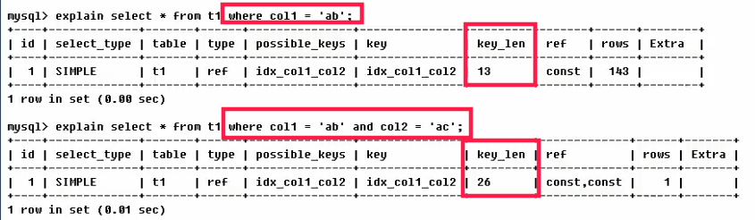

- ref：ref是指用来与key中所选索引列比较的常量(const)或者连接查询列；
  
  可以看上面key_len的例子；

- rows：大致估算出每张表有多少行记录被查询了

- **Extra**：额外信息
  
  - Using filesort：文件排序，在无法通过索引来进行排序的情况下，就会默认使用文件排序；如果出现此信息，表示需要优化；
  
  - Using temporary：使用临时表，表示在排序时，使用了临时表；也是提示我们，此语句需要优化；
    
    常见于：排序，分组查询（group by，order by）
  
  - Using index：表明相应的查询操作中，使用了**覆盖索引**；
    
    如果同时伴有Using where：表明索引被用来执行主键的查找；
    
    （就是说通过col1的索引B+树，找到了对应的主键，再通过主键索引的B+树，找到了全部数据）
    
    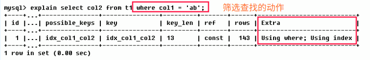
    
    如果不带有Using where：表明索引用来读取数据，而非查找动作；
    
    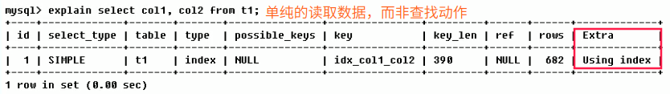
  
  - impossible where：表示错误的where，比如`where name = 'lisi' and name = 'zhangsan'`
  
  - distinct：自动优化distinct关键字，在找到第一条匹配项后停止

Explain例子

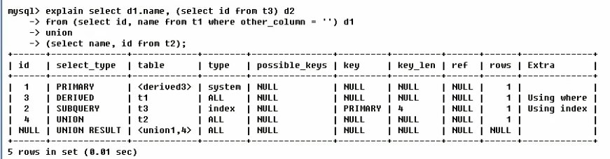

表的执行顺序：

1. 【select name, id from t2】
2. 【select id, name from t1 where other_column = ' '】子查询
3. 【select id, from t3 】衍生查询
4. 【select d1.name ...】最外层查询
5. UNION操作

# 优化思路

## SQL优化

1、定位需要优化的SQL，也就是响应时间比较长的SQL

首先要开启慢查询日志（不是为了调优，不建议开启，影响性能）

慢查询日志：会记录响应时间超过阈值的SQL语句；（默认阈值10s）

2、定位到SQL，通过Explain执行计划，查看SQL的执行过程；

主要看：

（1）Type：是否使用了索引；

- All：全表扫描
- ref：走了非唯一索引（存在回表）；
- eq_ref：走了唯一索引；
- const：表示一次索引，就找到了数据（覆盖了索引），不需要优化；

（2）Key：具体使用了哪个索引；

（3）Extra：判断回表的情况，最好是使用覆盖索引（）

- Using Index：使用了覆盖索引，是最好的；

- Using filesort：表明使用了一次额外的排序，即没有走唯一索引；

- Using temporary：使用了临时表；比如子查询，建了临时表，用完还会删除，降低性能；
  
  （临时表：自动创建的用来存储中间结果）

3、使用show profile查看SQL的执行耗时；

首先要开启:

```sql
set profiling=1; -- 开启profile
```

直接使用`show profile`查看最近几条SQL的执行耗时；

```sql
> show profiles; -- 获取执行sql的时间
+----------+------------+-----------------------+
| Query_ID | Duration   | Query                 |
+----------+------------+-----------------------+
|        1 | 0.00054100 | show databases        |
|        2 | 0.02368350 | SELECT DATABASE()     |
|        3 | 0.00561150 | show tables           |
|        4 | 0.03310350 | select * from user    |
|        5 | 0.00008600 | explain show profiles |
+----------+------------+-----------------------+
```

继续查询某个SQL的具体，每一步的耗时；

```sql
mysql> show profile for query 4;
+----------------------+----------+
| Status               | Duration |
+----------------------+----------+
| starting             | 0.000037 |
| checking permissions | 0.000004 |
| Opening tables       | 0.022872 |
| init                 | 0.000019 |
| System lock          | 0.000019 |
| optimizing           | 0.000004 |
| statistics           | 0.000007 |
| preparing            | 0.000006 |
| executing            | 0.000002 |
| Sending data         | 0.010039 |
| end                  | 0.000009 |
| query end            | 0.000008 |
| closing tables       | 0.000007 |
| freeing items        | 0.000060 |
| cleaning up          | 0.000012 |
+----------------------+----------+
```

## 使用缓存

- 缓存中间件：Redis、MongoDb

- 本地缓存：MyBatis缓存等

# MVCC

无锁并发控制、多版本并发控制：

概述：

> 通过为事务中的每一次数据，包括原本数据，都进行保存版本，将版本之间依次连成版本链，以此实现回滚；
> 并且每个事务都保存当前事务设计的版本号，以此达到事务隔离；

多版本并发控制：提高高并发场景的吞吐量；解决读写冲突问题；

- MVCC通过**版本链**，实现高并发下的读写；
- MVCC通过**ReadView（视图）**生成时机不同，实现RC、RR两个隔离级别；

MVCC只存在于读已提交（RC）、可重复读（RR）两个隔离级别下；

### 版本链

每一个表的每一条记录，都有三个隐藏列；

- 隐藏主键列（ROW_ID）
- 事务ID列（TRX_ID）
- 回滚指针列（ROLL_PTR）

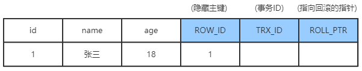

事务A修改age字段的操作过程：

1、对这行记录加上排他锁（for update）；

2、把整个原本的记录，copy到undo log中；

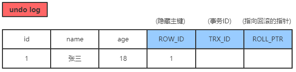

3、事务A修改age字段，产生一个新的版本的记录；

并且，回滚指针，指向undo log中的原数据记录；如果发生回滚，就可以找到历史版本数据；

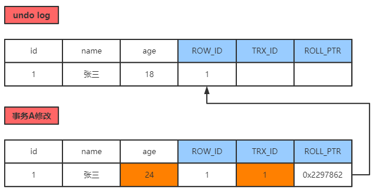

4、将上面一系列操作，记录到redo log中；提交事务到MySQL的执行器，最终会记录到bin log中；

> 就像上面，回滚指针，会指向上一个版本，每一次修改数据，都会如此，就会生成一个版本链；

### ReadView

ReadView是一个维护了当前活跃读写事务的列表，存放当前所有活跃事务的事务ID；

比如：

当前的ReadView维护了【80-100】的事务ID；

事务A要查询数据，查到了事务版本号为90的数据，那么就无法读取，因为此数据正在ReadView中；

那就根据版本链，继续向下寻找，直到找到数据的版本 < 80，就读出来；（避免了脏读）

# 三范式

范式：关系型数据库设计的标准，规范；

目的：

- 降低数据的冗余性，尽量让每个数据只出现一次；
- 保证数据的一致性；

### 第一范式

- 原则：保证列的**不可再分**；

比如：

```
id        item
001        5台电脑
```

上面的数据就出现了，item数据是可以再分的；

```
id        item    mount
001        电脑        5
```

### 第二范式

- 表必须有主键
- 除了主键字段，其余字段必须完全依赖于主键，不能出现部分依赖；

比如：

分数依赖于：学号，课程；

不依赖于系，课程；

```
学号        姓名        系        课程        分数        
101122     李四        经济系        高等数学    95
```

应该分离为两张表：

```
学号        课程        分数        
101122     高等数学    95

学号        姓名        系            
101122     李四        经济系    
```

### 第三范式

- 满足第二范式为前提
- 不能出现传递依赖：非主键A依赖非主键B，非主键B依赖主键（×）

比如：

很明显：系，系主任是相关的；系跟学生的关系，只是系；

系-->系主任

学号-->姓名--->系

```
学号        姓名        系        系主任
101122     李四        经济系        张三
```

应当分割开来：

```
学号        姓名        系
101122     李四        经济系

系        系主任
经济系        张三
```

# MySQL时间类型

| 日期时间类型    | 占用空间    | 日期格式                | 最小值                 | 最大值                 | 零值表示                |
| --------- | ------- | ------------------- | ------------------- | ------------------- | ------------------- |
| DATETIME  | 8 bytes | YYYY-MM-DD HH:MM:SS | 1000-01-01 00:00:00 | 9999-12-31 23:59:59 | 0000-00-00 00:00:00 |
| TIMESTAMP | 4 bytes | YYYY-MM-DD HH:MM:SS | 19700101080001      | 2038 年的某个时刻         | 00000000000000      |
| DATE      | 4 bytes | YYYY-MM-DD          | 1000-01-01          | 9999-12-31          | 0000-00-00          |
| TIME      | 3 bytes | HH:MM:SS            | -838:59:59          | 838:59:59           | 00:00:00            |
| YEAR      | 1 bytes | YYYY                | 1901                | 2155                | 0000                |