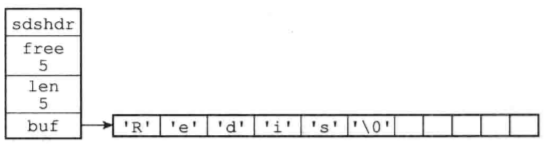
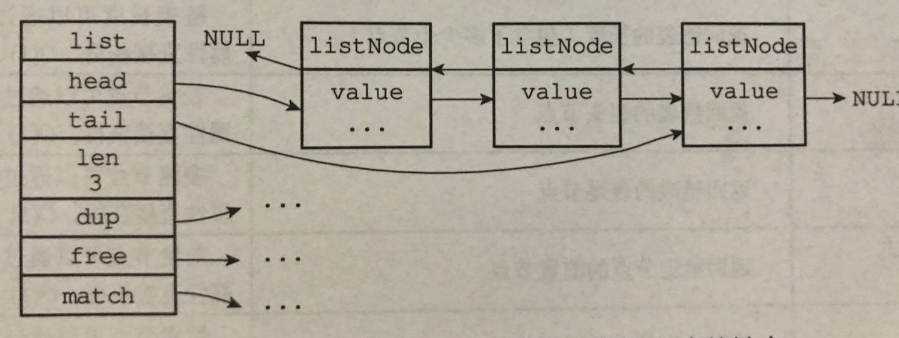
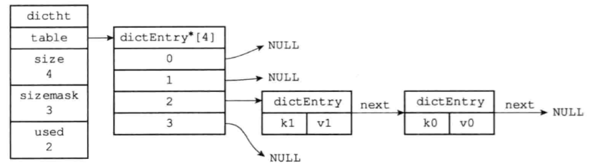
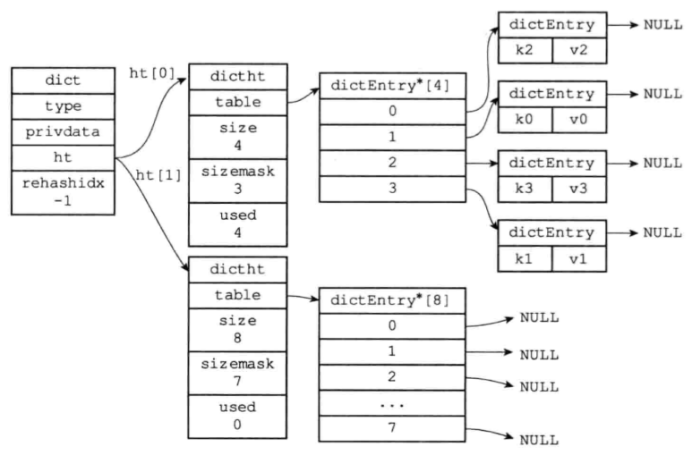
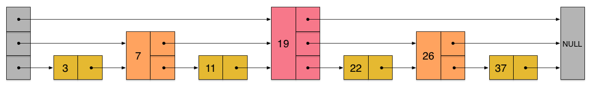
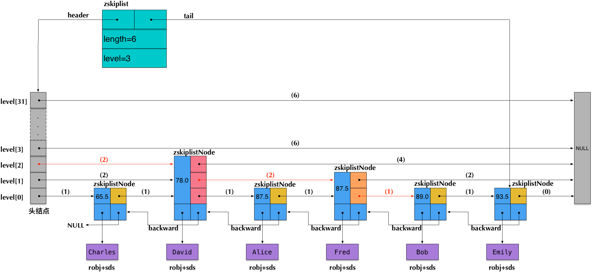

# Redis数据结构使用

string：一般value直接存储json串；

- value最大：512MB；

- 数值类型自增减：incr/decr [key]；

- 基本操作：get、set、mget、mset；

hash：当作对象一样使用，可操作每个字段；

- 比string占用空间更少(不需要存储json中的额外符号："、}、{)

- 可以单独操作每个字段，灵活；

- 场景：存储对象的场景，用户数据、商品数据；

- 基本操作：hget、hset；

list：为一个双向链表，即可以支持反向查找和遍历；

- 场景：列表场景、队列等；粉丝列表、同类商品列表；
- 基本操作：lrange、lpush、rpop；

set：无序集合，自动去重；

- 用于全局去重，提供求交集，差集，并集等操作；
- 场景：需要去重、求取差集、交集等场景；
- 操作：sadd、smembers、sinter(交集)、sunion(并集)、sdiff(差集)

sorted set：排序集合，自动去重，在set基础上增加score权重参数

- 底层：跳跃表实现；
- 场景：排序结构场景，实时的数据排名；
- 基本操作：zadd、zrange、zrangebyscore

# Redis数据结构底层

## Redis键空间

Redis中的一个库下所有k-v全都保存在一个字典内部：

一个库一个键空间：

```c
typedef struct redisDb{
    //...
    // 键空间
    dict *dict;
    // 过期字典
    dict *expires;
    //...
} redisDb;
```

- dict：存储了所有的key-value；

- expires：
  
  存储了设置了过期时间的key，value为计算出的过期时间点Unix时间戳；
  
  value是long类型；
  
  时间戳，精确到毫秒；
  
  （1）添加过期时间：将key添加进过期字典；value设置为当前时间戳；
  
  （2）删除过期时间：将key从过期字典中删除；
  
  （3）判断过期：value>当前时间戳，则没有过期；小于，则说明已经过期；
  
  （4）惰性删除/定期删除；


## RedisObject

Redis五种数据结构底层都是一个C语言下的redisObject结构体：

```c
typedef struct redisObject{
     //类型
     unsigned type:4;
     //编码
     unsigned encoding:4;
     //指向底层数据结构的指针
     void *ptr;
     //引用计数
     int refcount;
     //记录最后一次被程序访问的时间
     unsigned lru:22;

}robj
```

Redis中创建一个key-value，至少会创建两个redisObject：

键对象：一定是一个REDIS_STRING类型；

值对象；

- type：表明redisObject对象类型：
  
  - REDIS_STRING：字符串对象
  - REDIS_LIST：列表对象
  - REDIS_HASH：哈希对象
  - REDIS_SET：集合
  - REDIS_ZSET：有序集合

- ptr指针：指向具体的数据；
  
  - 如果是key，指向value（redisObject）
  - 如果是value，指向value的真正的值；

- refcount：引用计数；
  
  用于内存回收；
  
  - 当创建一个对象，引用计数初始化为1；
  - 当对象被一使用一次，计数+1；

## string



Redis的字符串底层使用SDS（动态字符串），而不是C语言的字符串；

```c
// SDS的定义
strcut sdshdr{
    // 记录字符串长度
    int len;
    // 记录未使用的buf；
    int free;
    // 字符数组，存放实际的字符串
    char buf[];
}
```

为什么不使用C的字符串？

| C字符串                | SDS                  |
| ------------------- | -------------------- |
| 获取字符串长度复杂度：O(N)     | 获取字符串长度复杂度：O(1)      |
| 不安全，可能缓冲区溢出         | 安全，不会溢出，不会泄露         |
| 修改字符串，必须执行N次内存的重新分配 | 修改字符串，除非是全部改需要N次内存分配 |

## list



底层双向链表

```c
typedef strcut list{
    // 头节点
    listNode *head;
    // 尾节点
    listNode *tail;
    // 节点数量
    unsigned long len;
    // 节点复制函数
    void *(*dup)(void *ptr);
    // 节点释放函数
    void *(*free)(void *ptr);
}

typedef strcut listNode{
    // 前置节点
    struct listNode *prev;
    // 后置节点
    struct listNode *next;
    // 节点值
    void *value;
}
```

链表特点：

- 双向链表；
- 带有头尾指针；
- 记录链表长度；
- 多态：同样是listNode，但是可以通过void*指针，保存不同类型的值；（泛型的感觉）

## Hash表

RedisObject中的ptr指针，指向的就是哈希对象：

```c
typedef struct dict{
    // 指向对哈希表操作的函数
    dictType *type;
    // 私有数据
    void *privdata;
    // ht[1]指向真正的哈希表结构,ht[2]用于备用扩容，指向正在扩容的哈希表
    dictht ht[2];
    // 是否在rehash：如果不在rehash，此值为-1；
    // 当rehash开始，用trehashidx来记录索引
    int trehashidx;
}
```

哈希表：

```c
typedef struct dictht{
    // 哈希数组
    dictEntry **table;
    // 哈希表大小
    unsigned long size;
    // 记录尾部：size-1
    unsigned long sizemask;
    // 已使用的大小
    unsigned long used;
}
```

哈希节点对象：

```c
typedef struct dictEntry{
    // key
    void *key;
    // value
    union{
        void *val;
        unit64_tu64;
        int64_ts64;
    } v;
    // next指针
    struct dictEntry *next;
} dictEntry;
```

- 上面的整个哈希表，出现了哈希冲突，使用链地址法解决哈希冲突；



### 渐进式ReHash

1、为ht[1]分配空间，`rehashidx`置为0，表示正在rehash，并以此记录索引；

2、采用`渐进式rehash`，不是rehash开始就一次性的把ht[0]都移动到ht[1]；

而是：保持rehash的状态，之后每次对此hash表的元素进行添加、删除、查找、更新时，除了执行相应的操作外，将`rehashidx`索引处的key-value，移动到ht[1]中；

3、随着对哈希表的操作，终会在某一次操作的时候，rehash完成；把h[1]整个放回ht[0]，清空ht[1]；

4、`渐进式rehash`：避免了集中rehash的计算量；

缺点：查找的时候，可能要找的键已经rehash到ht[1]中去了，所以，每次查找，两个ht[0]、ht[1]都要进行查找；



## Zset



是一种有序数据结构，通过每个节点中维持多个指向其他节点指针，达到快速访问；

复杂度：增删改查O（logn），最坏O（n）

- **通过节点的前进指针的个数（层），以及每个前进指针的跨度，来实现跳跃表；**

- 层：每个节点的多个指针，是一个指针集合List；同层之前指针关联；

- 前进指针：每一层的从头指向后面的指针；

- 跨度：记录两个节点间的距离；

- 后退指针：每个节点，只有一个后退指针，也就是全部后退指针相当于一个单链表；

- 分值Score：跳跃表，按照Score大小排序；

- 成员：也就是此节点的value；

Zset插入节点，跳跃表的结构：

（1）每插入一个节点，随机为当前节点设置一个层数；

结构源码：

```c
// zset结构（跳跃表外观）
typedef struct zskiplist{
    // 头节点，尾节点
    structz skiplisNode *header , *tail;
    // 节点数量
    unsigned long length;
    // 最大的节点层数；
    int level;
}

// 跳跃表的结构
typedef struct skiplisNode{
    // 层：是一个指针集合
    struct zskiplistLevel{
        // 前进指针
        struct zskiplistNode *forward;
        // 跨度
        unsigned int span;
    } level[];
    // 后退指针
    struct zskiplistNode *backward;
    // 分值
    double score;
    // 成员对象
    robj *obj;

}
```

按照上面两个结构，形成的总体为：

- zskiplist：元数据；
- zskiplistNode：每一个节点；


