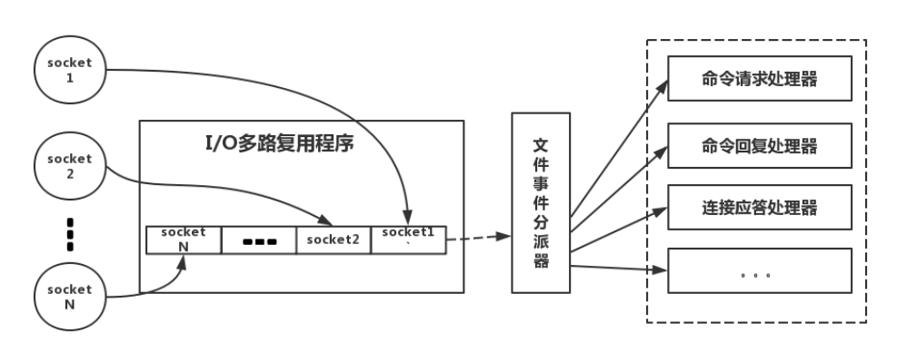

Redis6.0之前使用单线程+多进程的方案；

IO模型：事件驱动的IO多路复用模型；

# 模型

- Redis每个客户端都有一个指令队列，同一队列的指令顺序执行，响应类似；
- 不同队列之间由Redis的单线程Epoll多路复用切换处理；
- 一个Redis实例同一时刻只会处理一个命令或响应；

# 网络模型

Redis基于Reactor模型

1、通过`I/O多路复用程序`来同时监听多个Socket；（**并发处理**）

2、按照Socket的执行事件（连接、读取、写入等），为其关联不同的事件；

3、将Socket加入一个队列中，向文件事件分派器依次发送Socket；

4、`文件事件分派器`根据Socket的事件，调用不同事件处理器，处理命令；

事件处理器就是处理不同事件的函数；

# Redis高性能

Redis的瓶颈主要在IO而不是CPU，并且Redis的单线程是指：网络IO的读写命令由单线程完成，但是持久化、集群数据同步等操作，是由额外的线程处理；

#### 1. 纯内存访问

正是因为Redis是基于内存，CPU不是限制Redis速度的瓶颈，内存大小才是限制Redis的瓶颈，所以直接采用单线程即可，而且实现简单；

#### 2. 避免了线程切换

线程切换一定有性能损耗，避免线程切换；

避免竞态（加锁降低性能）的资源消耗；

#### 3. I/O多路复用

采用非阻塞I/O的Epoll多路复用技术—即：让单线程处理多个连接请求；

多路-指的是多个socket连接，复用-指的是复用一个线程
