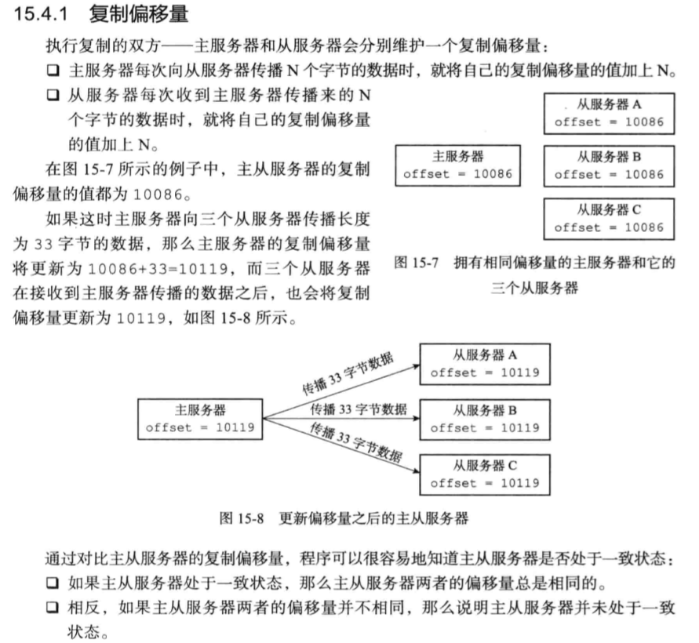
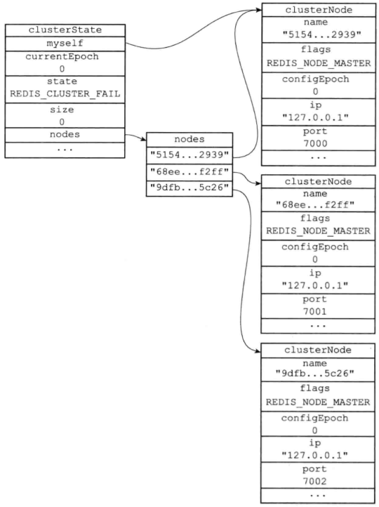
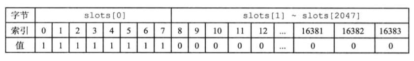
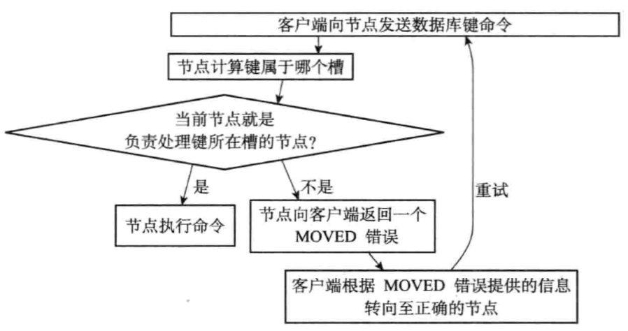
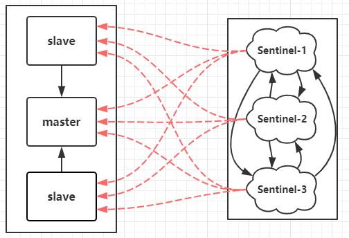
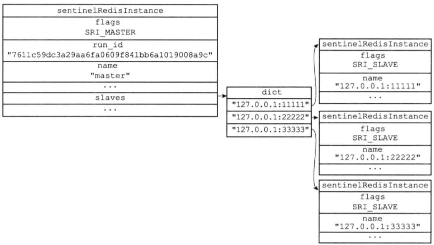

# Redis主从

## Redis复制过程

分为两个步骤：

1、同步：全量复制；

2、命令传播：增量复制；

### 同步

1、从服务器向主服务器发送`PSYNC`命令，告知要进行全量复制；

2、主服务器执行`BGSAVE`，生成一个RDB文件，发送给从服务器，并开启一个缓冲区，记录之后执行的命令；

3、从服务器收到RDB文件，进行载入；

4、主服务器，向从服务器，发送缓冲区内的命令，从服务器执行接受的命令；

5、直到两个服务器达到数据一致，同步完成；

### 命令传播

如果出现，主从数据不一致，那么主服务器就会发送命令到从服务器执行，确保数据一致；

如何检测到数据不一致：

主从都会维护一个复制偏移量；（偏移量按字节计数）



- 因为偏移量的存在，即使从服务器下线，也能根据偏移量，重新同步到数据一致性的状态；

- 通过心跳，从服务器默认1s，发送一个心跳给主服务器，并携带偏移量；

缺陷：

- 一旦主节点宕机，需要手动将slave提升为master，各个应用要更新主节点地址；（致命）

- 简单的主从，只是备份数据，还是无法达到高可用，需要集群或Sentinal；

# Redis集群


## 集群实现

1、启动节点

节点启动，会根据配置文件的：`cluster-enabled`来决定是否启动集群模式；

几乎启动方式都跟普通启动一样，只不过会新增2个结构：

`clusterState`：集群状态信息；

`clusterNode`：保存集群中所有节点的信息；（包括自己）

- 包括：IP、端口、节点名、槽信息等；



2、节点握手

master之间，通过cluster meet命令，完成节点握手；

3、槽指派

Redis集群通过分片方式，保存数据；

槽：16384个（是一个bit数组），共16384/8 = 2048字节；



- 当前节点所使用的槽的范围，其值置为1；

当所有槽全部指派给所有集群完毕，整个集群才能上线；

存储的key的落点，一般是哈希进行索引；

## 集群下的查询操作



1、客户端发送键命令；（get / set）

2、计算槽

接受命令的服务器，会计算出key所在的槽；

```c
def slot_number(key):

    return CRC16(key) & 16383
```

3、判断槽，是否在当前节点：（查看槽数组的值是否为1）

- 在当前节点，直接进行键命令操作；

- 不再当前节点，查询出槽在哪个节点，返回给客户端；

4、客户端重新发送键命令；

## 集群下优化

- Master不要做持久化工作，专注于处理客户端任务；

  让某个Slave进行AOF备份数据，策略：每秒同步一次；

- 最好是Master，Slave通过内网连接，速度和稳定性有保障；

# Sentinel

哨兵是一个独立的进程，哨兵会实时监控master节点的状态，当master不可用时会从slave节点中选出一个作为新的master，并修改其他节点的配置指向到新的master。

### 架构：



- 哨兵节点：哨兵节点是特殊的redis节点，不存储数据，Sentinel之间会相互通信；

- 数据节点：redis主从架构，主节点和从节点都是数据节点。

- 每个Sentinel都会监控所有的redis实例；

## Sentinel的启动

1、初始化Sentinel服务器

Sentinel本质是一个特殊的Redis服务器，但是启动不会加载RDB、AOF文件；

2、使用Sentinel的专用代码

Sentinel不存数据，所以不需要get、set等命令；

但是需要各种检测Redis服务器状态、通信的代码：

比如：INFO、Ping

3、初始化Sentinel

这里主要是Sentinel的数据结构中的字典，也不再存储数据，而是存储Redis节点和其他Sentinel的节点信息数据；



4、创建网络连接

此时Sentinel相当于Redis的客户端，需要创建连向Redis主服务器的连接：（两个连接）

- 命令连接：用以发送各种命令：INFO、Ping

- 订阅连接：

5、获取主服务器信息

通过INFO命令，获取主服务器信息：（两个信息）

- 主服务器的信息

- 主服务器下的所有从服务器的信息；

## 故障转义功能

核心功能：**主节点的自动故障转移**

1、检测主观下线

Sentinel每隔1s向所有Redis实例（包括其他Sentinel），发送Ping命令，来判断是否下线；

2、检测客观下线

如果一个Sentinel发现存在实例下线了，为了确认是否真的下线，会向其他Sentinel进行询问；

当从其他Sentinel接受到的确定下线的数量超过`<quorum>`个数，那么就确定客观下线；

开始执行故障转移；

3、选取领头Sentinel

各个Sentinel进行投票，选举一个领头Sentinel，完成故障转移；（投票超过半数）

4、开始故障转移

（1）领导者Sentinel来选取一个slave作为新的master，选取准则是取相似度最高的slave（偏移量最接近的）

（2）修改其他slave的复制目标为新的master

（3）所有Sentinel更新主节点信息；

（4）如果下线的master重新上线，就将其变成一个slave；

### 配置

在主从的基础上，还需要配置Sentinel：`sentinel.conf`；

```properties
port 26379

sentinel myid a780167ff20ae409c7803e2f7d5d55fbf120018f

daemonize yes

# Generated by CONFIG REWRITE

dir "D:\\Redis-6379"

sentinel monitor mymaster 127.0.0.1 6379 2

sentinel config-epoch mymaster 0

sentinel leader-epoch mymaster 0

sentinel current-epoch 0
```

### 缺陷

- 写操作无法均衡负载

## 脑裂

脑裂：同时存在了多个Master
