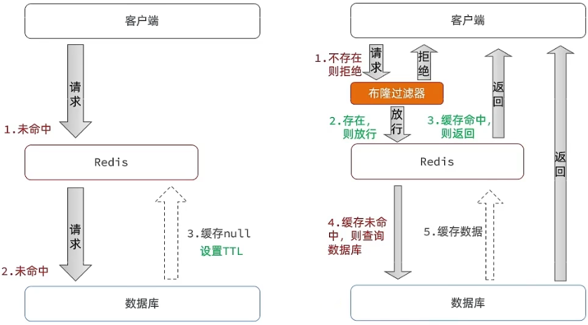
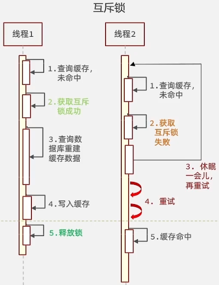
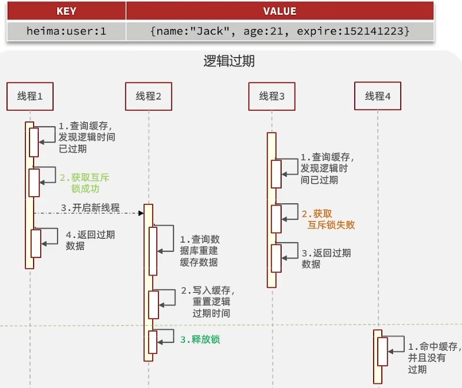

# 缓存热点数据

将多读少写的热点数据，尽量放入缓存，提升读取速度，提升服务吞吐量，降低服务端压力；

# 缓存一致性

缓存一致性：保证数据库、缓存的数据一致，保证不读取脏数据(旧数据)；

如何保证缓存一致性：

- 当热点数据发生更新，需要失效缓存中对应的脏数据；

- 当热点数据不在缓存中，应当以最新的数据写入缓存；

在多线程/多进程场景下，如何保证每次读取的数据，是最新的数据？

根据CAP理论：在分布式场景下，要保证数据一致性，必然牺牲服务可用性：

如果<mark>一定要保证完全一致性</mark>，就需要在写数据的时候加锁，暂停服务的可用；

---

缓存一致性策略：

1、<mark>先删缓存，再更新数据库</mark>，当再次读取热点数据，则更新缓存；

2、<mark>先更新数据库，再删缓存</mark>，当再次读取热点数据，则更新缓存；

这两种策略，单纯实现，无法保证缓存一致：[缓存更新策略分析](https://www.bilibili.com/video/BV1cr4y1671t?p=38&vd_source=ce67cf212f4a949cf75348b5404c5e27)

# 缓存雪崩问题

同一时间缓存大面积失效、缓存中间件直接宕机，导致大量请求进入后端服务、数据库，导致大量压力到达后端服务、数据库；

解决思路：

1、缓存层面：

- 不同的key，缓存的失效时间加上一个随机值，避免集体失效；

- 热点的key，永不过期；

- 增加缓存中间件的高可用性：集群化；

- 增加多级缓存，提升缓存雪崩难度；

2、后端服务层面：

- 热点缓存业务设置服务降级、限流策略；

# 缓存穿透

缓存穿透一般为攻击手段，大量请求查询缓存、数据库都不存在的数据；

解决思路：

1、缓存空值：数据库查询为空，则写入缓存空值，失效时间设置稍短；

2、布隆过滤器；

# 缓存击穿

缓存击穿：热点Key失效，大量请求穿透到数据库；

解决思路：热点Key失效，查询数据库，重写回缓存；

根据数据一致性要求的强弱，可以采取不同的写缓存方式：

1、强一致性，不允许读取到旧数据的场景：(要避免多缓存嵌套存在死锁可能)

写数据必须加锁，防止多线程同时写的情况；

- 获取锁的线程，执行写操作；

- 其他线程获取锁失败，则说明有线程在更新缓存；则不断重新读取缓存，如果读到缓存数据，则返回；

在缓存更新时，服务可用性收到影响，响应的延迟会提高；

2、弱一致性，希望更低的响应延迟，可以容忍读取到脏数据：逻辑过期方案

将热点key设置为永不过期，通过业务逻辑手动维护key的过期；

在value中加上时间戳；当线程发现时间戳过期，则加锁刷新缓存；

- 获取锁成功，则刷新缓存；

- 获取锁失败，则直接返回旧数据；

缓存更新时，不会提高响应延迟，但数据不一致；

