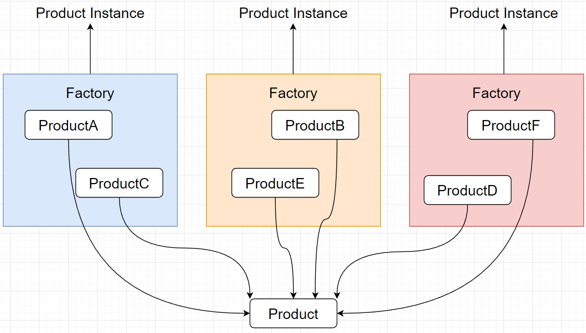
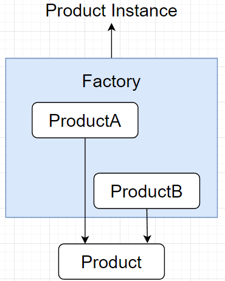

工厂模式：提供一个工厂类用于创建指定的对象，以供消费；

为什么需要工厂模式：

1、解耦合：解除业务和创建逻辑的耦合

- 业务使用对象 和 对象创建过程 隔离开来，如果要对某个Prodcut进行丰富，只需要在创建对象过程中进行增强，无需修改业务使用的方式；

2、明确业务逻辑、方便管理

- 将不同族的对象分离开，使用不同的工厂生产，业务逻辑上清晰；

- 新增逻辑，横向扩展；


# 简单工厂



只有一个工厂类，根据特定参数，返回不同的对象实例；

- 不同对象实现同一接口；

- 简单起见，多用if-else做参数判断；

```java
public class SimpleFactory {
    public Product createProduct(int type) {
       if (type == 1) {
            return new Product1();
        } else if (type == 2) {
            return new Product2();
        }
        return new DefaultProduct();
    }
}
```

# 工厂方法

多个工厂，


# 抽象工厂


