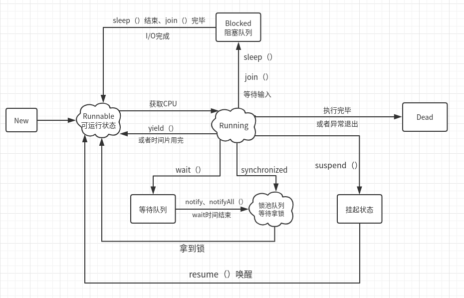

# 线程状态



其中状态：

- **New：新建状态**，线程中的任务代码还没有开始运行

- **Runnable：就绪状态**（可执行状态）。新建线程调用start（）方法，此时线程就处于**就绪状态**
  
  处于就绪状态的线程，并不一定立刻执行run方法，还需要同其他就绪线程竞争CPU，由**Java的线程调度程序**来调度执行线程。

- **Running**：线程获得CPU使用权，开始执行run方法
  
  - 正在运行的线程，如果调用**yield()方法**，则强制进入Runnable就绪状态

- **Blocked：阻塞状态。**几种进入阻塞的情况：
  
  - sleep方法：**不释放锁。**
  - join方法：A线程内调用B.join()，则串行执行，B线程先执行，A线程阻塞，底层是wait，并且释放锁。当B线程执行完毕，A线程继续执行。
  - 等待用户输入
  
  当sleep结束，join中断，或者用户输入（I/O完成），则线程进入**Runnable就绪状态**

- **Wating：等待同步。**
  
  - 此线程调用了wati（）方法，**释放CPU，释放锁**，进入等待队列。
  - 当其他线程调用notify（）、notifyAll（）方法，可以唤醒等待队列中的线程，进入锁池队列。

- **锁池队列：**如果此线程获取锁失败，则进入锁池队列，**等待拿锁线程释放锁。**

- **线程挂起：**一种主动行为，需要主动resume（）进行恢复。**不释放CPU**

- **死亡状态**：线程run方法结束，或因异常退出run方法。线程生命周期结束。

## sleep、wait

sleep：让出cpu，不会放弃锁；

wait：让出cpu，放弃锁；

# volatile轻量同步

当一个变量定义为volatile之后，他将具备两种特性：

- **第一是保证此变量所有的线程的可见性**。
  
  (只能保证其可见性，不能保证其原子性，
  
  volatile int a = 0之后有一个操作 a++，a具有可见性，但是a++ 依然是一个非原子操作)
  
  修改：线程A修改了一个普通变量，立即向主内存进行回写；
  
  读取：强制从主内存进行读取操作，更新这个变量。
  
  这里的**可见性**是指，当一个线程对此变量进行了修改，JVM就会更新所有CPU的此变量，其他线程立刻可知
  
  **（而普通线程做不到，普通线程之间的变量传递，必须经由主内存来完成）**

- **禁止指令重排序优化**（volatile修饰的变量，修改后，会增加内存屏障）

**但是volatile并不能真正实现同步效果（不能保证原子性）：**

- 在线程修改了此变量，到JVM更新主内存中的此变量的过程中，并不是原子性的，其他线程有可能修改此值，或者拿到未修改前的值

## 缓存一致性协议MESI

### 缓存行

缓存存储数据的单元；

可以认为volatile在缓存中，就是一个或多个缓存行；

### MESI协议缓存状态

MESI协议通过四个状态，来标记当前的缓存的状态；（M、E、S、I）

- M：表示数据已经被修改了，内存和缓存数据不一致；（有效）
- E：独占，其他线程/缓存不可使用（有效）
- S：共享，其他线程/缓存可以使用（有效）
- I：无效，此缓存行无效；

## 总线嗅探

本质：CPU总会将读写操作，发送到bus总线中，进行广播；

这样其他CPU就通过总线嗅探，来感知自己的缓存行的状态；

volatile就根据总线嗅探，来判断当前缓存行是否被修改，如果被修改，则将其标记为无效；

## volatile工作流程


1、多个CPU（线程）读取volatile变量，到缓存中；

2、线程1修改变量，执行写操作，写回缓存，再写回主内存；并将写请求，发送到总线bus中；

3、线程2通过总线嗅探到缓存行a发生了写操作，就将其标记为无效，再从主内存，重新读取；

## 指令重排序

为啥会有指令重排序：

为了提高性能，充分利用CPU，充分利用多级缓存，会对指令进行适当的调序，保证业务前提下，发挥CPU的性能；

JVM在读取，写入volatile变量的时候，会在前后加上两条Barrier指令；

告诉CPU，不可以重排序指令；

这两个防止指令重排序的指令，就是内存屏障；

## 单例中的volatile

```java
private static volatile Singleton = null;
```

必须加volatile；

`SingletonDemo = new SingletonDemo();`是一个非原子操作，要禁止指令重排序！

# CAS

Compare and Swap，即比较再交换；

区别于synchronize同步锁的一种乐观锁（是一种无锁算法）

CAS有3个操作数，

- 内存地址，以直接从内存中获取旧值；
- 旧的预期值A，代码中的旧值；
- 要修改的新值B

当且仅当预期值A和内存值V相同时，将内存值V修改为B，否则什么都不做；

CAS是CPU级别的指令操作，上述操作是一步原子操作；

### 缺陷

ABA问题

有可能value被改了，又被改回来了，那么CAS算法是无法发现value已经被修改过了，误认为没有被修改；

解决：加版本号，对每个值，绑定一个version；

# Atomic

## AtomicInteger

```java
private volatile int value;
private static final long valueOffset;
// 通过unsafe对象，来进行native操作
private static final Unsafe unsafe = Unsafe.getUnsafe();
```

两个重要属性：

- value：就是创建此对象的值
- valueOffset

valueOffset

就是说：AtomicInteger对象，在创建完成之后，在内存中分配一片内存，其中此对象的每个属性相对于这片内存的偏移量就已经确定了；

valueOffset就是AtomicInteger对象的value属性在内存中的偏移量；

通过下面的Unsafe类的native方法`unsafe.objectFieldOffset`，直接从内存中获取value的值；

这个方法直接根据属性在对象内存中的偏移量，来获取内存中的值，区别于参数传值；

```java
private static final long valueOffset;
static {
    try {
        valueOffset = unsafe.objectFieldOffset
            (AtomicInteger.class.getDeclaredField("value"));
    } catch (Exception ex) { throw new Error(ex); }
}
```

### getAndAdd方法

我们要执行下面一系列操作时：

```java
AtomicInteger i = new AtomicInteger(0);
int original =i.getAndAdd(3);
```

1. 首先创建AtomicInteger对象，值会存放在`value`属性中；

```java
// 构造器
public AtomicInteger(int initialValue) {
    value = initialValue;
}
```

2. 其次调用`getAndAdd`方法

```java
// 调用getAndAdd方法
private static final Unsafe unsafe = Unsafe.getUnsafe();
public final int getAndAdd(int delta) {
    return unsafe.getAndAddInt(this, valueOffset, delta);
}
```

3. 此方法会调用Unsafe类下的多个Native方法
   
   `getIntVolatile`和`compareAndSwapInt`都是Unsafe类下的native方法；
   
   `getIntVolatile`：就是CAS中的根据内存地址，直接在内存级别获取当前旧值；
   
   `compareAndSwapInt`：就是CAS的比较修改的操作，修改成功，返回true，那么跳出循环；修改失败，继续尝试获取内存值，进行修改；

```java
// 再调用Unsafe类下的getAndAddInt方法
public final int getAndAddInt(Object var1, long var2, int var4) {
    int var5;
    // CAS操作
    do {
        /**
         * var1：我们创建的AtomicInteger对象
         * var2：valueOffset
         * 就是找到此对象下，value属性在内存中的偏移量，在内存级别直接拿到value的值
         */
        var5 = this.getIntVolatile(var1, var2); 
    } while(!this.compareAndSwapInt(var1, var2, var5, var5 + var4));
    // 返回旧值
    return var5;
}
```

### getAndIncrement方法

与`getAndAdd`类似

同样是调用unsafe对象下的`unsafe.getAndAddInt(this, valueOffset, 1)`

只不过delta直接传值为1；

# Lock接口

Lock接口功能：

```java
public interface Lock {
    // 获得锁
    void lock();
    // 获得锁
    void unlock();
    // lock非阻塞版本，成功返回true
    boolean tryLock();
    // 添加尝试时间，时间到返回false
    boolean tryLock(long time, TimeUnit unit)
    // 返回一个监视器对象
    Condition newCondition();
}
```

# AQS

在看ReenTrantLock之前，先大致看看AQS都做了什么：

这是一个简化的线程队列模型：


重要属性：

- state：代表了资源是否处于锁定状态；
  
  1：锁定（已经有线程拿锁，如果重入了，此值一直累加）2：未锁定
  
  线程拿锁，就是通过CAS修改state，修改成功，则拿到锁；

- Node内部类：
  
  每一个Node装载一个线程；对线程通过双向链表的方式排队；

- Node内部类：还定义资源是 独占 / 还是共享
  
  也就是每个线程都有一个mode，标识是独占，还是共享；
  
  **Node EXCLUSIVE**：代表独占；
  
  **Node SHARED**：代表共享；

先看几个重要方法，后面会用到；

### acquire

`acquire`：顾名思义获取，获取锁的方法

`tryAcquire`：就先当作是获得锁，返回true，没拿到锁，返回false；这个方法是ReenTrantLock的方法，后面会讲；

`addWaiter`：如果没拿到锁，将当前要拿锁的线程加入线程队列；（Node.EXCLUSIVE：标志线程独占）

`acquireQueued`：已经入队完成，会进一步判断，后面讲；主要是判断线程是否被挂起；

- true：挂起
- false：拿锁成功了

所以：

当：拿锁失败，并且线程被挂起，就会执行`selfInterrupt();`，执行线程的中断

```java
public final void acquire(int arg) {
    if (
        !tryAcquire(arg) && acquireQueued(addWaiter(Node.EXCLUSIVE), arg))
        selfInterrupt();
}
```

### addWaiter

这个方法就是：（CAS操作入队）

让当前线程包装成Node，

队列存在，直接入队

如果队列不存在，调用`enq(node);`，初始化队列，再入队

（入队：将node设置为队列的tail尾部节点，并且与tail双向关联起来）

```java
private Node addWaiter(Node mode) {
    // 包装线程为Node，并且独占的
    Node node = new Node(Thread.currentThread(), mode);
    // 拿到线程队列的尾节点
    Node pred = tail;
    // 如果pred存在，即队列非空
    if (pred != null) {
        node.prev = pred;
        // CAS操作成功入队，将Node设置为tail
        if (compareAndSetTail(pred, node)) {
            // 因为是双向链表，要再链一次
            pred.next = node;
            return node;
        }
    }
    // 队列为空，调用enq，初始化队列，并入队
    enq(node);
    return node;
}
```

### acquireQueued

此方法：是线程没拿到锁，入队之后执行；

主要是：如果发现当前线程的前一个结点是队列的head，那么会再次尝试拿锁；

也就是说，此时线程队列，就俩线程，一个是head，持锁线程，一个是当前线程；

那么当前线程会不断尝试拿锁（`for (;;)`）

最终返回的boolean型`interrupted`：

- true：挂起
- false：拿锁成功了

```java
final boolean acquireQueued(final Node node, int arg) {
    boolean failed = true;
    try {
        boolean interrupted = false;
        for (;;) {
            // 拿到当前线程的前一任节点
            final Node p = node.predecessor();
            // 发现前任是head，再次尝试拿锁
            if (p == head && tryAcquire(arg)) {
                // 拿锁成功，node设置为head
                setHead(node);
                p.next = null; // help GC
                failed = false;
                return interrupted;
            }
            // 判断是否将当前线程挂起
            if (shouldParkAfterFailedAcquire(p, node) &&
                parkAndCheckInterrupt())
                interrupted = true;
        }
    } finally {
        if (failed)
            cancelAcquire(node);
    }
}
```

# ReenTrantLock

实现Lock接口

ReenTrantLock只有一个内部属性：就是`Sync内部类`的锁抽象对象

```java
// 这是一个父类，两个子类分别实现公平锁，非公平锁
private final Sync sync;
```

三个内部类：

- Sync（继承AQS）：锁抽象；
- NonfairSync（继承Sync）：非公平锁抽象；
- FairSync（继承Sync）：公平锁抽象；

### 构造器

我们在创建ReenTrantLock对象，调用构造器时，就会创建不同的Sync（锁抽象的实现）

```java
// 非公平锁
public ReentrantLock() {
    sync = new NonfairSync();
}
// 公平锁
public ReentrantLock(boolean fair) {
    sync = fair ? new FairSync() : new NonfairSync();
}
```

### 公平锁源码（拿锁，排队，重入锁）

当我们调用了`lock.lock();`

公平锁下，sync已经是`FairSync`的实例了；

调用`sync.lock()`

```java
public void lock() {
    sync.lock();
}
```

然后调用FairSync内部类下的lock方法：（建议点进源码，看下）

`acquire(1)`：此方法是AQS下的方法；（去上面看！）在内部是调用了下面的tryAcquire方法；

这个参数1是干嘛的：就代表尝试获取锁；之前AQS的属性state，如果为0表示未锁定；

这个1就是要通过`compareAndSetState(0, acquires)`CAS操作进行加锁的；

（这里也是通过内存地址stateOffset，拿到state的状态，CAS操作不再赘述）

尝试将state设置为1，即拿到锁；

**重点：tryAcquire方法（实现了拿锁，排队，重入锁）**

```java
static final class FairSync extends Sync {
    final void lock() {
        acquire(1); // 调用AQS acquire方法，前面讲了
    }
    protected final boolean tryAcquire(int acquires) {
        final Thread current = Thread.currentThread();
        // 从AQS中拿到当前资源的state状态
        int c = getState();
        // 如果为0，则表示未锁定，可以尝试获取锁
        if (c == 0) {
            // hasQueuedPredecessors是看当前线程队列中是否有其他线程(非公平锁没有此判断)
            // 如果有其他线程，当前线程不允许拿锁，而是去排队
            // 如果没有线程，并且CAS操作将state置1，那么当前线程就拿到了锁
            if (!hasQueuedPredecessors() &&
                compareAndSetState(0, acquires)) {
                // 设置独占的资源持有者为当前线程，即拿锁，并返回true
                setExclusiveOwnerThread(current);
                return true;
            }
        }
        // state非0，即资源已被锁定
        // 判断当前的线程，是不是占用锁的线程
        // 是，则累加state，也就是重入锁的实现
        else if (current == getExclusiveOwnerThread()) {
            int nextc = c + acquires;
            if (nextc < 0)
                throw new Error("Maximum lock count exceeded");
            // 叠加state状态
            setState(nextc);
            return true;
        }
        return false;
    }
}
```

### 非公平锁源码

同样是lock()方法，不再赘述，只不过这里的`Sync`实例，是NonfairSync的实例；

直接看NonfairSync

```java
static final class NonfairSync extends Sync {
    private static final long serialVersionUID = 7316153563782823691L;
    // 加锁方法
    final void lock() {
        // CAS尝试加锁
        if (compareAndSetState(0, 1))
            // 成功，设置资源独占者为当前线程
            setExclusiveOwnerThread(Thread.currentThread());
        else
            // 底层依然调用下面的tryAcquire
            acquire(1);
    }

    protected final boolean tryAcquire(int acquires) {
        return nonfairTryAcquire(acquires);
    }
}
```

`nonfairTryAcquire`方法是其父类`Sync`下的方法

类似于公平锁的`tryAcquire`方法

区别是：不再进行`hasQueuedPredecessors()`方法的判断

```java
final boolean nonfairTryAcquire(int acquires) {
    final Thread current = Thread.currentThread();
    int c = getState();
    if (c == 0) {
        // 这里是区别，不再判断是否队列中是否有其他线程，也就是不需要排队
        if (compareAndSetState(0, acquires)) {
            setExclusiveOwnerThread(current);
            return true;
        }
    }
    // 重入逻辑
    else if (current == getExclusiveOwnerThread()) {
        int nextc = c + acquires;
        if (nextc < 0) 
            throw new Error("Maximum lock count exceeded");
        // 叠加state状态
        setState(nextc);
        return true;
    }
    return false;
}
```

是否要排队的方法：

1. 拿到队列的头，尾

2. 排队逻辑：
   
   （1）头！=尾
   
   如果为false，队列没有其他线程，不用排队，返回；
   
   为true，队列有其他线程，继续判断；
   
   （2）头节点的下一个线程，不是当前线程；
   
   true && (true || true) 才会去排队；

```java
public final boolean hasQueuedPredecessors() {
    Node t = tail;
    Node h = head;
    Node s;
    return h != t &&
        ((s = h.next) == null || s.thread != Thread.currentThread());
}
```

### 释放锁

释放锁的过程：

并不是说直接将state置为0即可，因为可能发生了多次重入；

每调用一次`tryRelease`，state减一；

```java
protected final boolean tryRelease(int releases) {
    // 当前state-1
    int c = getState() - releases;
    if (Thread.currentThread() != getExclusiveOwnerThread())
        throw new IllegalMonitorStateException();
    boolean free = false;
    // state如果为0，可以释放锁
    if (c == 0) {
        free = true;
        // 独占线程设为null
        setExclusiveOwnerThread(null);
    }
    // 不能释放锁，state设置为c，即：减一操作；
    setState(c);
    return free;
}
```

## Lock/Synchronized

1. 都是可重入锁
   
   可以再次获取自己的内部锁，即：一个线程获取某对象锁，在没有释放此对象锁的同时，可以再次获得此锁；
   
   一个锁每次被线程获取，锁计数器就增加1，知道锁计数器将为0，才能释放锁；

2. Synchronized依赖于JVM，ReenTrantLock依赖于API
   
   Synchronized的很多优化，都是在JVM层面优化的，并不暴露给用户；
   
   ReenTrantLock的各种功能实现，都可以用户自己通过调用API进行实现（lock，unLock）；

3. ReenTrantLock增加了高级功能
   
   1. 等待可中断
      
      调用：
      
      lock.lockInterruptibly( )；
      
      A,B想要获取同一个锁，A获取了锁，B只有等待，A可以中断B的等待；
   
   2. 可实现公平锁
      
      Synchronized默认非公平；ReenTrantLock默认也是非公平锁；
      
      构造公平锁：
      
      Lock lock=new ReentrantLock(true)
   
   3. 锁可以绑定Condition，实现选择性通知
      
      synchronized关键字与wait()和notify/notifyAll()方法相结合可以实现等待/通知机制；
      
      ReentrantLock借助于与锁绑定的condition对象，来调用await()和signal/signalAll()方法来实现；
   
   4. ReentrantLock可以实现tryLock
      
      对于没有拿到锁的线程，可以令其做一些别的事情，不会阻塞；

4. Synchronized与ReentrantLock性能持平
   
   在JVM各种锁机制的优化下，Synchronized在很多地方都默认使用CAS的乐观锁，进行优化了；
   
   所以并不是ReentrantLock性能更强！！

# ReentrantReadWriteLock

读写锁实现；

是在`ReenTrantLock`基础上，实现的；

## 内部类

- Sync（锁抽象）
- FairSync（公平锁抽象）：实现方式不同于`ReenTrantLock`
- NonfairSync（非公平锁抽象）：实现方式不同于`ReenTrantLock`
- ReadLock（读锁）
- WriteLock（写锁）

重点说一下Sync：

### 读写状态

通过一个32位的`int`值`c`维护了读写的状态;

0000 0000 0000 0100 | 0000 0000 0000 0001

表示当前锁：4个读状态，1个写状态

高16位：读状态；

低16位：写状态；

```java
// 用于位移的16位
static final int SHARED_SHIFT   = 16;
// 增加一个读状态，即：1左移16位
static final int SHARED_UNIT    = (1 << SHARED_SHIFT);
// 65535（最大state值）
static final int MAX_COUNT      = (1 << SHARED_SHIFT) - 1;
// 主要用于读取：写状态
static final int EXCLUSIVE_MASK = (1 << SHARED_SHIFT) - 1;
```

`MAX_COUNT` = `EXCLUSIVE_MASK` = 0000 0000 0000 0000 | 1111 1111 1111 1111

### 状态计算

通过两个方法，来计算当前的读写状态：

- 当要获取读状态：只需要将`c`右移16位，即可拿到；

- 当要获取写状态：
  
  `c`位与上` 0000 0000 0000 0000 | 1111 1111 1111 1111`就拿到了低16位的写状态；

```java
// 读状态
static int sharedCount(int c)    { return c >>> SHARED_SHIFT; }
// 写状态
static int exclusiveCount(int c) { return c & EXCLUSIVE_MASK; }
```

### 记录读线程

Sync类下有一个内部类，记录读线程的读取次数；

```java
static final class HoldCounter {
    int count = 0;
    // Use id, not reference, to avoid garbage retention
    final long tid = getThreadId(Thread.currentThread());
}
```

## 初始化

```java
private static final ReentrantReadWriteLock lock = new ReentrantReadWriteLock();
```

在初始化完成，创建一个`ReentrantReadWriteLock`实例的时候

同样是根据传入的boolean，不同，实现公平锁或者非公平所；

并且：读锁对象，写锁对象，都完成了初始化；

```java
public ReentrantReadWriteLock(boolean fair) {
    sync = fair ? new FairSync() : new NonfairSync();
    readerLock = new ReadLock(this);
    writerLock = new WriteLock(this);
}
```

## ReadLock源码

读锁要想拿到锁的条件：

（1）写锁状态=0，即没有写锁线程；

（2）有写锁线程，并且是当前要读的线程；（自己拿了写锁，又要拿读锁）

当调用读锁lock方法时：

```java
lock.readLock().lock();
```

其中`readLock()`方法：会返回`readerLock`对象

```java
public ReentrantReadWriteLock.ReadLock  readLock()  { 
    return readerLock; 
}
```

然后，`lock()`方法则是：调用了`Sync`锁抽象的方法

```java
public void lock() {
    sync.acquireShared(1);
}
// acquireShared方法是AQS下的方法：
public final void acquireShared(int arg) {
    if (tryAcquireShared(arg) < 0)
        doAcquireShared(arg);
}
```

重点是：`acquireShared`方法：调用了Sync内部类下的`tryAcquireShared`方法；

假设当前要拿读锁线程为A：

1. 首先获取当前线程A，和 `state`锁状态（高16位读，低16位写）

2. 第一个判断：
   
   (1) 拿到当前的写锁状态，如果！=0，说明，写锁被拿着；
   
   (2) 并且，拿写锁的线程！= A
   
   那么返回 `-1` 拿锁失败；

3. 拿到读状态，第二个判断：
   
   （1）读线程是否应该阻塞
   
   （2）读状态未满 `r < MAX_COUNT`
   
   可以拿锁：CAS尝试：读状态+1

```java
protected final int tryAcquireShared(int unused) {
    // 获取当前线程
    Thread current = Thread.currentThread();
    // 拿到state
    int c = getState();
    // exclusiveCount：拿到写状态，前面讲了
    // 并且，拿了写锁的线程不是当前线程
    if (exclusiveCount(c) != 0 &&
        getExclusiveOwnerThread() != current)
        return -1;
    // 读状态
    int r = sharedCount(c);
    // 
    if (!readerShouldBlock() &&
        r < MAX_COUNT &&
        // CAS尝试：共享状态的读状态+1
        compareAndSetState(c, c + SHARED_UNIT)) {
            // 读状态为0,记录第一个读线程
            if (r == 0) {
                firstReader = current;
                firstReaderHoldCount = 1;
            } else if (firstReader == current) {
                firstReaderHoldCount++;
            } else {
                HoldCounter rh = cachedHoldCounter;
                if (rh == null || rh.tid != getThreadId(current))
                    cachedHoldCounter = rh = readHolds.get();
                else if (rh.count == 0)
                    readHolds.set(rh);
                rh.count++;
        }
        return 1;
    }
    // 拿锁失败：
    return fullTryAcquireShared(current);
}
```

## writerLock源码

直接看`lock.readLock().lock();`

之前的代码与上面类似；直接看tryAcquire：

（仅当前线程持有读锁，并且写锁线程=0，才可以拿到锁）

- 第一个判断：
  
  （1）读写状态 ！= 0（只要有读，写，就不能拿锁）
  
  （2）持锁线程 ！= 当前线程
  
  不可拿锁，返回false；

- 第二个判断：
  
  锁状态超过最大值，抛出异常

- 第三个判断：
  
  （1）写线程 需要 阻塞
  
  （2）CAS操作 拿锁失败
  
  不可拿锁，返回false；

- 其余情况，可以拿锁`setExclusiveOwnerThread(current)`
  
  并且更新state，递增；

```java
protected final boolean tryAcquire(int acquires) {

    Thread current = Thread.currentThread();
    int c = getState();
    // 得到写锁状态
    int w = exclusiveCount(c);
    // 说明有线程持有写锁，或读锁
    if (c != 0) {
        // 写锁=0，但是c！=0，说明有线程持有读锁！
        if (w == 0 || current != getExclusiveOwnerThread())
            return false;
        // 超出最大锁上限
        if (w + exclusiveCount(acquires) > MAX_COUNT)
            throw new Error("Maximum lock count exceeded");
        // 写锁是当前线程，写锁重入！
        setState(c + acquires);
        return true;
    }
    // c==0
    // 判断是否阻塞；如果是非公平锁永远不阻塞！公平锁：
    // 即：不被阻塞，并且没有CAS拿到锁，就false
    if (writerShouldBlock() ||
        !compareAndSetState(c, c + acquires))
        return false;
    // 前面所有判断通过，拿到锁！
    setExclusiveOwnerThread(current);
    return true;
}
```

# 队列

# 线程池

为什么要线程池：

1. 创建线程和销毁线程的花销是比较大的；
   
   使用线程池，可能进行线程的重复利用，不需要一直创建新的线程；

2. 线程不进行管理，设计不当，有可能无休止占用资源；

线程池作用：

1. 提高效率，线程会有提前创建好的，直接用即可；
2. 方便管理，避免无休止的创建线程，占用系统资源；

创建方式：

1. Executors.new一个（底层是封装了一个ThreadPoolExecutor的构造器）
   - newFixedThreadPool(int nThreads)
   - newCachedThreadPool
   - newSingleThreadExecutor
   - newScheduledThreadPool
2. 手动通过ThreadPoolExecutor创建；

线程池生命周期：


1. Running：执行县城任务
2. Shutdown：不再接收新的任务，继续处理线程池内的任务
3. Stop：不再接受新任务，并尝试终止线程池内任务
4. Tidying：所有任务执行完毕；
5. Terminated：彻底终止线程池；

## 多服务并行

比如：商品的详情页；需要查询商品基本属性，SKU属性，配送属性，增值服务等等；

也就是一个接口：需要调用多个服务，如果串行执行，效率很低，响应很慢；

多个Service，实现并行执行；

1. 每一个服务创建一个异步线程执行`Callable`；
2. 使用线程池来管理线程；（无限线程，宕机）；
3. 线程池`ThreadLocalPool`：不可以使用无界队列！

#### 一个服务几个线程池？

一般2-3个：

- 核心业务线程池（比较大的业务，异步执行）
- 非核心业务线程池（边缘业务：发邮件）

这样做的目的：

- 随时能够释放非核心业务；来增加服务器性能；
- 也能够自定义接口监控线程池；服务器状态；

#### 线程数设置多少？

一般是`CPU内核数`；实际：通过压力测试，找到系统的瓶颈；（预估到峰值流量）

实际会设置成：`CPU内核^2-3`（CPU内核数的2-3次方）

#### 每个服务就要做异步线程

首先是必须使用`Callable`接口线程；

其次：使用`CompletableFuture`：异步提交线程至执行线程池；

## 异步线程事务回滚

（1）手动回滚

```java
CompletableFuture.supplyAsync(()->{
    // 异步任务
}).exceptionally(throwable -> {
    // 这里异步回调，拿到异常，手动回滚；
}
```

（2）通过countDownLatch控制回调；

在最终接受所有数据的线程中：await()；

在每个异步线程的回调中，countDonw()；

https://www.zhihu.com/question/395676009

# Executors

通过Executors的静态方法，返回已经封装好的ThreadPoolExecutor（线程池对象）

常用四种：

```java
public static ExecutorService newFixedThreadPool(int nThreads)
```

- 使用LinkedBlockingQueue；无界队列；

```java
public static ExecutorService newCachedThreadPool()
```

- ```java
  public static ExecutorService newSingleThreadExecutor()
  ```

- 单线程的线程池；

```java
public static ScheduledExecutorService newScheduledThreadPool(int corePoolSize)
```

# ThreadPoolExecutor

使用此方法，更明确线程池的运行规则，规避资源耗尽的风险

可以认为是ExecutorService的实现类

### 线程池流程

1. 线程先进入核心池运行；
2. 核心池满了，进队列等待；
3. 队列满了，就创建新线程，直到最大线程数满了，之外的线程就被拒绝rejected；

### 线程池参数

```java
// 最多的七参构造器，前五个参数必须
public ThreadPoolExecutor(int corePoolSize,
                          int maximumPoolSize,
                          long keepAliveTime,
                          TimeUnit unit,
                          BlockingQueue<Runnable> workQueue,    
                          ThreadFactory threadFactory,//线程工厂，可以不写
                          RejectedExecutionHandler handler)//拒绝策略，可以不写
```

ThreadPoolExecutor的四种构造器的各项参数：

- **corePoolSize：核心池的大小，并非线程的最大数量**
  
  - maximumPoolSize > corePoolSize
  - 在创建了线程池后，线程池中的线程数为0，当有任务来之后，就会创建一个线程去执行任务，当线程池中的线程数目达到corePoolSize后，就会把到达的任务放到**缓存队列当中**

- maximumPoolSize：线程池的最大线程数，表示线程池中最多能创建多少个线程

- keepAliveTime：表示线程没有任务执行时最多保持多久时间会终止
  
  - **默认：只有线程池内线程数大于corePoolSize的线程，keepAliveTime才会对其计时**
  - 当一个线程的空闲时间大于keepAliveTime，则会被终止
  - 如果调用了allowCoreThreadTimeOut(boolean)，线程池内线程数小于corePoolSize，keepAliveTime也会起作用

- unit：参数keepAliveTime的时间单位（七种单位）
  
  ```java
  TimeUnit.DAYS;              //天
  TimeUnit.HOURS;             //小时
  TimeUnit.MINUTES;           //分钟
  TimeUnit.SECONDS;           //秒
  TimeUnit.MILLISECONDS;      //毫秒
  TimeUnit.MICROSECONDS;      //微妙
  TimeUnit.NANOSECONDS;       //纳秒
  ```

- workQueue：选择一个阻塞队列
  
  ```java
  // 常用，无界阻塞队列，不传值默认为Integer.MAX_VALUE，容易内存耗尽
  // 先入先出排序
  LinkedBlockingQueue;    
  SynchronousQueue;
  // 基于数组的有界阻塞队列，先入先出策略排序
  ArrayBlockingQueue;
  PriorityBlockingQueue // 优先队列
  ```

- threadFactory：线程工厂，主要用来创建线程。如果不传此参数，默认：Executors.defaultThreadFactory()

- handler：表示当拒绝处理任务时的策略（线程池无法再容纳的线程），有以下四种取值：
  
  如果不传此参数，默认：ThreadPoolExecutor.AbortPolicy
  
  （**这里的丢弃，都是针对队列的线程任务**）
  
  ```java
  // 丢弃任务并抛出RejectedExecutionException异常。 
  ThreadPoolExecutor.AbortPolicy 
  // 也是丢弃任务，但是不抛出异常。
  ThreadPoolExecutor.DiscardPolicy 
  // 丢弃队列最前面的任务，然后重新尝试执行任务（重复此过程）
  ThreadPoolExecutor.DiscardOldestPolicy
  // 由调用线程处理该任务 
  ThreadPoolExecutor.CallerRunsPolicy
  ```

ThreadPoolExecutor的重要方法：

- execute（Runnable command）
  
  通过这个方法可以向线程池提交一个任务，交由线程池去执行
  
  此方法在执行的时候，会判断当前线程数是否大于corePoolSize
  
  如果当前线程数大于corePoolSize，并且，当前线程池处于RUNNING状态，则将此任务加入任务缓冲队列

- submit（）
  
  内部调用execute（）方法
  
  这个方法也是用来向线程池提交任务的，但是它和execute()方法不同
  
  它能够返回任务执行的结果，利用了Future来获取任务执行结果

- shutdown（）
  
  关闭线程池，此时线程池不能够接受新的任务，**它会等待所有任务执行完毕**

- shutdownNow（）
  
  关闭线程池，线程池处于STOP状态，此时线程池不能接受新的任务，**并且会去尝试终止正在执行的任务**

### 可视化线程池流程

这个例子演示了线程进入线程池的流程：


线程会先占用**核心池**，满了之后去队列等待；

队列满了之后，如果还没有达到最大线程数量，继续创建线程；

到最大线程数，启动拒绝策略；

先看结果：

```java
PoolSize: 1,Queue[]
PoolSize: 2,Queue[]
// 到这里，核心池满了，之后线程，进入队列
PoolSize: 2,Queue[Task_2]
PoolSize: 2,Queue[Task_2, Task_3]
PoolSize: 2,Queue[Task_2, Task_3, Task_4]
PoolSize: 2,Queue[Task_2, Task_3, Task_4, Task_5]
PoolSize: 2,Queue[Task_2, Task_3, Task_4, Task_5, Task_6]
// 队列满了，继续创建线程到线程池，这一个多余的线程会在等待,并倒计时keepAliveTime
PoolSize: 3,Queue[Task_2, Task_3, Task_4, Task_5, Task_6]
// 最大线程数已满，拒绝后续线程
Rejected：Task_8
PoolSize: 3,Queue[Task_2, Task_3, Task_4, Task_5, Task_6]
Rejected：Task_9
PoolSize: 3,Queue[Task_2, Task_3, Task_4, Task_5, Task_6]
```

代码：

```java
/**
 * 这个例子演示了线程进入线程池的一个流程
 * 线程会先占用核心池，满了之后取队列等待，
 * 队列满了之后，如果还没有达到最大线程数量，继续创建线程。
 */
public class ThreadPoolDemo {
    public static void main(String[] args) {
        ThreadPoolExecutor threadPoolExecutor = 
                                   new ThreadPoolExecutor(
                                                2, 3, 2000,
                                                TimeUnit.MILLISECONDS, 
                                                new ArrayBlockingQueue(5), 
                                                new MyRejectedHandler());
        Runnable runTask = new Runnable() {
            @Override
            public void run() {
                for (int i = 0; i < 10; i++) {
                    String name = "Task_" + i;
                    Task task = new Task(name);
                    try {
                        threadPoolExecutor.execute(task);
                        System.out.println(
                            "PoolSize: " + threadPoolExecutor.getPoolSize()+
                                ",Queue"+threadPoolExecutor.getQueue());
                        System.out.println();
                        //Thread.sleep(1000);
                    } catch (Exception e) {
                        System.out.println("Refused:" + name);
                    }
                }

                try {
                    Thread.sleep(1000);
                } catch (InterruptedException e) {
                    e.printStackTrace();
                }
            }
        };
        Thread thread = new Thread(runTask);
        thread.start();
    }
}
```

```java
public class Task implements Runnable {
    private String name;
    public Task(String name) {
        this.name = name;
    }
    @Override
    public void run() {
        try {
            Thread.sleep(2000);
        } catch (InterruptedException e) {
            e.printStackTrace();
        }
    }
    @Override
    public String toString() {
        return this.name;
    }
}
// 重写RejectedExecutionHandler
public class MyRejectedHandler implements RejectedExecutionHandler {
    @Override
    public void rejectedExecution(Runnable r, ThreadPoolExecutor executor) {
        System.out.println("Rejected："+r.toString());
    }
}
```

# CompletableFuture

**如何做异步线程，感知执行完成，拿到返回结果？**

首先是必须使用`Callable`接口线程；

其次：使用`CompletableFuture`类：异步提交线程至执行线程池；（实现Future接口）

此接口的作用：

- 将多个异步线程的结果合并返回；（多个服务查询结果一并返回）
- 回调：线程执行结束，触发某个动作；
- 感知：异常；

```java
CompletableFuture future1 = CompletableFuture.supplyAsync(() -> {
    // 业务
}, pool).whenComplete((r, e) -> {
    // 线程执行完成，回调处理 返回结果和异常
});
```

**打包多个异步线程的返回结果**

```java
CompletableFuture.allOf(future1, future2, future3).thenRun(() -> {});
```

### 回滚事务

（1）每个线程的回调内手动回滚；

（2）使用CountDownLatch，回调存在异常`countDown()`，最终任务接受线程`await()`，回滚；

```java
CompletableFuture future1 = CompletableFuture.supplyAsync(() -> {
    // 查询过程
    try{}catch(E e){e.printStackTrace};
}, pool).exceptionally(throwable -> {
    System.out.println(throwable.getMessage());
    // 手动回滚
    TransactionAspectSupport.currentTransactionStatus().setRollbackOnly();   
//    throw new RuntimeException(throwable.getMessage());
)
```

通过获取异常，交给Spring进行回滚；

### 最终代码

**注入线程池：两个**

```java
@Configuration
@PropertySource("classpath:threadPoolProperties.properties")
public class ThreadPoolConfig {
    @Value("${gmall.poll.coreSize}")
    private Integer coreSize;
    @Value("${gmall.poll.maximumPoolSize}")
    private Integer maximumPoolSize;
    @Value("${gmall.poll.queueSize}")
    private Integer queueSize;
    @Bean("mainThreadPool")
    public ThreadPoolExecutor mainThreadPool() {
        LinkedBlockingQueue<Runnable> queue = new LinkedBlockingQueue<>(queueSize);
        ThreadPoolExecutor mainThreadPool = new ThreadPoolExecutor(coreSize, maximumPoolSize, 10, TimeUnit.MINUTES, queue);
        return mainThreadPool;
    }
    @Bean("notMainThreadPool")
    public ThreadPoolExecutor notMainThreadPool() {
        LinkedBlockingQueue<Runnable> queue = new LinkedBlockingQueue<>(queueSize);
        ThreadPoolExecutor notMainThreadPool = new ThreadPoolExecutor(coreSize, maximumPoolSize, 10, TimeUnit.MINUTES, queue);
        return notMainThreadPool;
    }
}
```

服务伪码：

```java
@Autowired
@Qualifier("mainThreadPool")
ThreadPoolExecutor pool;
// 返回结果 model
HashMap<String, Object> json = new HashMap<>();
// 业务1
CompletableFuture future1 = CompletableFuture.supplyAsync(() -> {
    // 查询过程
    String res = "查询SPU完成";
    return res;
}, pool).whenComplete((r, e) -> {
    // 处理返回结果 r 和 异常e
    json.put("f1", r);
});
// 业务2
CompletableFuture future2 = CompletableFuture.supplyAsync(() -> {
    String res = "查询SKU完成";
    return res;
}, pool).whenComplete((r, e) -> {
    json.put("f2", r);
});
// 业务3
CompletableFuture future3 = CompletableFuture.supplyAsync(() -> {
    String res = "查询Sale完成";
    return res;
}, pool).whenComplete((r, e) -> {
    json.put("f3", r);
});
// 阻塞方法 判断是否批量任务执行完毕，执行完毕则回调
CompletableFuture.allOf(future1, future2, future3).thenRun(() -> {
    System.out.println("全部任务完成....");
    // 最终执行结束
    json.forEach((k, v) -> {
        System.out.println(k + "--->" + v);
    });
}).join();
```

# Semaphore

作用：控制线程的并发数量；

- 可以通过公平锁（传入true）、非公平锁（默认）实现；
- 并发线程数量：就是AQS的state；
  - `semaphore.acquire()`：递减state值；
  - `semaphore.release()`：递增state值；
  - 当state<0，会中断掉尝试运行的线程；

1、通过设置一个信号量，传入一个int值，表示同时并发线程数量

```java
Semaphore semaphore=new Semaphore(3);
```

2、在线程执行开始时，执行acquire方法，来获取一个信号量；

```java
semaphore.acquire();
```

然后执行业务逻辑，

3、执行完毕，通过release方法，释放信号量；

```java
semaphore.release();
```

这样，保证同一时刻，线程的并发数量是可控的；

# CountDownLatch

作用：使某线程等待其他一批线程执行完毕，再开始执行；

场景：多个业务并发执行，最后启动一条线程进行汇总，拿到运行结果；

底层：使用AQS的state控制同步的实现；

1、首先设置总的线程数量，表示

```java
CountDownLatch latch = new CountDownLatch(3);
```

2、在首先执行的线程中，通过调用：

```java
latch.countDown();
latch.countDown(long timeout,TimeUnit unit);
```

3、对最后需要执行的线程，使用await，挂起最后执行的线程，等待所有计数线程执行完毕，自动唤醒；

```java
latch.await();
```

## 底层实现

CountDownLatch内有一个Sync内部类；Sync继承AQS；

构造器：

```java
public CountDownLatch(int count) {
    if (count < 0) throw new IllegalArgumentException("count < 0");
    this.sync = new Sync(count);
}
```

传入的count，就是AQS的state的值；

```java
Sync(int count) {
    setState(count);
}
```

每次调用countDown，减少计数器的时候：

都会通过Sync来减少AQS中的state的值；

当state==0，触发singnal，唤醒awati的线程；

```java
protected boolean tryReleaseShared(int releases) {
    for (;;) {
        int c = getState();    // AQS拿到state
        if (c == 0)
            return false;    // 已经state为0，return false；
        int nextc = c-1;    // state减一
        if (compareAndSetState(c, nextc))
            return nextc == 0;
    }
}
```

# CyclicBarrier起跑线

循环栅栏

让所有线程等待，所有等待完成，一起执行下一步操作；

没有使用AQS的state；

## 执行流程

1、构造方法：传入一个线程数；

```java
int threadCount = 3;
CyclicBarrier cyclicBarrier = new CyclicBarrier(threadCount);
```

表示要一起等待的线程数量；

2、每一个线程内，都调用：

```java
cyclicBarrier.await();
```

进行等待；

3、（构造器的）所有线程等待完毕

底层会调用`signalAll`方法，唤醒所有线程，开始执行；

## 对比CountDownLatch

- CountDownLatch的计数器只能使用一次，而CyclicBarrier的计数器可以使用reset()方法重置，可以使用多次；

- CyclicBarrier还提供了一些其他有用的方法：
  
  getNumberWaiting()方法：可以获得CyclicBarrier阻塞的线程数量；

# ThreadLocal

https://www.cnblogs.com/fsmly/p/11020641.html

每个线程中都可以通过ThreadLocal定义一个独立的副本，不会影响到其他线程；

ThreadLocal主要属性：

1. 每个线程中都有一个自己的ThreadLocalMap类对象（叫做threadLocals），可以将线程自己的对象保持到其中，
   
   各管各的，线程可以正确的访问到自己的对象。

2. 线程的ThreadLocalMap中Key为公共的ThreadLocal对象

**也就是说：value是放在当前线程下的`ThreadLocalMap`中的Entry中；**

**而`ThreadLocal`的作用不过是作为了不同的`ThreadLocalMap`的相同的Key;**

**也就是`ThreadLocal`只是获取和存放value的工具类，他只是用于寻址；**

图片参考：https://www.jianshu.com/p/98b68c97df9b


## 内存泄漏

ThreadLocal：作为key的一个弱引用；活不过下次GC；

当ThreadLocal被回收了，这个value的获取途径，也被打断了，但是当前线程仍然持有ThreadLocalMap引用，仍然有Entry引用，所以它不会被GC回收；

也就发生了内存泄漏；

https://blog.csdn.net/thewindkee/article/details/89390145

- 尽量每次使用完ThreadLocal，都调用它的remove()方法，清除数据。

## 浅析源码

```java
public class ThreadLocal<T> {
    static class ThreadLocalMap {
        // 每个线程一个Entry，对应唯一的Value，弱引用对象
        static class Entry extends WeakReference<ThreadLocal<?>> {
            /** The value associated with this ThreadLocal. */
            Object value;

            Entry(ThreadLocal<?> k, Object v) {
                super(k);
                value = v;
            }
        }
        private Entry getEntry(ThreadLocal<?> key) {
            int i = key.threadLocalHashCode & (table.length - 1);
            Entry e = table[i];
            if (e != null && e.get() == key)
                return e;
            else
                return getEntryAfterMiss(key, i, e);
        }
    }
    .....
}
```

还要知道：

每一个Thread对象下都有一个ThreadLocalMap对象：

```java
public class Thread implements Runnable {
    ThreadLocal.ThreadLocalMap threadLocals = null;
      ......
}
```

比如：

1. `ThreadLocalMap`下维护一个table数组，初始容量为16；存放Entry

2. 提供`set()`方法：
   
   （1）这个table在当前的`ThreadLocalMap`下；（不同的线程，有不同的`ThreadLocalMap`，但有相同的key）
   
   （2）key是ThreadLocal对象；
   
   （2）所以通过key，就可以获取当前线程的table数组，再取出value；
   
   找到这个Entry对象，拿到里面的value，就是此线程存放的值；
   
   ```java
   public T get() {
       Thread t = Thread.currentThread();
       ThreadLocalMap map = getMap(t);
       if (map != null) {
           ThreadLocalMap.Entry e = map.getEntry(this);
           if (e != null) {
               @SuppressWarnings("unchecked")
               T result = (T)e.value;
               return result;
           }
       }
       return setInitialValue();
   }
   ```

3. set()方法
   
   比较简单；不说了。。
   
   ```java
   public void set(T value) {
       Thread t = Thread.currentThread();
       ThreadLocalMap map = getMap(t);
       if (map != null)
           map.set(this, value); // 这里是key是线程对象，value是要村的值
       else
           createMap(t, value);
   }
   ```
