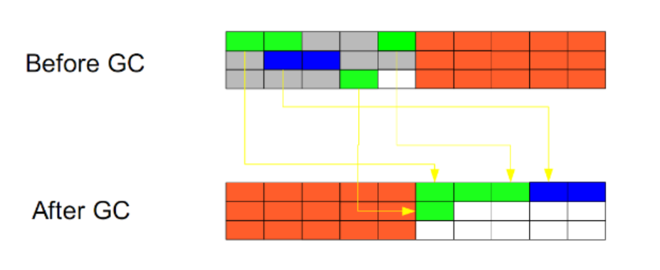

# JVM内存模型-JMM

内存模型的目标是：定义程序中的变量的访问规则；

（就是：共享变量，安全共享的问题）

1、规定：

- 所有变量都存储在主内存；
- 每条线程都有自己的工作内存，并且对变量的所有操作，都必须在工作内存中完成；
- 不同线程不可进行变量的访问，必须通过主内存；

## 内存交互


Java内存模型定义了八种方法来实现这个细节。

- 必须保证下面的操作都是原子性的、不可再分的。

​       1：lock：把主内存变量标识为一条线程独占，此时不允许其他线程对此变量进行读写。

​       2：unlock：解锁一个主内存变量。

​       3：read：把一个主内存变量值读入到线程的工作内存，强调的是读入这个过程。

​       4：load：把read到变量值保存到线程工作内存中作为变量副本，强调的是读入的值的保存过程。

​       5：use：线程执行期间，把工作内存中的变量值传给字节码执行引擎。

​       6：assign（赋值）：字节码执行引擎把运算结果传回工作内存，赋值给工作内存中的结果变量。

​       7：store：把工作内存中的变量值传送到主内存，强调传送的过程。

​       8：write：把store传送进来的变量值写入主内存的变量中，强调保存的过程。

## volatile的特殊规则

1、可见性

修改：线程A修改了一个普通变量，立即向主内存进行回写；

读取：强制从主内存进行读取操作，更新这个变量；

2、禁止指令重排序

写入volatile变量的时候，会在前后加上两条Barrier指令；

告诉CPU，不可以重排序指令；

这两个防止指令重排序的指令，就是内存屏障；

# JVM运行时数据区


栈代表了处理逻辑，而堆代表了数据

## 程序计数器（线程私有）

- 记录当前线程下一条要执行的指令；
- 每个线程都有，互不影响；
- 不会OOM

保证：线程切换时，仍能够正常运行；

Java虚拟机的多线程是通过线程之间切换来轮流获得处理器的执行时间的

（Java的线程调度机制：**抢占式线程调度**，由系统来分配执行时间）

## 虚拟机栈（线程私有）

- **栈内存**，在线程创建的时候创建，生命周期跟随线程，线程结束，栈内存释放。

- **每一个方法的执行到结束，就对应一个栈帧的入栈和出栈**；

执行每个方法的时候都会创建一个栈帧，**用来存储局部变量表、操作数栈、方法出口等信息。**

局部变量表：用来生成此方法所需要的所有局部变量，提前给定内存空间；

操作数栈：用来存放中间结果；

这个区域有两种异常情况：

- StackOverflowError异常：栈帧过多，或栈帧内存过大，超过虚拟机栈的内存大小；
- OutOfMemoryError异常：栈帧过多，虚拟机栈动态扩展，但是扩展时无法申请到足够的内存；

## 本地方法栈（线程私有）

本地方法栈与虚拟机栈的作用类似，只不过是虚拟机栈是为执行Java方法服务，而本地方法栈是为执行Native方法服务。本地方法：调用非Java方法的接口；

JVM需要与操作系统底层交互，并且JVM本身也有一部分是C语言完成的，所以Native方法帮助实现与底层交互；

**Unsafe类的CAS操作，基本都是Native方法；**

## 堆（线程共享）

Java堆是由所有线程共享的一块内存区域；

并且也是Java虚拟机管理管理的内存中最大的一块。

动态分配内存，速度较慢。

**Java堆主要用于存放对象实例以及数组**

Java堆是垃圾回收的主要区域，也被成为“GC”堆。

## 元空间

用于存储已经被虚拟机加载的类信息、常量、静态变量等数据。

JDK移除了方法区（永久代）；取而代之的是元空间（占用本地内存，不占用JVM内存）原因：

1. 字符串在永久代中，容易出现性能问题和溢出；
2. 类及方法信息比较难确定大小，
3. 永久代垃圾回收效率低下，给GC带来不必要的复杂度；

使用本地内存的元空间，不会出现上面问题。

# 堆(分代收集)


默认大小

新生代：老年代=1：2

### 新生代

使用**复制算法**（每次收集，大批对象死去，少量存活）

所有新生成的对象首先都是放在新生代的。新生的对象，会有一个年龄属性（Age），一个计数器，开始为0；

**新生代的目标就是尽可能快速的收集掉那些生命周期短的对象。**

新生代分三个区：

- Eden区：（MinorGC）
  
  大部分对象在Eden区中生成。当Eden区满时，触发**MinorGC**，还存活的对象将被复制到Survivor区（两个中的一个），并且，存活进入Survivor区的对象年龄变为1；之后每经历一次MinorGC，GC年龄+1；

- 两个Survivor区（from区，to区）：
  
  当这个Survivor区满时，此区的存活对象将被复制到另外一个Survivor区；
  
  在年轻代中经历了15次垃圾回收（也就是年龄15，此值默认15，可调）后仍然存活的对象，就会被放到年老代中。

晋升老年代的情况：

1、经历15次GC；

2、大的对象直接创建在老年代；

3、新生代内存不足，把GC年龄大的晋升到老年代；

### 老年代（FullGC）

**标记整理** 或**标记清除**算法（对象存活率高）

在年轻代中经历了15次垃圾回收（也就是年龄15，此值默认15，可调）后仍然存活的对象，就会被放到年老代中。

因此，可以认为年老代中存放的都是一些**生命周期较长的对象**。

### 为什么分代

不同的对象的生命周期是不一样的。因此，不同生命周期的对象可以采取不同的收集方式，以便提高回收效率。

- 在不进行对象存活时间区分的情况下，每次垃圾回收都是对整个堆空间进行回收，花费时间相对会长，
- 同时，因为每次回收都需要遍历所有存活对象，对于生命周期长的对象而言，这种遍历是没有效果的，他们依旧存在

因此，分代垃圾回收采用分治的思想，进行代的划分，把不同生命周期的对象放在不同代上，不同代上采用最适合它的垃圾回收方式进行回收。

### MinorGC

新生代GC，JVM中最频繁的GC；

1. 当新生代中的Eden区满了（仅Eden区，Survivor区不会触发），会触发MinorGC；
2. 即新来的对象，JVM无法为其分配足够的内存的时候，就会触发MinorGC；
3. MinorGC期间会触发STOP-THE-WORLD，所有线程停止运行，但是这个延迟，很小，可以忽略不计。而且，回收的是Eden区，基本是不怎么使用的对象，大部分Eden区对象被认为是垃圾；
4. 此GC不会影响到老年代，也不会影响Survivor区，不会影响永久代，仅针对Eden区；
5. 此GC效率高，速度快，使用频率高。

### FullGC

老年代GC，JVM的调优，很大一部分的工作就是对Full GC的调优

**此方法，比较慢，应该尽量减少Full GC的次数**

1. 调用System.gc时，系统建议执行Full GC，但是不必然执行；
2. 老年代空间不足，方法区空间不足，都会触发Full GC；
3. 元空间满时也会引发Full GC，会导致Class、Method元信息的卸载；
4. 上一次GC之后，Heap的各区域分配策略动态变化，需要调整，就会触发Full GC；

# GC 算法

### 一、标记 - 清除


此方法分为两个阶段：

- 先标记所有可达的对象
- 遍历整个堆，把没有标记的对象清除

**此方法需要暂停整个应用，不会压缩堆，同时，还会产生内存碎片**

剩余内存是不规整的，就需要用一个列表记录下哪些内存块是可用的，当需要分配内存的时候就需要在这个列表中查找，找到一个足够大的空间进行分配，然后在更新这个列表

### 二、复制算法



此算法把内存空间划为两个相等的区域，每次只使用其中一个区域。

垃圾回收时，遍历当前使用区域，把正在使用中的对象复制到另外一个区域中。

同时复制过去以后还能进行相应的内存整理，不会出现“碎片”问题。

**缺点：需要两倍的内存空间**

### 三、标记 - 整理


此算法结合了“标记-清除”和“复制”两个算法的优点。

分两个阶段：

- 第一阶段从根节点开始标记所有被引用对象
- 第二阶段遍历整个堆，清除未标记对象并且把存活对象“压缩”到堆的其中一块，按顺序排放。

**此算法避免了“标记-清除”的碎片问题，同时也避免了“复制”算法的空间问题**。

# 垃圾收集器

jdk1.8 默认垃圾收集器**Parallel Scavenge**（新生代）+**Parallel Old**（老年代）

### Serial（年轻代） / Serial Old（老年代）

（本意就是串行） 收集器

- Serial：复制算法
- Serial Old：标记整理


**单线程，简单高效**

它进行垃圾收集时，必须暂停其他所有的工作线程，直到它收集结束（Stop The World）;

Client模式下，新生代的默认收集器。

在用户场景下，JVM管理的内存不会很大，Serial收集器在整理200M以内的内存，可以控制在100ms以内，可以接受。

### ParNew（新生代） / Parallel Old（老年代）


- ParNew：使用复制算法收集新生代；
- ParallelOld：使用标记-整理算法收集老年代；

Serial 收集器的多线程版本

Server 模式下的虚拟机首选新生代收集器，主要是因为除了 Serial 收集器，只有它能与 CMS 收集器配合工作

默认开启的线程数量与 CPU 数量相同，可以使用 -XX:ParallelGCThreads 参数来设置线程数。

### Parallel Scavenge收集器（复制算法）— 年轻代

与 ParNew 一样是并行的多线程收集器。关注点是尽可能缩短垃圾收集时用户线程的停顿时间；

“吞吐量优先”收集器。这里的吞吐量指 CPU 用于运行用户代码的时间占总时间的比值。

控制最大垃圾收集停顿时间： -XX:MaxGCPauseMillis

直接设置吞吐量大小： -XX:GCTimeRatio 

 GC 自适应的调节策略开关：-XX:+UseAdaptiveSizePolicy；不需要手工指定新生代的大小（-Xmn）、Eden 和 Survivor 区的比例（-XX:SurvivorRatio）、晋升老年代对象年龄（-XX:PretenureSizeThreshold）等细节参数了，JVM会监控运行情况，动态调整。

### CMS （Concurrent Mark Sweep）收集器


并发**标记—清除**算法：并发收集，低停顿

收集流程：

- 初始标记：仅仅只是标记一下 GC Roots 能直接关联到的对象，速度很快，需要停顿；
- 并发标记：进行 GC Roots Tracing 的过程，它在整个回收过程中耗时最长，不需要停顿；
- 重新标记：为了修正并发标记期间因用户程序继续运作而导致标记产生变动的那一部分对象的标记记录，需要停顿；
- 并发清除：不需要停顿，耗时略长；

缺点：

- 吞吐量低：低停顿时间是以牺牲吞吐量为代价的，导致 CPU 利用率不够高；
- 在并发清除时，用户线程仍会产生垃圾，这些CMS无法处理；
- 收集算法导致：会产生内存碎片

### G1（Garbage First）收集器

jdk1.9默认G1收集器（同时针对新生代和老年代，在物理上不再隔离两个内存区域）


G1（Garbage-First）是一款面向服务端应用的垃圾收集器。

与CMS的“标记—清理”算法不同，G1从整体来看是基于“标记—整理”算法实现的收集器，从局部（两个Region之间）上来看是基于“复制”算法实现的

- **不会产生内存空间碎片**

- **可控制的停顿** （可控在于：根据你想要控制的时间内，尽量收集价值高的Region）
  
  它将整个Java堆划分为多个大小相等的独立区域（Region），虽然还保留有新生代和老年代的概念，但新生代和老年代不再是物理隔离的了，它们都是一部分Region（不需要连续）的集合。
  
  G1跟踪各个Region里面的垃圾堆积的价值大小，在后台维护一个优先列表，每次根据允许的收集时间，优先回收价值最大的Region（这也就是Garbage-First名称的来由）。

执行过程：

- 初始标记
  初始标记阶段仅仅只是标记一下GC Roots能直接关联到的对象，并且修改TAMS（Next Top at Mark Start）的值，让下一阶段用户程序并发运行时，能在正确可用的Region中创建新对象，这阶段需要停顿线程，但耗时很短。
- 并发标记
  并发标记阶段是从GC Root开始对堆中对象进行可达性分析，找出存活的对象，这阶段耗时较长，但可与用户程序并发执行。
- 最终标记
  最终标记阶段是为了修正在并发标记期间因用户程序继续运作而导致标记产生变动的那一部分标记记录，虚拟机将这段时间对象变化记录在线程Remembered Set Logs里面，最终标记阶段需要把Remembered Set Logs的数据合并到Remembered Set中，这阶段需要停顿线程，但是可并行执行。
- 筛选回收
  筛选回收阶段首先对各个Region的回收价值和成本进行排序，根据用户所期望的GC停顿时间来制定回收计划，这个阶段其实也可以做到与用户程序一起并发执行，但是因为只回收一部分Region，时间是用户可控制的，而且停顿用户线程将大幅提高收集效率。

## 对比CMS/G1

|         | CMS            | G1                 |
| ------- | -------------- | ------------------ |
| 收集算法    | 标记-清除          | 标记-整理              |
| 内存是否规整  | 不规则，存在内存碎片     | 内存规整，不存在内存碎片       |
| 关注点     | 响应优先，尽量减少STW时间 | 响应优先，尽量减少STW时间     |
| 关注的内存区域 | 只收集老年代         | 同时收集新生代和老年代，物理上不隔离 |

# JVM调优

https://www.cnblogs.com/Darrenblog/p/10712125.html

调优核心（目的）：

- 减少年轻代进入老年代的数量；
- 降低出现Full GC的机会

常用参数：

- -Xms：初始堆大小
- -Xmx：堆最大内存
- -Xss：栈内存
- -XX:PermSize 初始永久代内存
- -XX:MaxPermSize 最大永久带内存

## GC日志

开启GC日志：

```shell
-XX:+PrintGCDetails -Xloggc:gc.log -XX:+PrintGCTimeStamps
```

日志中的FullGC：

```shell
1.710: 
[Full GC (Metadata GC Threshold) 
[PSYoungGen: 7587K->0K(141824K)] 
[ParOldGen: 40K->7297K(102400K)] 7627K->7297K(244224K), 
[Metaspace: 20496K->20495K(1067008K)], 0.0232658 secs] 
[Times: user=0.16 sys=0.00, real=0.02 secs] 
```

可以观察到：

新生代、老年代、元空间的大小变化，以及FullGC触发的时长；

## 使用工具调优

工具：Visual VM

重要插件：Sampler抽样器、Visual GC可视化内存

主要看：年轻代/老年代/元空间的内存、GC频率、GC时间

Visual VM可以清楚的可视化三个内存的变化；（需要安装Visual GC插件）

- 当前内存大小；
- 已经GC的次数；
- 上次GC用时；


## 一、FullGC释放内存不大->内存泄漏

内存泄漏：存在无法回收的内存，即：对象无用，但是GCRoots是可达的，无法回收掉；

如果发现：经历了FullGC之后，老年代内存变化不大，有可能是内存泄露问题；

1、根据Visual VM的可视化，发现FullGC后，内存无明显变化。考虑内存泄漏；

2、查看抽样器（记录Heap中的所有对象）

抽样器记录着Heap中的所有对象的状态，

（1）我们在当前生成一次快照；

（2）在FullGC之后再次生成一个快照；

（3）然后进行两次的快照的对比，就可以找到哪些对象，是持续在增加，并没有因为GC而减少；

就说明这些对象，可能存在内存泄漏!

## 二、FullGC频繁/时间太久

FullGC频繁，一般是因为老年代内存持续上涨；

（1）不断地有大量对象涌入老年代——考虑新生代内存太小；（频繁MinorGC）

（2）FullGC之后，老年代内存变化不大——考虑内存泄漏；

导致需要不断地FullGC；

1、还是通过Visual VM，观察老年代的内存空间的变化，GC次数，GC的时长；

2、确定FullGC太过于频繁，老年代内存回收不充分的时候；

3、通过Sampler抽样器，观察内存对象的分布；最重要的是：看每个线程的内存使用！

4、如果发现某个线程占用大量的内存，并且无法被回收；就要根据这个线程去检查响应的代码；

处理：

（1）确定代码没有问题，那么增大Heap区内存；

（2）代码需要优化；

不使用的内存、对象尽量手动释放掉；

尽量减少对象的频繁创建；

## 三、内存溢出

一般是Heap区的溢出，JDK1.8之后，元空间分离出去，不存在溢出；

主要是通过查看抽样器（记录了Heap中的所有对象）

看是否创建了特别大的对象；

## 四、MinorGC频繁

主要原因：

1、Eden区过小，很容易满，需要频繁MinorGC；

2、短期对象过多，频繁创建；

# 内存泄漏

Java中的内存泄露，就是：不再会被使用的对象的内存不能被回收，就是内存泄露。(空占内存)

这些对象，与GCRoots存在引用链，但是没有用处，导致了无法GC；

有以下几种情况：

1、静态集合持有非静态遍历；

静态的对象、字段生命周期是与程序是一致的；无法释放；

如果元素不再使用，需要手动删除；

2、长生命周期的对象，持有段生命周期对象的引用；

即使短生命周期的对象不用了，依然无法释放，因为有引用；

3、存在无法释放的数据库连接、IO连接等；

连接使用过程中，垃圾回收不会回收连接使用的对象；

4、内部类持有外部类对象；

即使外部类对象不再使用，也不会被回收；

5、ThreadLocal存在内存泄漏的风险；

# 内存溢出

三种常见内存溢出：

### 元空间OOM

元空间主要存储着大量的class信息，静态数据；

- 内存上：增加元空间的大小

### 堆OOM

对象创建过多，或者不必要的大对象过多；

在创建对象时，申请不到足够的内存，抛出OOM

1、代码上：主要检查程序

2、内存上：增加JVM堆大小（最小值-Xms、最大值-Xmx）

### 栈内存溢出OOM

如果线程引用了特别大的遍历，在申请空间的时候，无法申请到足够的空间，就会抛出OOM；

- 程序上：尽量优化线程（使用线程池，参数合理）
- 内存上：默认Java给每个线程分配1M内存，整个对于线程太大了，可以通过参数，缩小整个内存，这样就可以创建更多线程；（线程的栈内存 -Xss128k）

## 栈StackOverflowError

栈内存溢出是指线程请求的栈深度大于虚拟机所允许的最大深度，则将抛出StackOverflowError异常；

最有可能的原因就是**方法递归**产生的这种结果。