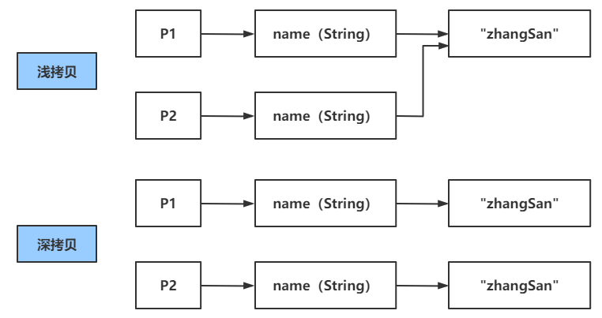
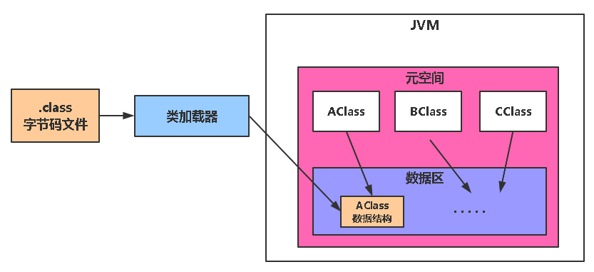

# 基础

## Java引用类型

1、强引用

2、软引用：内存不足时，回收；

3、弱引用：只要GC，就会回收；

4、虚引用：GC

尽量不要重写finazlie()；

- 影响回收速度，重写了finazlie()的对象，不会直接回收，会先入队，再次回收；
- 可能造成对象再次复活：在队列中，如果执行finazlie()，存在强引用再次持有对象，会复活；

## 基本数据类型

| byte    | 8bit  | 1字节 |
|:-------:|:-----:|:---:|
| short   | 16bit | 2字节 |
| int     | 32bit | 4字节 |
| long    | 64bit | 8字节 |
| char    | 16bit | 2字节 |
| float   | 32bit | 4字节 |
| double  | 64bit | 8字节 |
| boolean | 1bit  | 1字节 |

### 机器数

计算机一律用补码来表示和存储数字；

1、原码 = 符号位+真值

byte表示范围：[1111 1111 , 0111 1111]    即：[-127 , 127]

1000 0000：正零，0000 0000：负零（-128）

2、反码

正数：反码 = 原码

负数：反码 = 符号位 + 真值取反

3、补码

正数：补码 = 原码

负数：补码 = 反码 + 1

## 面向对象

### 多态

1、对象引用的具体类型，在运行期才能确定；（存在向上转型）

2、存在继承关系；

3、方法重写；

### 抽象类

1、抽象类不能实例化；

2、至少存在了一个abstract，就必须声明为抽象类，也可以不包含abstract

3、抽象类可以包含实现的方法；

### 重载/重写

1、重写(Override)

存在于继承体系中，指子类实现了一个与父类在方法声明上完全相同的一个方法。

2、重载(Overload)

存在于同一个类中，指一个方法与已经存在的方法名称上相同，但是**参数类型、个数、顺序**至少有一个不同。

**返回值不同，其它都相同不算是重载**。

# 接口和抽象类区别

接口：自上而下，定义约束；

抽象类：自下而上，从子类中抽取公共部分，作为抽象类进行继承；

- Java中的抽象类是以继承的方式进行复用；

- 多数语言没有抽象类，而是以组合的方式实现；

# 深拷贝/浅拷贝

对于基本数据类型，不存在深浅拷贝，直接拷贝；

对于引用类型

- 浅拷贝是拷贝了对象地址；
- 深拷贝是复制了一个新的对象过来；



## 浅拷贝

1、=：直接赋值

2、Object的clone()方法；

3、 Arrays.copyOf()方法；

## 如何深拷贝

1、new一个一样的对象；

2、重载clone方法

3、序列化深拷贝：

- Apache Commons Lang序列化
- Gson
- Jackson

# Java反射

首先要了解Java的类加载机制！



元空间中存储着每个加载过的类的class对象（在Heap中）；

Java的反射就是通过class对象，来获取类的各种属性！

通过这个Class对象，能干嘛？：

```java
public final class Class<T>{
    // 获取属性
    public Field[] getFields() throws SecurityException {}
    // 获取类加载器
    public ClassLoader getClassLoader() {}
    // 获取构造器
    public Constructor<?>[] getConstructors(){}
    // 获取私有方法
    public Method getDeclaredMethod(){ }
    ....
}
```

## 获取Class对象的方式

1、通过对象实例获取

（需要对象实例，不实用）

```java
Student stu=new Student();
Class stuClass1=stu.getClass();
```

2、直接通过类获取

（需要导入类，存在依赖）

```java
Class stuClass2=Student.class;
```

3、通过Class类的`forName`静态方法

（最常用，不需要创建对象，不需要导入类，只需要对象全限定类名）

```java
// 需要全类名
Class stuClass3=Class.forName("com.entity.Student");
```

## 反射创建对象

```java
Student stu = studentClass.newInstance();
```

# final关键字

属性不可重新赋值；

反射可以修改非基本数据类型和非String类型的final修饰的属性；


# 动态代理

## JDK动态代理

利用反射机制！针对接口创建代理对象；(被代理类，必须实现接口！！！！！)

1. 创建代理对象；
   
   需要：被代理类的类加载器，接口和一个`InvocationHandler`；
   
   `InvocationHandler`可以自己定义；
   
   ```java
   Test testProxy 
   =(Test) 
       Proxy.
       newProxyInstance(Test.class.getClassLoader(), Test.class.getInterfaces(), proxyInvokeHandler);
   ```

2. 在自己定义的`InvocationHandler`中，对原有的方法进行织入；
   
   重写`invoke`方法，实现对原方法的丰富；
   
   这里是自定义的，也可以直接在上面方法，`new InvocationHandler(()->{.....})`
   
   ```java
   // 自定义一个，也可以直接在上面方法，new InvocationHandler(()->{.....})
   public class proxyInvokeHandler implements InvocationHandler {
       private Object subject;
       // 构造，传入被代理类的对象 
       proxyInvokeHandler(Object subject){
           this.subject = subject;
       }
       @Override
       public Object invoke(Object proxy, Method method, Object[] args) throws Throwable {
           // 执行方法前
           Object invoke = method.invoke(subject, args);    // 执行方法
           // 执行方法后
           return invoke;
       }
   }
   ```

## CGLib动态代理

利用继承机制实现，无法代理被final的类；

原理是：

通过ASM包，将被代理类的**字节码文件**，加载进来，修改字节码文件生成一个被代理类的子类；

然后创建代理，这个代理是被代理类的子类对象；

通过CGlib下的方法拦截器，对被代理类的方法进行一个增强；

然后就可以使用代理对象，调用对应的方法，并对其增强丰富等；

# 序列化

序列化：将对象转换成字节序列；

反序列化：将字节序列转化成对象；

序列化目的：可以在网络中传输字节序列；

transient关键字：如果想要对象某个字段不参与序列化：

# equals / HashCode

为什么有了equals判断对象是否相等，还需要hashCode？

因为查找对象位置和判断对象是否相同的效率太低，hashCode使用散列表，效率很高！

提高map集合的索引速度；

那为什么有了hashCode，还需要equals？

hashCode不一定完全可靠，不同的对象，哈希值也有可能相同！equals是判断对象是否相同，最可靠的方法！

**重写原则**：

1. equals返回true，那么hashCode也应当返回true！
2. hashCode相同，equals不一定返回true，hashCode方法并不可靠。

**那么这两个方法是怎么运作的？**

1. **在添加元素的时候，先调用hashCode方法（效率大大提升），判断哈希值是否相同，或者说是否已经存在，如果不存在（不相同），就没必要调用eqauls了。**
2. **如果hashCode相同，那么继续调用equals方法判断，两个对象是否相同如果返回true，那就确定这是重复的对象。如果返回false，确定为不同对象，继续存储。比如在HashMap中，就会在同一个bucket中产生链表或红黑树。**
