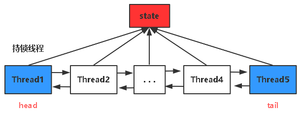

# Lock接口

Lock接口功能：

```java
public interface Lock {
    // 获得锁
    void lock();
    // 获得锁
    void unlock();
    // lock非阻塞版本，成功返回true
    boolean tryLock();
    // 添加尝试时间，时间到返回false
    boolean tryLock(long time, TimeUnit unit)
    // 返回一个监视器对象
    Condition newCondition();
}
```

# AQS

AbstractQueuedSynchronizer：抽象队列式同步器；也就是通过队列保证并发安全的同步器；

每一个由lock锁定的共享资源，都会维护一个AQS队列；来保证并发安全性；

---

简单概述AQS：是一个双向链表，每一个节点装载一个线程，并维护一个state值来代表共享资源的状态，state>0，则代表锁定状态，只有state==0，才可被其他线程竞争，修改state值使用的是CAS方法，不断尝试修改state来获取锁；



重要属性：

- state：代表了资源是否处于锁定状态；
  
  1：锁定（已经有线程拿锁，如果重入了，此值一直累加）2：未锁定
  
  线程拿锁，就是通过CAS修改state，修改成功，则拿到锁；

- Node内部类：
  
  每一个Node装载一个线程；对线程通过双向链表的方式排队；

- Node内部类：还定义资源是 独占 / 还是共享
  
  也就是每个线程都有一个mode，标识是独占，还是共享；
  
  **Node EXCLUSIVE**：代表独占；
  
  **Node SHARED**：代表共享；

先看几个重要方法，后面会用到；

重要方法：

`acquire`：顾名思义获取，获取锁的方法；

addWaiter：加入AQS队列；

```java
private Node addWaiter(Node mode) {
    // 包装线程为Node，并且独占的
    Node node = new Node(Thread.currentThread(), mode);
    // 拿到线程队列的尾节点
    Node pred = tail;
    // 如果pred存在，即队列非空
    if (pred != null) {
        node.prev = pred;
        // CAS操作成功入队，将Node设置为tail
        if (compareAndSetTail(pred, node)) {
            // 因为是双向链表，要再链一次
            pred.next = node;
            return node;
        }
    }
    // 队列为空，调用enq，初始化队列，并入队
    enq(node);
    return node;
}
```

# ReenTrantLock

实现Lock接口，核心实现为AQS；

ReenTrantLock只有一个内部属性：就是`Sync内部类`的锁抽象对象

```java
// 这是一个父类，两个子类分别实现公平锁，非公平锁
private final Sync sync;
```

三个内部类：

- Sync（继承AQS）：锁抽象；
- NonfairSync（继承Sync）：非公平锁抽象；
- FairSync（继承Sync）：公平锁抽象；

### 构造器

默认创建非公平锁

```java
// 非公平锁
public ReentrantLock() {
    sync = new NonfairSync();
}
// 公平锁
public ReentrantLock(boolean fair) {
    sync = fair ? new FairSync() : new NonfairSync();
}
```

### 公平锁源码（拿锁，排队，重入锁）

当我们调用了`lock.lock();`

公平锁下，sync已经是`FairSync`的实例了；

调用`sync.lock()`

```java
public void lock() {
    sync.lock();
}
```

然后调用FairSync内部类下的lock方法：

`acquire(1)`：此方法是AQS下的方法；在内部是调用了下面的tryAcquire方法；

这个参数1是干嘛的：就代表尝试获取锁；之前AQS的属性state，如果为0表示未锁定；

这个1就是要通过`compareAndSetState(0, acquires)`CAS操作进行加锁的；

（这里也是通过内存地址stateOffset，拿到state的状态，CAS操作不再赘述）

尝试将state设置为1，即拿到锁；

**重点：tryAcquire方法（实现了拿锁，排队，重入锁）**

```java
static final class FairSync extends Sync {
    final void lock() {
        acquire(1); // 调用AQS acquire方法，前面讲了
    }
    protected final boolean tryAcquire(int acquires) {
        final Thread current = Thread.currentThread();
        // 从AQS中拿到当前资源的state状态
        int c = getState();
        // 如果为0，则表示未锁定，可以尝试获取锁
        if (c == 0) {
            // hasQueuedPredecessors是看当前线程队列中是否有其他线程(非公平锁没有此判断)
            // 如果有其他线程，当前线程不允许拿锁，而是去排队
            // 如果没有线程，并且CAS操作将state置1，那么当前线程就拿到了锁
            if (!hasQueuedPredecessors() &&
                compareAndSetState(0, acquires)) {
                // 设置独占的资源持有者为当前线程，即拿锁，并返回true
                setExclusiveOwnerThread(current);
                return true;
            }
        }
        // state非0，即资源已被锁定
        // 判断当前的线程，是不是占用锁的线程
        // 是，则累加state，也就是重入锁的实现
        else if (current == getExclusiveOwnerThread()) {
            int nextc = c + acquires;
            if (nextc < 0)
                throw new Error("Maximum lock count exceeded");
            // 叠加state状态
            setState(nextc);
            return true;
        }
        return false;
    }
}
```

### 非公平锁源码

同样是lock()方法，不再赘述，只不过这里的`Sync`实例，是NonfairSync的实例；

直接看NonfairSync

```java
static final class NonfairSync extends Sync {
    private static final long serialVersionUID = 7316153563782823691L;
    // 加锁方法
    final void lock() {
        // CAS尝试加锁
        if (compareAndSetState(0, 1))
            // 成功，设置资源独占者为当前线程
            setExclusiveOwnerThread(Thread.currentThread());
        else
            // 底层依然调用下面的tryAcquire
            acquire(1);
    }

    protected final boolean tryAcquire(int acquires) {
        return nonfairTryAcquire(acquires);
    }
}
```

`nonfairTryAcquire`方法是其父类`Sync`下的方法

类似于公平锁的`tryAcquire`方法

区别是：不再进行`hasQueuedPredecessors()`方法的判断

```java
final boolean nonfairTryAcquire(int acquires) {
    final Thread current = Thread.currentThread();
    int c = getState();
    if (c == 0) {
        // 这里是区别，不再判断是否队列中是否有其他线程，也就是不需要排队
        if (compareAndSetState(0, acquires)) {
            setExclusiveOwnerThread(current);
            return true;
        }
    }
    // 重入逻辑
    else if (current == getExclusiveOwnerThread()) {
        int nextc = c + acquires;
        if (nextc < 0) 
            throw new Error("Maximum lock count exceeded");
        // 叠加state状态
        setState(nextc);
        return true;
    }
    return false;
}
```

是否要排队的方法：

1. 拿到队列的头，尾

2. 排队逻辑：
   
   （1）头！=尾
   
   如果为false，队列没有其他线程，不用排队，返回；
   
   为true，队列有其他线程，继续判断；
   
   （2）头节点的下一个线程，不是当前线程；
   
   true && (true || true) 才会去排队；

```java
public final boolean hasQueuedPredecessors() {
    Node t = tail;
    Node h = head;
    Node s;
    return h != t &&
        ((s = h.next) == null || s.thread != Thread.currentThread());
}
```

### 释放锁

释放锁的过程：

并不是说直接将state置为0即可，因为可能发生了多次重入；

每调用一次`tryRelease`，state减一；

```java
protected final boolean tryRelease(int releases) {
    // 当前state-1
    int c = getState() - releases;
    if (Thread.currentThread() != getExclusiveOwnerThread())
        throw new IllegalMonitorStateException();
    boolean free = false;
    // state如果为0，可以释放锁
    if (c == 0) {
        free = true;
        // 独占线程设为null
        setExclusiveOwnerThread(null);
    }
    // 不能释放锁，state设置为c，即：减一操作；
    setState(c);
    return free;
}
```

## Lock/Synchronized

1. 都是可重入锁
   
   可以再次获取自己的内部锁，即：一个线程获取某对象锁，在没有释放此对象锁的同时，可以再次获得此锁；
   
   一个锁每次被线程获取，锁计数器就增加1，知道锁计数器将为0，才能释放锁；

2. Synchronized依赖于JVM，ReenTrantLock依赖于API
   
   Synchronized的很多优化，都是在JVM层面优化的，并不暴露给用户；
   
   ReenTrantLock的各种功能实现，都可以用户自己通过调用API进行实现（lock，unLock）；

3. ReenTrantLock增加了高级功能
   
   1. 等待可中断
      
      调用：`lock.lockInterruptibly()`
      
      A,B想要获取同一个锁，A获取了锁，B只有等待，A可以中断B的等待；
   
   2. 可实现公平锁
      
      Synchronized默认非公平；ReenTrantLock默认也是非公平锁；
      
      构造公平锁：`Lock lock=new ReentrantLock(true)`
   
   3. 锁可以绑定Condition，实现选择性通知
      
      synchronized关键字与wait()和notify/notifyAll()方法相结合可以实现等待/通知机制；
      
      ReentrantLock借助于与锁绑定的condition对象，来调用await()和signal/signalAll()方法来实现；
   
   4. ReentrantLock可以实现tryLock
      
      对于没有拿到锁的线程，可以令其做一些别的事情，不会阻塞；

4. Synchronized与ReentrantLock性能持平
   
   在JVM各种锁机制的优化下，Synchronized在很多地方都默认使用CAS的乐观锁，进行优化了；所以并不是ReentrantLock性能更强！！
