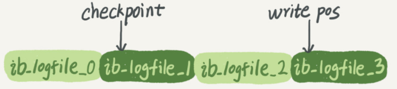

# SQL查询执行过程

主体分为三部分：

- 客户端
- 服务端
- 存储引擎

## 客户端发送SQL

客户端发送SQL到服务端，这里是通过Server的<mark>连接器</mark>，进行权限验证；比如用户名，密码，通过之后，进行验证client的权限；

## 查询缓存（不建议）

连接建立完成，select语句，首先查询缓存，如果命中，直接返回；

否则：查询数据库，再更新缓存；

- 缓存中，以Key-Value存储着查询语句为Key，结果集为Value的形式；
- 不建议开启查询缓存，

查询缓存的失效非常频繁，只要有对一个表的更新，这个表上所有的查询缓存都会被清空，如果更新多的库，那么查询缓存的命中率会非常低；所以**弊大于利**，不建议开启缓存；

## 分析器

如果没有命中查询缓存，就要开始真正执行语句了。MySQL需要知道你要做什么，因此需要对SQL语句做解析。

两个任务：

1. 词法解析
   
   识别SQL关键字，区分非关键字；

2. 语法解析
   
   对SQL语法进行解析，判断客户端传入的SQL语句是否满足Mysql语法；
   
   语法不对，返回ERROR

3. 获得锁
   
   当语法、语义都正确后，系统就会对我们需要查询的对象加锁。这主要是为了保障数据的一致性；

## 优化器

优化器是在表里面有多个索引的时候，决定使用哪个索引；

也就是 选取最优的执行计划；

主要两个步骤：

1. 当涉及到多个索引时，决定用哪个索引
2. 多表关联时，决定连接顺序

## 执行器(关键字执行顺序)

根据执行计划，操作存储引擎，逐步执行sql语句；

- 首先，判断是否对表有权限；如果没有，就会返回没有权限的错误
- 如果有权限，就打开表继续执行。

直到查询到结果，返回到结果集；结果集，最终包含所有满足的结果，返回给客户端；

```sql
SELECT `name`,COUNT(`name`) AS num 
FROM student 
WHERE grade < 60 
GROUP BY `name` 
HAVING num >= 2 
ORDER BY num DESC,`name` ASC 
LIMIT 0,2;
```

1. 首先执行的是`FROM student` ，把数据库的表文件加载到内存中；如果有`join`，则`from`后执行`join`
2. 然后`WHERE grade < 60` ，对表中的数据进行过滤，生成一张临时表；
3. `GROUP BY name`
4. `HAVING num >= 2`对上面的临时表的数据再次进行过滤；
5. `ORDER BY num DESC,name ASC` 将临时表进行排序；
6. `LIMIT 0,2`取排序后的前两个；

# SQL更新语执行过程

重要的日志模块：

## bin log（逻辑日志，记录SQL的原始语句）

bin log是server的所有日志记录的位置；（binlog是追加写，所有记录会保存，所以要备份数据库，备份的就是binlog）

## redo log（物理日志，记录修改了什么，不记录语句）

InnoDB还有自己的日志：redo log；（redo log是循环写的，两个指针write pos和checkpoint）

- write pos：记录当前写的位置；
- checkpoint：记录已经擦除到了哪；

（redo log：保证即使数据库发生异常重启，之前提交的记录都不会丢失）



所以，更新操作，每次会先更新redo log，再更新到bin log；

比如语句：

```sql
update T set c=c+1 where ID=2;
```

首先还是会通过where查询出对应的结果集；

将结果集，加载进内存中；

**MySql执行器**会在内存中，根据sql语句，修改结果集；

此时，更新的操作，会记录在InnoDB的redo log中；记录完成之后，会提交一个事务，并告知MYSQL的**执行器**；

执行器就将这个操作，写入bin log中；bin log随后会写入磁盘；

最终，执行器将redo log提交的事务状态修改为 commit，提交状态，就更新完成了；

# 关键字

## Limit

limit分页原理：

`select * from table limit n,m;`

会先查询出n+m条数据，然后过滤出m条数据，所以n越大，性能越差；

所以在数据量大的情况下，不建议用Limit；

优化：

1. 添加大致范围：
   
   ```sql
   select * from table where id > 2000 limit m;
   ```

2. 子查询
   
   ```sql
   select * from table
   where id >= (select * from table limit n , 1)
   limit m;
   ```

## join/子查询

数据库是最低层的，性能差，很容易到达瓶颈；

不要将业务相关的操作，直接通过SQL去实现，应该仅将数据库当作存储工具；

比如：

- in子查询：
  
  效率差，执行子查询时，MYSQL需要创建临时表，查询完毕后再删除这些临时表，所以，子查询的速度会受到一定的影响，这里多了一个创建和销毁临时表的过程。

- join
  
  当表数据大的时候，join效率会下降；
  
  并且在分布式下，分库分表下，跨库join，效率就更低了；

解决办法：

1、在应用层进行关联：

复杂逻辑，最好是单表走索引查询，拿到结果，在程序中进行join关联处理；

## left/right join

left join：返回左表全部记录和右表联结字段相等的记录；

right join：返回右表全部记录和左表联结字段相等的记录；

## in/exists

in和exists主要用在子查询：

```sql
select * from A where id in (select id from B);
select * from A where exists (select 1 from B where A.id=B.id);
```

两者区别在于：

- exists：将主查询的结果集放到子查询去做验证，验证存在，则返回True，保留数据，否则不保留；
- in：会先执行in中的子查询，然后结果缓存，然后查询主表，比较缓存存在，就放到结果集；

总结：

主查询表小，则用exists；

主查询表大，则用in；

## where/having

作用时机：where在结果返回之前过滤，having是返回结果集后再次过滤；

## MySQL时间类型

| 日期时间类型    | 占用空间    | 日期格式                | 最小值                 | 最大值                 | 零值表示                |
| --------- | ------- | ------------------- | ------------------- | ------------------- | ------------------- |
| DATETIME  | 8 bytes | YYYY-MM-DD HH:MM:SS | 1000-01-01 00:00:00 | 9999-12-31 23:59:59 | 0000-00-00 00:00:00 |
| TIMESTAMP | 4 bytes | YYYY-MM-DD HH:MM:SS | 19700101080001      | 2038 年的某个时刻         | 00000000000000      |
| DATE      | 4 bytes | YYYY-MM-DD          | 1000-01-01          | 9999-12-31          | 0000-00-00          |
| TIME      | 3 bytes | HH:MM:SS            | -838:59:59          | 838:59:59           | 00:00:00            |
| YEAR      | 1 bytes | YYYY                | 1901                | 2155                | 0000                |
