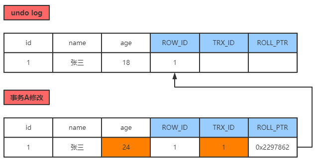

# 事务特征—ACID

- **原子性**（atomicity）
  
  一个事务必须被视为一个不可分割的最小工作单元，整个事务中的所有操作要么全部提交成功，要么全部失败回滚，对于一个事务来说，不可能只执行其中的一部分操作，这就是事务的原子性；

- **一致性**（consistency）
  
  数据库总是从一个一致性的状态转换到另一个一致性的状态。

- **隔离性**（isolation）
  
  通常来说，一个事务所做的修改在最终提交以前，对其他事务是不可见的。

- **持久性**（durability）
  
  一旦事务提交，则其所做的修改会永久保存到数据库。

# 隔离级别

**隔离级别就是通过锁，来避免出现下面三个问题，而实现的**

脏读：一个事务对数据进行增删改，但并没有提交，另一个事务却能读到未提交的数据；

不可重复读：一事务对数据进行了更新或删除操作，另一事务中多次读取同一个数据，结果不一致；

幻读：第一个事务对一个表中的数据进行了修改，这种修改涉及到表中的全部数据行。同时，第二个事务也修改这个表中的数据，这种修改是向表中插入一行新数据。那么，以后就会发生操作第一个事务的用户发现表中还有没有修改的数据行，就好象发生了幻觉一样；

| 隔离级别                      | 级别      | 脏读  | 不可重复读 | 幻读  |
| ------------------------- | ------- | --- | ----- | --- |
| **Read Uncomitted（读未提交）** | 无保证     | 存在  | 存在    | 存在  |
| **Read Comitted（读已提交）**   | 语句级     | 不存在 | 存在    | 存在  |
| **Repeatable Read（可重复读）** | 事务级     | 不存在 | 不存在   | 存在  |
| **Serializable（可串行化）**    | 最高级，效率低 | 不存在 | 不存在   | 不存在 |

读未提交：可以读到别的事务未提交的数据；（脏读）

读已提交：只能读到提交的数据；

## MVCC

无锁并发控制、多版本并发控制：

概述：

> 通过为事务中的每一次数据，包括原本数据，都进行保存版本，将版本之间依次连成版本链，以此实现回滚；
> 并且每个事务都保存当前事务设计的版本号，以此达到事务隔离；

多版本并发控制：提高高并发场景的吞吐量；解决读写冲突问题；

- MVCC通过**版本链**，实现高并发下的读写；
- MVCC通过**ReadView（视图）**生成时机不同，实现RC、RR两个隔离级别；

MVCC只存在于读已提交（RC）、可重复读（RR）两个隔离级别下；

### 版本链

每一个表的每一条记录，都有三个隐藏列；

- 隐藏主键列（ROW_ID）
- 事务ID列（TRX_ID）
- 回滚指针列（ROLL_PTR）

事务A修改age字段的操作过程：

1、对这行记录加上排他锁（for update）；

2、把整个原本的记录，copy到undo log中；

3、事务A修改age字段，产生一个新的版本的记录；

并且，回滚指针，指向undo log中的原数据记录；如果发生回滚，就可以找到历史版本数据；

4、将上面一系列操作，记录到redo log中；提交事务到MySQL的执行器，最终会记录到bin log中；

> 就像上面，回滚指针，会指向上一个版本，每一次修改数据，都会如此，就会生成一个版本链；

### ReadView

ReadView是一个维护了当前活跃读写事务的列表，存放当前所有活跃事务的事务ID；

比如：

当前的ReadView维护了【80-100】的事务ID；

事务A要查询数据，查到了事务版本号为90的数据，那么就无法读取，因为此数据正在ReadView中；

那就根据版本链，继续向下寻找，直到找到数据的版本 < 80，就读出来；（避免了脏读）
