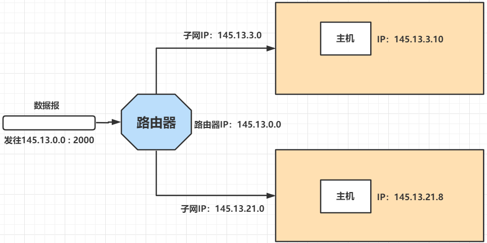
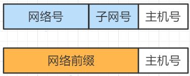
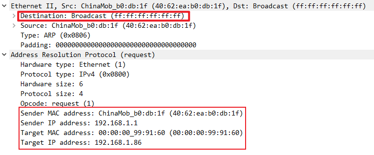
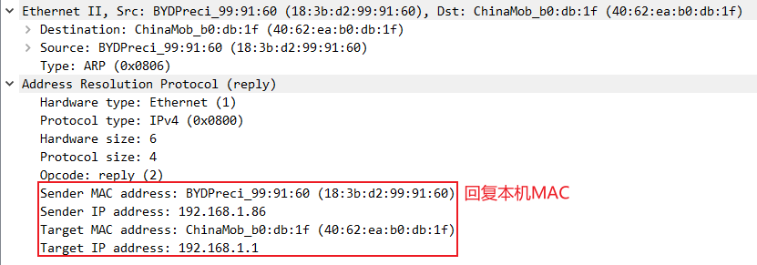

# IP协议

## IP数据包

一个IP数据包由首部和数据两部分构成：（最大65535 字节）

- 首部：固定长度20字节，所有IP数据包固有部分；IPV4存在可变部分，IPV6不存在可变部分，固定20字节；

- 版本：用来表示TCP/IP协议的版本 IPV4，IPV6；（4 bit）

- 首部长度：一般20字节，如果存在可变字段，会用到这个量；

- 区分服务：数据包存在优先级，区分服务用于区分优先级，让优先级高的数据包先传输；（QOS）

- 总长度：整个IP数据包的长度，用2字节表示；在链路层会判断数据包的大小，大于1480字节（加上帧开始符和帧结束符，一共1500字节），会进行数据包的分片；

- 标识：在数据包分片之后，进行编号，有相同标识的分片数据，表明是同一个数据包，根据相同编号，来组装成一个完整的数据包；

- 标志：用来标记，此数据包是分片，还是完整的数据包；（3 bit）

- 偏移量：分片数据包占总数据包的偏移位置；第一个包偏移：0，第二个包偏移：1480，以此类推；

- 生存时间TTL：每经过一个路由，TTL减1，TTL为0，数据包作废；防止数据包在环路路由内循环；windows默认TTL：128，Linux：64，Unix：255；

- 协议号：表明数据部分的协议：TCP（6），UDP（17），ICMP（2），IGMP（1）；

- 首部检验和：判断整个数据包的首部，在传输过程中有没有出现错误，在接受端收到数据包会计算检验和，如果为0，则保留，否则丢弃；

- 源IP地址：占32 bit，发送端IP；

- 目的IP地址：占32 bit，接收端IP；

## 五类IP地址

- A，B，C类地址固定位 { 网络号+主机号 }
  
  - A类网络号占1个字节，主机号3字节；规定起始位为0
    
    即范围：00000001 00000000 00000000 00000001 ～01111111 11111111 11111111 11111110
    
    一般用十进制表示：1.0.0.1~126.255.255.254
    
    其中：127.0.0.1为回环地址
  
  - B类网络号占2个字节，主机号2字节；规定起始位为10
    
    同上面方法一样，范围：128.0.0.1~191.255.255.254
  
  - C类网络号占2个字节，主机号1字节；规定起始位为110
    
    范围：192.0.0.1~223.255.255.254

- D类地址用于多播，起始位：1110
  
  224.0.0.1—239.255.255.254

- E类地址保留今后使用；起始位1111
  
  240.0.0.1—255.255.255.254

## 子网划分

网络通信过程中，要路由到对应主机需要以下步骤：

1、指定要发往的主机IP和端口

2、如果有多级子网：到达路由器后，路由器依据路由表的子网掩码，确定此端口所在的子网，再确定子网内对应主机号；

3、如果只有一个子网，直接确定主机号；即可路由给对应主机；

### 定长子网划分

- 整个网络对于外网，只暴露了一个IP：145.13.0.0
- 路由器内有NAT软件，通过不同的端口号绑定不同的主机

外部数据报找到路由器，并标识访问145.13.0.0:2000

路由器根据端口号，从NAT转换表中找到对应的主机IP为145.13.3.10

| NAT转换表          |                  |
| --------------- | ---------------- |
| WAN端（外网）        | LAN端（内网）         |
| 145.13.0.0:2000 | 145.13.3.10:9000 |
| 145.13.0.0:4000 | 145.13.21.8:8000 |

### 无分类编址CIDR子网划分

定长的子网掩码对于网络的利用率太低

子网内不再使用网络号、子网号，而采用：网络前缀 + 主机号 + (变长的子网掩码)

- 通过在IP地址后面加上网络前缀的位数

来划分128.14.32.0/20：即前20位是网络前缀，后12位是主机号  
子网掩码：前20位全1

# ARP协议

ARP：Address Resolution Protocol 地址解析协议

为什么需要ARP？

局域网中存在多台主机，路由器要找到对应的主机，就需要直到其MAC地址，ARP协议可以通过ARP广播的形式，获取目标主机的MAC地址；

## ARP广播

在只有IP地址，不知道MAC地址的情况下，需要对子网内所有IP进行广播，此时MAC地址设为FF-FF-FF-FF-FF-FF

1、向广播域内所有IP发送ARP广播；

2、广播域内的主机，会查看ARP请求的目标主机是不是自己，是自己则回复自己的MAC地址，不是则会丢弃此报文；

**ARP欺骗**：缓存了错误的MAC地址；

如果缓存了错误的本网段的路由器的MAC地址，那么就无法与外网通信；

# ICMP

IP协议并不提供可靠传输。如果丢包了，IP协议并不能通知传输层是否丢包以及丢包的原因；

此功能就由：ICMP协议完成；

- 确认IP包是否成功到达目标地址
- 通知在发送过程中IP包被丢弃的原因

ping命令就是ICMP协议的实现；

能验证网络的连通性;

# IGMP
