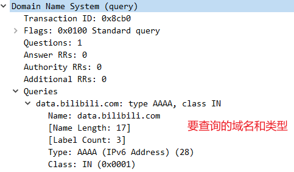
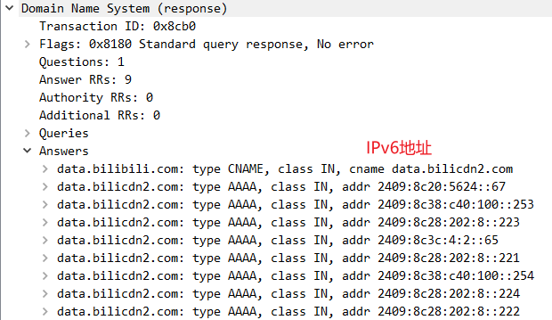

# HTTP

# SSL/TLS

HTTPS = HTTP + TLS/SSL(应用层协议)

SSL：Secure Socket Layer，安全套接字层,已经更名为TLS;

TLS：传输层安全协议，是 SSL3.0 的后续版本，更安全，更完善；

TLS 1.1,1.2(废弃)

TLS 1.2(主流)

TLS 1.3(性能更好,更安全)

TLS建立在传输层、应用层之间,为应用层提供数据封装、压缩、加解密等功能；

# DNS

DNS请求报文

DNS响应报文

