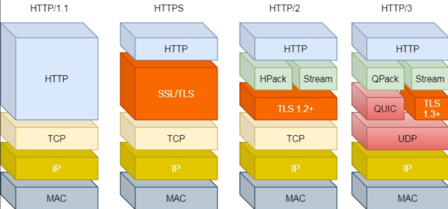
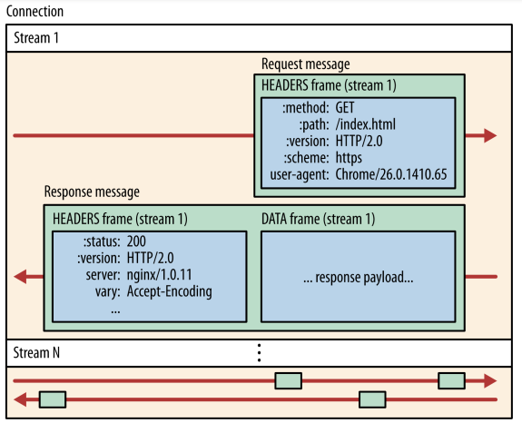
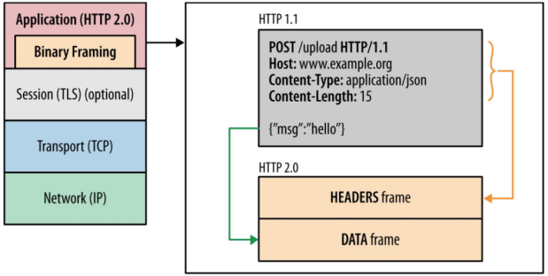
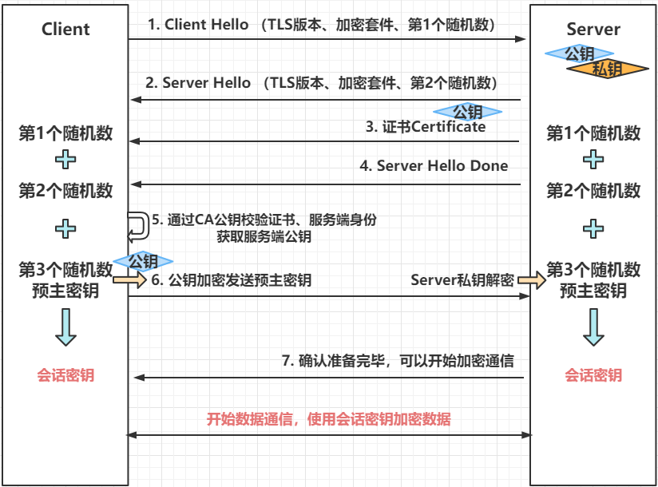

# HTTP版本迭代

## HTTP 1.0（废弃）

](../images/httpversion.png)

- 无状态：不跟踪不记录请求的状态；
- 无连接：每次请求都需要建立连接（不支持长连接）；
- 队头阻塞：请求全部同步处理，处理请求后，发送响应，接受到ACK，再处理下一个请求；
- 端口易耗尽：主动断开一方，必须经过2个MSL的TIME_WAIT状态；
- 仅支持文本内容；不支持图片、视频；

## HTTP 1.1（使用广泛）

- 增加长连接：增加了Connection，设置为keep-alive保持长连接；默认保持
- 管道化技术：将多个请求通过一个TCP连接发送，但是接受响应仍要顺序接受；
- 缓存：允许浏览器缓存响应，在资源无变化的情况下，可以直接使用缓存；缓存有失效时间；
- 断点续传：增加Header
- 支持图片、视频、音频；

缺陷：（总体缺陷：高延迟）

- 对头阻塞：管道化并不能解决此问题，此问题依然存在；
- 管道话技术使得请求体积变大；
- 不支持服务端推送消息；

## HTTP 2

在HTTP1.1基础上新增特性，HTTP2必须建立在TSL上，即必须是HTTPS

- 使用二进制帧代替报文格式：
- 头部压缩：使用HPACK作为头部压缩算法；
- 解决队头阻塞：基于Stream实现并发，解决了队头阻塞;
- 多路复用：多个Stream复用一个TCP连接，实现并发传输；
- 实现应用层的流量控制：基于二进制帧中的窗口更新帧；
- 实现资源的优先级：基于二进制帧中的优先级帧；
- 主动推送：在客户端请求资源时，如发现一些连带的资源会主动推送给客户端，如：css、js等资源；

### Stream



一个TCP连接可有多个Stream（流、乱序）

一个Stream包含多个Message

一个Message包含多个Frame（帧、有序）

Stream优势：

1. 仅需建立一次TCP连接，就可以做到100+的并发Stream数据交换；

有效避免了Http1.1的建立多个TCP连接的耗时；

2. Stream可设置优先级，可根据优先级响应；
3. 乱序传输；

### 乱序传输

Client、Server间的TCP连接中Stream是乱序发送的，也就支持了高并发；

每个Stream由ID标识，Client根据StreamID组装成完整的HTTP消息；

- Client端StreamID为奇数；
- Server端StreamID为偶数；
- StreamID顺序递增，统一TCP连接ID不可复用；

### Http2二进制帧：Frame



开始行和首部封装成：Headers Frame帧，将body封装成Data Frame

- 二进制帧分为：数据帧和控制帧

- 数据帧：HEADERS、DATA、PRIORITY优先级；

- 控制帧：

- RST_STREAM：终止帧；

- PUSH_PROMISE：推送帧；

- WINDOW_UPDATE：窗口更新帧；

- GOWAWY：关闭TCP连接帧；

### 主动PUSH


服务端在客户端请求了HTML后，主动将其依赖的css、js等文件，推送给客户端；

### 缺陷

主要问题出在TCP上：

- HTTP2仍有对头阻塞，因为TCP层的字节流必须要求数据完整，丢包会导致后续响应即使接受了，也要等待前面的数据接受完整，才能处理；
- 在TSL四次握手之前，必须经过TCP三次握手，动作重复，TSL握手完全可以替代TCP握手；
- TCP拥塞控制的慢启动，刚建立的TCP连接，启动减速；
- TCP连接必须保证（源IP、源port、目的IP、目的port）不变，切换网络，必须重新建立连接；

# 一次完整的HTTP请求

## 1、域名解析

- 首先浏览器搜索自身的DNS缓存  

- 如果浏览器没有缓存,则会搜索系统的DNS缓存  

- 如果还没有,就从hosts文件中找  

- 还没有,就递归地去域名服务器查找  

## 2、建立TCP连接

三次握手，建立成功后，客户端才能发送Http请求  

## 3、客户端发送HTTP请求

HTTP请求报文由三部分组成：请求行，请求头和请求正文  

- 请求行：用于描述客户端的请求方式，请求的资源名称以及使用的HTTP协议的版本号 

- 请求头：用于描述客户端请求哪台主机，以及客户端的一些环境信息等  

- 空行  

- 请求正文(数据)  

```context
POST /user HTTP/1.1 //请求行

Host: www.user.com

Content-Type: application/x-www-form-urlencoded

Connection: Keep-Alive

User-agent: Mozilla/5.0. //以上是请求头

（此处必须有一空行） //空行分割header和请求内容

name=world 请求正文
```

## 4、服务端响应html

HTTP响应也由三部分组成：状态码，响应头和实体内容  
●状态码  
●若干响应头  
●实体内容  

## 5、浏览器解析html代码

览器拿到html文件后，就开始解析其中的html代码  
遇到js/css/image等静态资源时，就向服务器端去请求下载  
此时就需要用到Connection:keep-alive特性了,建立一次连接,就可以请求多个资源  
针对每个资源, 进行多线程请求, 页面显示顺序不一定按照代码顺序执行  

## 6、浏览器渲染HTML

浏览器是一个边解析边渲染的过程  

- 首先浏览器解析HTML文件构建DOM树  

- 然后解析CSS文件构建渲染树  

- 等到渲染树构建完成后，浏览器开始布局渲染树并将其绘制到屏幕上  

JS的解析是由浏览器中的JS解析引擎完成的。  
JS是单线程运行，JS有可能修改DOM结构，  
意味着JS执行完成前，后续所有资源的下载是没有必要的，所以JS是单线程，会阻塞后续资源下载

7.服务端关闭TCP连接  
如果浏览器的请求头信息中有Connection:keep-alive,则会保持连接

# HTTPS

## TLS/SSL

HTTPS = HTTP + TLS/SSL(应用层协议)

SSL：Secure Socket Layer，安全套接字层,已经更名为TLS;

TLS：传输层安全协议，是 SSL3.0 的后续版本，更安全，更完善；

- TLS 1.1,1.2(废弃)

- TLS 1.2(主流)

- TLS 1.3(性能更好,更安全)

TLS建立在传输层、应用层之间,为应用层提供数据封装、压缩、加解密等功能；

## HTTPS握手过程



1、客户端告知服务端，自己支持的TLS版本、加密套件、和第1个随机数  
2、服务端确认支持的TLS版本、选择的加密套件、并生成第2个随机数，返回给客户端  
3、发送CA证书（含有服务端公钥、CA签名）给客户端  
4、都发送完成，发送Server Hello结束报文  
5、客户端使用CA公钥验签证书，验证服务端身份，获取服务端公钥  
6、客户端生成第3个随机数，并使用公钥加密，发送给服务端，服务端私钥解密拿到预主密钥

> 只有客户端、服务端知道 预主密钥  
> 双方通过3个随机数 计算出 会话密钥

7、服务端确认握手完成，表示可以使用会话密钥加密通信  
后续数据通信，都使用预主密钥进行通信（对称加密：效率高）  

两种加密方式用途  

> 非对称加密：用于交换信息、验证身份、保障获取对称密钥（会话密钥）  
> 对称加密：用于最终业务数据通信
