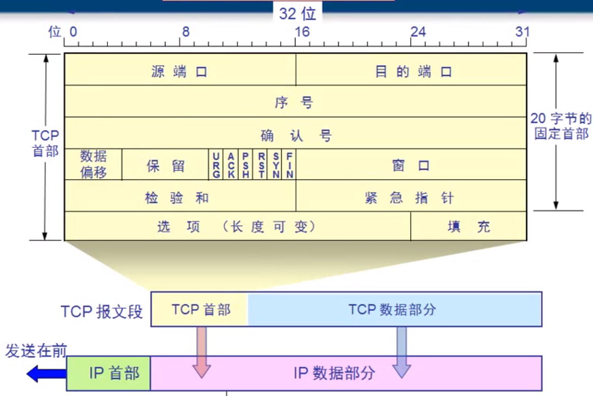
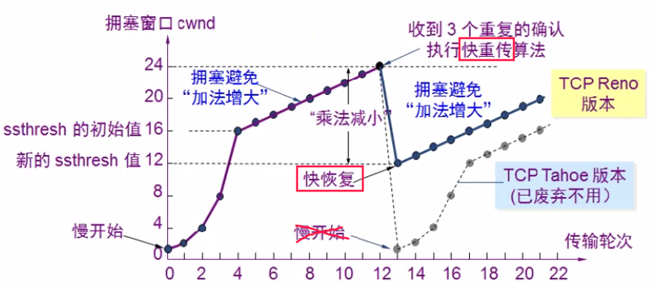

# TCP报文首部

- 源端口，目标端口：各占2字节；

- 序号（seq）：数据分段的时候，每一段的第一个字节在整个数据中是第几个字节，序号就是几；用于能够准确的分段发送数据；

- 确认号（ack）：接收端收到数据之后，返回确认信息；确认号是接收端要接受的下一个数据包的起始字节；
  
  （就是下一个数据包的序号）
  
  比如1~4字节发送完成，接收端返回确认信息5，表明要求发送第5个字节起始的数据包；

- 数据偏移：用来记录，TCP首部从开始数，第几个字节开始是数据部分；
  
  （4位二进制表示，1个1代表4个字节，也就是说最长60字节，以后是数据）

- 保留：6位二进制，没有用；

- 标志位：
  
  - URG：urgent表示紧急数据，此标志位=1，能够在发送端的TCP缓存中插队；比如用Ctrl+C打断数据传输，此命令的数据包会插队到TCP缓存第一位置，进行打断数据传输；
  
  - ACK，SYN：ACK表示确认号是否有效，SYN表示想要建立会话
    
    （**三次握手**）客户端想要与服务器建立会话，客户端向服务器发送数据包中序号=0，确认号=0，ACK=0（表示确认号无效，这个包中没有确认号），SYN=1（表示想要建立会话）；
    
    服务器同意建立会话，返回的数据包中SYN=1（表示可以建立回话），ACK=1（表示确认号有效），序号=0，确认号=1；
  
  - PSH：PUSH标志位，主要用于数据接收端，此标志位为1的数据包在接收端的TCP缓存中能够插队，优先提交；
  
  - RST：此值为1，表明会话出现严重问题，需要断开连接重新建立；比如刷新页面，就是RST标志位为1，重新建立会话；
  
  - FIN：表示释放连接的标志位；比如一个会话的数据传输完毕，后续数据包的FIN为1，表示释放连接；（**四次挥手**）

- 窗口：

- 校验和

- 紧急指针：只有URG为1，此指针才发挥作用，表示紧急数据的结束字节数；（2个字节）

传输连接有三个阶段：

- 连接建立（三次握手）
- 数据传送
- 连接释放（四次挥手）

# TCP三次握手

连接建立

TCP的连接建立都是采用客户服务器方式；

TCP使用**三次握手**建立连接：（确保网络畅通）

- 客户端发送连接请求报文给服务器：
  
  SYN=1(表示想要建立会话)
  
  ACK=0(表示无效的确认号，因为在没有真正传输数据的时候，不需要确认号)
  
  seq=x(初始序号为x)；34
  
  TCP规定SYN=1的报文段，不能携带数据，但要消耗掉一个序号；
  
  A客户机进入SYN-SENT（同步已发送状态）

- 服务器如果同意建立连接，则向客户端发送确认报文段：
  
  SYN=1，ACK=1，ack=x+1(确认号：上一个包的seq+1)，seq=Y(选择一个初始序号)，;
  
  此报文段，也不能携带数据，需要消耗一个序号；
  
  B服务器进入SYN-RCVD（同步收到状态）

- 客户端收到服务器的确认后，还需要向服务器进行确认，发送确认报文段：
  
  ACK=1，ack=y+1(上一个包的seq+1)，seq=x+1(这里的seq仍然是)
  
  此报文端可以携带数据，也可以不携带数据，不携带数据则不消耗序号，那么seq仍然是x+1；
  
  客户端收到服务器的确认后，状态变为ESTAB-LISHED（已建立连接状态）
  
  服务器收到客户端的确认后，状态变为ESTAB-LISHED（已建立连接状态）

**明明前两次数据包已经确认了连接，为什么要发第三个数据包？**

防止失效的连接请求报文段被服务端接收，从而产生错误；

所以：不能第一个报文，就建立连接；

客户端发送第一次：连接1，由于网络问题，迟迟到达；

客户端再次发送：连接2，到达了，双发直接建立连接（两次握手）

通信完毕，断开连接，此时连接1到达服务端，服务端再次建立了连接，

但是客户端并不会响应，也不会发送数据给服务端；

服务端资源浪费；

# TCP四次挥手

- A首先向B发出连接释放报文：
  
  **FIN=1**(连接终止标志位)
  
  然后A进入**FIN-WAIT-1**（终止等待1状态），等待B确认
  
  TCP规定：FIN报文段即使不携带数据，也要消耗一个序号；

- B收到连接释放报文，通知应用程序并发出确认释放连接：
  
  **ACK=1**
  
  B进入**CLOSE-WAIT**（关闭等待状态），到此，A到B的连接就释放了，TCP连接处于半关闭状态；A已经不会向B发送数据了，但是B仍然可以向A发送数据；

- A收到B的确认后，进入FIN-WAIT-2（终止等待2状态），等待B发出连接释放报文；

- 若应用程序没有要向A发送的数据，就通知TCP释放连接，发送连接释放报文：
  
  **FIN=1，ACK=1**，ack=u+1(重复上次已经发送的确认号)
  
  seq=w(w仍然是上一个数据包的最后字节+1，在半关闭状态B有可能继续向A发送了数据)
  
  B进入**LAST-ACK**（最后确认状态）

- A收到B的连接释放报文，返回确认：
  
  **ACK=1**，ack=w+1，seq=u+1
  
  然后A进入**TIME-WAIT**（时间等待状态），因为此时还需要等待2MSL（2个最大报文生存时间）才能真正释放连接，进入CLOSED状态；

- B收到A的确认，进入CLOSED状态；

### TIME-WAIT阶段的作用

确保B能收到确认报文，如果B没收到，那么B会超时重传连接释放报文，那么A在2MSL内，就能收到这个重传的报文，再次确认；

MSL：（Maximum Segment Lifetime  报文最大生存时间 ）任何报文在网络上存在的最长时间，超过这个时间报文将被丢弃

# TCP可靠传输原理

### 一、ARQ协议（停止等待协议）

1、每一个数据包，都必须有确认；（停止等待）

2、超时重传，超时（RTT），重新发送；一个来回是一个RTT时间（往返时间）；

3、确认信息丢失，仍然重传，重新确认；

4、确认迟到，依然重传，迟到的确认忽略；

### 二、连续ARQ协议

连续ARQ = ARQ协议（选择性重传） + 滑动窗口

ARQ协议有点是简单，但是缺点是信道利用率太低；

连续ARQ协议：

一次发送多个数据包，而不进行等待；

此协议配合**以字节为单位滑动窗口协议**：

不必每一个段进行一次确认应答，而是以一个窗口的大小进行确认。减少往返时间，提高速度；

发送窗口：表示一次性可发送的数据包的个数，当1收到确认，则窗口右移一位，继续发送6；

### 三、快重传机制

在滑动窗口下，如果发生丢包的情况，怎么处理？

比如第二个包丢了，接收方会将上一个确认信息（第一个包的确认信息）

**连续重复确认三次**，来表示发生丢包现象，要求重传；

这样，发送发就会意识到网络可能出现了**拥塞现象**，进而采取措施，但是这里不执行慢开始算法，而是执行快恢复算法：

# TCP流量控制

为什么要流量控制？

因为客户端和服务器处理数据的速度不相同，不能出现，发送方发送太快，接收方来不及接受，而导致数据丢失的情况，所以需要流量控制，让发送方不要发的太快，接收方能够全部接受；

### 利用滑动窗口实现流量控制

- 发送端、接收端之间会互相通信来调整滑动窗口大小；
- 通过，修改滑动窗口大小，来实现流量控制；

比如：A为发送方，B为接收方

在建立连接的时候，B会告诉A：B的滑动窗口大小（比如rwnd=400）；

A会根据B的rwnd大小，来调整自己的窗口大小；

B在恢复确认信息的时候，可以动态控制滑动窗口的大小，来给自己处理数据的时间；

比如，B要处理数据，恢复确认信息中rwnd=0，表示我滑动窗口为0，你别发数据了，我先处理完成之前的数据；这时候，A会发送1个字节的零窗口探测报文段给B，B如果处理完数据了，回复的rwnd大于0了，那么就继续传送数据；

# TCP网络拥塞

### 一、慢开始算法和拥塞避免算法

- 慢开始算法：当发送端拥塞窗口(cwnd) < 门限，使用慢开始算法，拥塞窗口从1开始**指数增长**；

刚开始是指数增长：1，2，4，8.....

当到达**慢开始门限（ssthresh）**，就转为使用避免拥塞算法，每次加一；

拥塞窗口：发送端使用的窗口；

- 避免拥塞算法：当拥塞窗口 > 门限，就开始使用避免拥塞算法（**线性增长**）
  
  如果发生网络拥塞（丢包现象），重新启用满开始算法，门限值也会更小

缺陷：

每次发生网络拥塞，拥塞窗口就会重新从1开始；效率比较低；

### 二、快重传和快恢复算法

新的连接依然是采用慢开始算法，达到门限，依然是采用拥塞避免的线性增长；

**快重传**：就是在连续ARQ协议下，发生丢包，会触发快重传；

接收方丢包，连续发送三个重复确认，发送方收到，就知道丢包了，重复发送丢的报文；

如果发生快重传，就表示，有可能发生了网络拥塞；

**快恢复**：发生网络拥塞，不再是将拥塞窗口置1（不再使用慢开始）；而是置为：一个**新的门限（ssthresh）**；

新的门限 = 网络拥塞发生时的窗口的一半大小；

- 刚开始还是慢开始的算法；

- 当发生快重传，判断可能发生拥塞；

- 如果能够顺利的收到快重传的三次重复确认，就说明，网络还不是特别拥塞；
  
  那就不采用**慢开始**，而是采用**快恢复**；

# TCP保活计时器

服务端会设有保活计时器，根据时间持续计时；

- 服务端每次收到请求，都会复位保活计时器；

- 如果客户端出现故障，无法主动断开连接，保活计时器一直计时到超时，服务端会发送探测报文，连续发送多个探测报文，没有反应，服务端主动断开连接；

# UDP和TCP区别

1、TCP20字节固定首部，UDP只需要8字节；UDP首部开销更小；

2、UDP不需要建立连接；TCP面向连接，需要三次握手建立连接；

3、

UDP是不可靠的传输，尽最大努力交付，会丢包，不会流量控制，也不受拥塞算法调节；

TCP是可靠传输，有停止等待协议、连续ARQ协议、滑动窗口、快速重传机制等去保证TCP的可靠传输和流量控制，另外还有四种算法来解决网络拥塞（慢开始、避免拥塞算法、快重传、快恢复）；

4、UDP是基于报文的；TCP是基于字节流的；

TCP会有一个发送缓冲区，不看报文大小，每次发送固定的字节数；

- 如果报文大，会进行拆分；
- 如果小，会多个报文组合发送；

UDP的报文是由应用层决定的，一个报文多大，就发送多少，没有边界的概念；

# SYN/Accept队列

1、客户端发起建立连接请求，服务端收到请求时，会将Socket打开，即执行Socket的accept系统调用，Socket进入阻塞状态；

2、服务端响应客户端，并将Socket加入<mark>半连接队列</mark>（SYN队列）；

3、服务端收到客户端的确认后，从半连接队列中获取对应的Socket，accept返回，将socket加入<mark>全连接队列</mark>（Accept队列）

4、Socket出队，并执行accept()，完成连接建立，开始进行网络读写；

# SYN泛洪

攻击者发送大量的连接建立请求，但不响应第二次握手，导致服务端半连接队列满，无法处理正常请求的一种攻击；不会窃取信息，但会致使服务不可用；

Linux会重试5第二次握手，每次间隔递增，大概需要持续60s左右，非常耗时；

因此Linux提供了SYNCookie来解决这种问题，类似于HTTP Cookie，连接信息不再保存在半连接队列中，而是将连接信息编码返回给客户端，客户端响应二次握手时，携带，服务端再进行连接的建立；
- 需要开启：net.ipv4.tcp_syncookies

