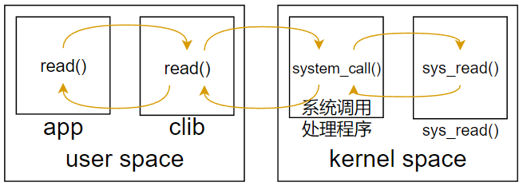
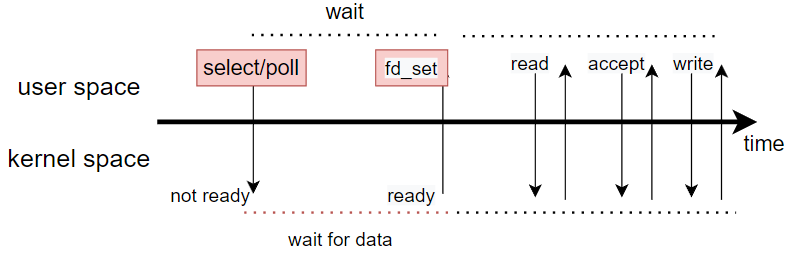
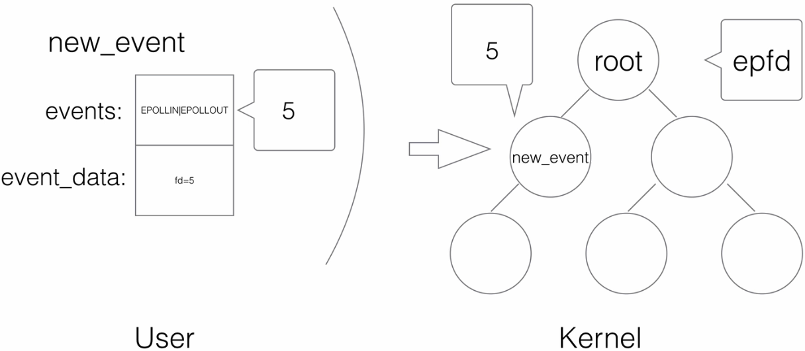
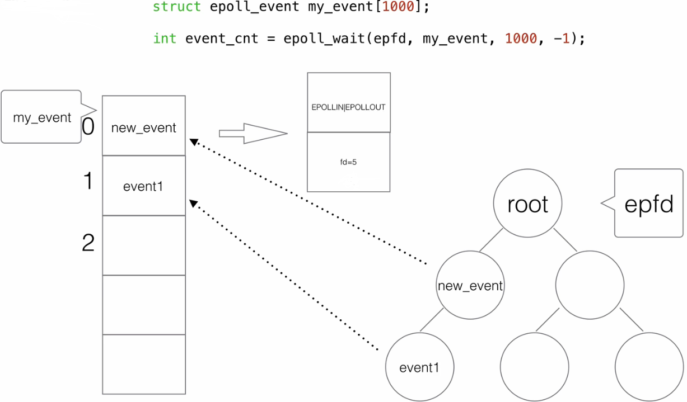

# 文件描述符

- fd是流的入口；

# 系统调用



systemcall：open

```c
 int open(const char *pathname, int flags, mode_t mode);
```

- pathname：要打开的文件位置

- flags：定义文件行为（阻塞式、非阻塞式）

- mode：文件读写方式：O_RDONLY, O_WRONLY, O_RDWR.

systemcall：read

```c
ssize_t read(int fd, void *buf, size_t count);
```

- fd:指定要读取的文件；

- buf：由用户线程设定的缓存区，存放读取的内容；

- count：读取的字节数

- 成功：返回读取到的字节数；错误：-1；无数据：0；

# Blocking I/O


- 当fd设置成阻塞模式（open时由flags设置），调用read会等待数据处理完成，再返回；

- 阻塞线程会让出CPU，不会占用系统资源；（优势，相比于非阻塞的忙轮询）

- 当任务量大，且系统资源足够，一直等待IO，处于阻塞状态就大大降低系统性能、增加处理时延，系统资源浪费；（缺点）

适合：计算密集型；

不适合：IO密集型；

# NonBlocking I/O


- fd设置成非阻塞，read立即返回，无论有没有读取完成；当检测到fd为readable，则执行数据拷贝，完成读取；

- 非阻塞通常需要<mark>忙轮询</mark>来实现，大量占用CPU；不断检测fd状态；（缺点）

- 

--------------------------

> Blocking\NonBlocking都为同步模式
> 
> 文件是否读取完成、数据是否准备完成，都需要自行检查；
> 
> 只不过非阻塞IO等待时，可以去干别的事儿；
> 
> 异步：不需要等待，也不需要轮询，而是被通知；

-----------------------

# I/O Multiplexing

阻塞、非阻塞的缺陷：

非阻塞模式下，线程不停发起系统调用，不断轮询fd状态系统调用，CPU资源占用高；

阻塞模式下，单线程只能处理一个事件，导致有就绪事件到来，也需要等待；

IO多路复用：为了避免忙轮询带来的CPU压力，单独使用一个阻塞线程，专门监听事件的状态，当事件就绪，交由其他线程处理；

- 复用的线程是阻塞IO；

- 监听多种IO事件；

IO多路复用的实现：select、poll、epoll

## select/poll



多路复用线程调用select、poll，阻塞等待事件集合返回，拿到fd集合，根据集合中的就绪事件，处理不同的事件（可由多线程处理）；

区别：

1、fd_set返回大小不同

- select默认1024，可调整，但是有限；（现在好像不限制了，待确定）

- poll基本无限制，基于内存；

2、fd_set返回后处理机制不同：

- select会返回所有fd，具体是否就绪，什么事件就绪，由用户线程遍历处理；

- poll仅返回就绪事件，直接处理即可；

# epoll

参考：[刘丹冰—epoll的API及内部机制](https://www.bilibili.com/video/BV1jK4y1N7ST/?p=3&spm_id_from=pageDriver&vd_source=ce67cf212f4a949cf75348b5404c5e27)

epoll接口的核心是在内核创建一个epoll数据结构：**一个包含两个列表的容器**；

能够处理的最大请求，取决与系统可打开的文件描述符个数；

> `cat /proc/sys/fs/file-max`查询可得

## epll接口

1、<mark>epoll_create</mark>

```c
int epoll_create(int size);
```

- size：需要监听的socket数量；现在已经不需要了，内核会动态调整，但在调用时，仍需要传递大于0的一个数；

创建epoll实例，返回一个文件描述符指向创建的epoll实例；

此fd用于后续所有对epoll接口的调用，不需要时则删除此fd，内核则会销毁epoll实例，释放所有关联的资源；

本质是创建了一颗红黑树，size为节点个数；

2、<mark>epoll_ctl</mark>

```c
int epoll_ctl(int epfd, int op, int fd, struct epoll_event *event);
```

- epfd：指向epoll实例的fd，由create创建；

- fd：需要执行以上动作的文件描述符（红黑树中的一颗节点）

- epoll_event：想要关联到fd上的事件；
  
  - EPOLLIN：对fd绑定读事件，可以执行read()系统调用；
  
  - EPOLLOUT：对fd绑写读事件，可以执行write()系统调用；
  
  - .....
  
  event是一个位掩码，可以绑定多个：
  
  `epoll_event.events = EPOLLIN | EPOLLOUT`

- op：需要对fd执行的动作：
  
  - EPOLL_CTL_ADD：将此fd添加进红黑树，并绑定event；
  
  - EPOLL_CTL_MOD：将event绑定到fd上；
  
  - EPOLL_CTL_DEL：注销、删除fd，此时event参数被忽略，可以为null；

epoll_ctl就是在操作已经创建完成的epoll实例中的节点，添加、修改、删除指定fd上的监听事件；

执行过程：

用户创建epoll_event结构体，并添加事件、用户数据、指定fd，然后调用epoll_ctl；内核会在epfd红黑树中的对应fd上进行事件绑定；当此fd事件就绪时，就触发对应的事件；



3、<mark>epoll_wait</mark>

```c
int epoll_wait(int epfd, struct epoll_event *events,
                      int maxevents, int timeout);
```

- epfd：监听等待的epoll实例；

- events：是一个epoll_event空列表，有就绪fd时，内核会将对应epoll_event结构体，放入数组中，返回后，用户线程进行处理；

- maxevents：大于等于events的大小；

- timeout：超时时间；
  
  - timeout=-1，永久阻塞，直到有时间返回；
  
  - timeout=0，非阻塞，立即返回，无论有无就绪IO；
  
  - timeout>0，阻塞指定时间后返回；



epoll_wait就是在等待epoll实例上的事件发生，如果没有事件，则阻塞；

## epoll实现

```c
// 创建epoll
int epfd = epoll_create(1000);
// 添加事件
epoll_ctl(epfd, EPOLL_CTL_ADD, listen_fd, &listen_event);
// 循环监听
while(1){
    int active_cnt = epoll_wait(epfd, events, 1000, -1);
    for(i=0; i<active_cnt; i++){
        if (event[i].data.fd & EPOLLIN){
            // TODO read
        ) else if (event[i].data.fd & EPOLLOUT) {
            // TODO write
        }
    }
}
```

## epoll水平触发、边沿触发

数字电路中由电平、边沿触发

- 电平触发（水平触发）：当处于高电平时，则保持触发，处理完成降为低电平；

- 边沿触发：只有从低电平到高电平变化的瞬间，才会输出，输出完成，不会再次输出；

epoll中则是：

- 水平触发：数据未处理，则下次调用wait，仍然可以返回未处理的数据；
  
  - 容错高；

- 边沿触发：只会返回一次，无论是否处理；
  
  - 效率高；

# Asynchronous I/O

- 用户线程

- 异步IO在多核处理器上才能发挥性能；假定在单核处理器中，即使使用异步IO，用户线程也无法利用异步的特性处理别的事情；反而，单核下，用户线程和内核线程将不停的抢占CPU。

为什么数据库连接池不改成IO多路复用模型？

可行，代价很高；

web容器通常是每个请求单个线程处理，如果数据库采用多路复用：

1. 一个请求线程处理完其余业务逻辑，需要查询数据库，此时可能执行查询任务的线程就不是同一个请求线程，系统更加复杂；

2. JDBC协议不支持；

## 异步接口

Linux-aio接口提供一系列异步接口：

systemcall:aio_read()

```c
int aio_read(struct aiocb *aiocbp);
```
