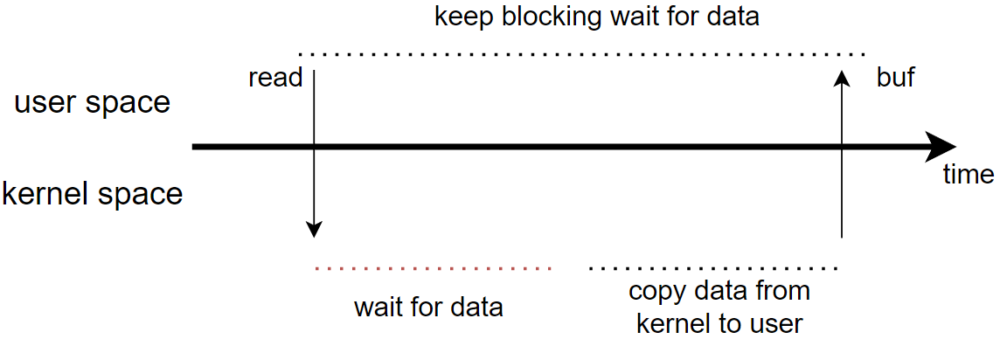
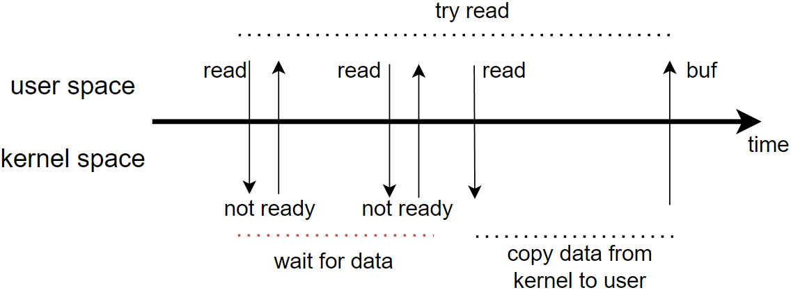
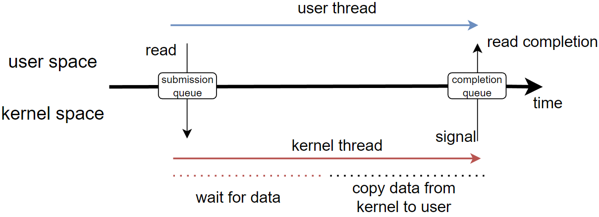

# Blocking I/O

- 当fd设置成阻塞模式（open时由flags设置），调用read会等待数据处理完成，再返回；

- 阻塞线程会让出CPU，不会占用系统资源；（优势，相比于非阻塞的忙轮询）

- 如果阻塞是在读写，那应该阻塞，但其实读写的阻塞很快，并不耗时；但是数据还没准备好，线程白白空等，那就是浪费；

- 针对阻塞IO，在任务量大的时候，就只能创建更多线程，但是linux下线程相当于进程，创建、切换的开销很大，

# NonBlocking I/O

- fd设置成非阻塞，read立即返回，无论有没有读取完成；当检测到fd为readable，则执行数据拷贝，完成读取；

- 非阻塞IO就是立即返回；但它仍然是同步的；

- 图中是一个使用非阻塞IO的错误例子；如果一个任务，是需要一直监听的，比如：socket.accept等待事件到来；此时使用非阻塞IO是不明智的，需要不断轮询并且占用CPU，应当阻塞，直到事件到来，并且不占用CPU；

--------------------------

> Blocking IO\NonBlocking IO都为同步模式
> 
> - Blocking IO:不真正干活的时候也在阻塞；
> 
> - NonBlocking IO：只有真正干活的时候阻塞；read、write
> 
> - Asynchronous I/O：完全不阻塞，读写交由另一个线程，完成后通知；

因此最好的情况是：内核的读写过程，用户线程应该也不参与，内核读取完成通知用户线程，用户线程直接获取。

-----------------------

# Asynchronous I/O

异步IO在多核处理器上才能发挥性能；

假定在单核处理器中，即使使用异步IO，内核线程在处理用户提交的请求，用户线程也无法利用异步的特性处理别的事情；反而，单核下，用户线程和内核线程将不停的抢占CPU。

内核数据就绪，如何通知用户线程？

用户线程如果要将内核数据copy进来，传统情况下，不得不进行系统调用，这就与异步初衷违背；

因此，势必需要开辟用户和内核空间的共享区域，内核数据就绪，直接copy进共享内存即可；

Linux的异步IO有：aio、io_uring;

io_uring采取<mark>生产者消费者模型</mark>，势必需要两个<mark>队列</mark>：

- 提交队列：用户线程提交IO请求，应用为生产者，内核为消费者；

- 完成队列：内核完成请求，内核为生产者，生产完成的事件，应用为消费者；

共享缓冲区也带来新的问题：

1、竞争；

2、共享缓存区大小的维护，高并发情况下，事件的完成速度、消费速度都很难控制，要考虑缓存区的大小对内核带来的压力；

# 对比

异步IO：缓存区大小维护、竞争导致实现困难；

目前IO多路复用模型已经能满足大量的场景，epoll并没有竞争问题，性能很好；

# 问

为什么数据库连接池不改成IO多路复用模型？

可行，代价很高；

web容器通常是每个请求单个线程处理，如果数据库采用多路复用：

1. 一个请求线程处理完其余业务逻辑，需要查询数据库，此时可能执行查询任务的线程就不是同一个请求线程，系统更加复杂；

2. JDBC协议不支持；
