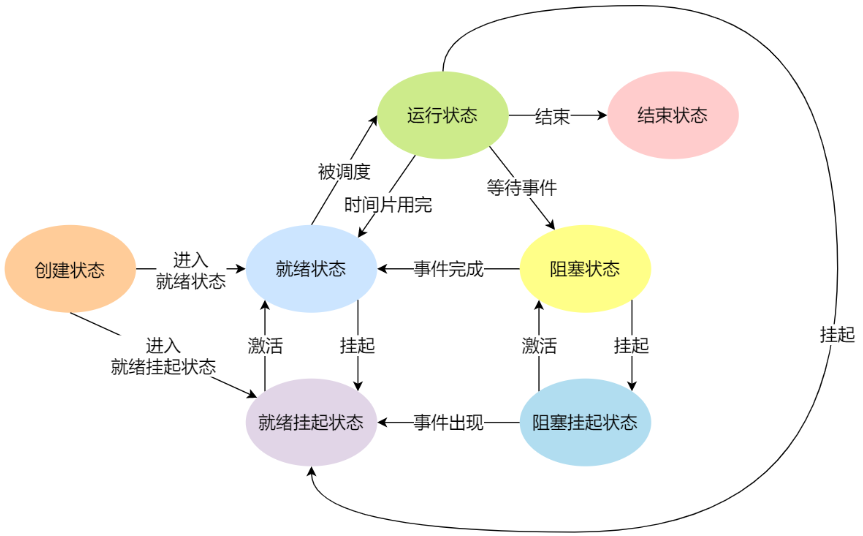
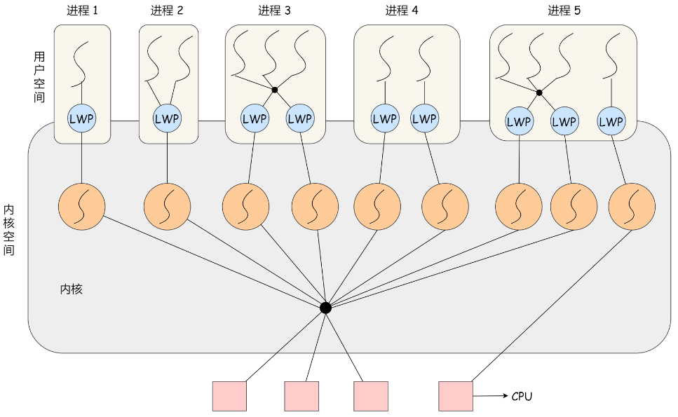

# 进程

参考：[小林](https://blog.csdn.net/qq_34827674/article/details/107305756)

## 进程状态

## 进程通信

1、管道

2、共享内存：高效，但需要加锁保护；

3、消息队列

4、socket：基于TCP、UDP通信

# 线程

分为：用户线程、内核线程、轻量级进程(LWP)

内核、用户线程对应关系：

- 1对1

- 1对多

- 多对多

轻量级进程(LWP)：内核中专门支持用户线程的轻量进程，拥有进程最小的执行上下文；总是跟内核线程一对一；

# socket

要进行网络通信，就需要建立网络连接，网络连接需要建立在约定的通信协议之上，如：TCP协议、UDP协议；为了能够更方便的通信，对协议进行抽象，定制接口，就形成了socket规范，封装成Socket接口，供上层开发者调用。

Socket：是传输层的协议，对上层（应用层）暴露的抽象接口；

# 

内核缓冲区：磁盘告诉缓存（PageCache）
