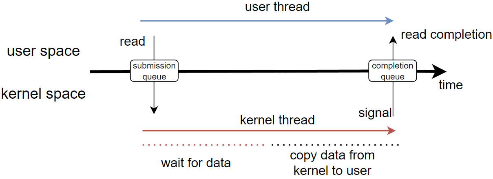

# 五种IO分类：

- 同步IO：阻塞IO、非阻塞IO、IO多路复用、信号驱动IO

- 异步IO

同步、异步本质是：接受内核通知的事件类型不同；

同步接受<mark>就绪事件</mark>，仅通知应用程序时间就绪，需要用户主动处理；

异步接受<mark>完成事件</mark>，读写都会由内核处理完成，用户不需要再处理，直接使用；

用户进程感知IO事件，只有两种方式：主动询问、信号通知；

# Blocking I/O

调用read会在两个阶段阻塞：

1、等待读取网卡的网络数据；

2、等待数据从内核空间拷贝到用户空间；

特点：

- 阻塞线程会让出CPU，不会占用系统资源，但当前线程挂起，不能处理别的任务；
  
  因此通常需要开启大量线程，提高并发能力；但线程频繁切换又会带来很大的开销；

# NonBlocking I/O

数据未准备好，read系统调用立即返回-1；

例如执行read函数，非阻塞IO会在一个阶段阻塞：

1、数据从网卡拷贝到内核不会阻塞，在未完成时，read立即返回；

2、数据从内核缓存区拷贝到用户缓冲区，read阻塞；

对于非阻塞IO，要么忙轮询，要么配合SIGIO信号的通知，有socket可读可写了，再读写；因此，尽量选择后者，忙轮询还不如阻塞了，还占用CPU；

即使使用信号通知，只能通知可读，仍然需要应用程序调用read将内核缓冲区数据拷贝到用户缓冲区；

--------------------------

> Blocking IO\NonBlocking IO都为同步模式
> 
> - Blocking IO:不真正干活的时候也在阻塞；
> 
> - NonBlocking IO：只有真正干活的时候阻塞；read、write
> 
> - Asynchronous I/O：完全不阻塞，读写交由另一个线程，完成后通知；

因此最好的情况是：内核的读写过程，用户线程应该也不参与，内核拷贝完成通知用户线程，用户线程直接使用。

-----------------------

# IO多路复用

通过IO复用函数，向内核注册一组事件，当这些事件就绪时，一并通知应用程序；

本质仍然<mark>阻塞</mark>，只是<mark>同时监听多个IO事件</mark>提高了处理效率；

IO多路复用的实现：select、poll、epoll

# 事件驱动IO

# Asynchronous I/O

同步IO、异步IO区别本质是：<mark>内核通知的IO事件不同</mark>；

- 同步IO：内核向app通知IO<mark>就绪</mark>事件，读写仍需用户线程执行，阻塞完成；

- 异步IO：内核向app通知IO<mark>完成</mark>事件，用户线程直接使用已拷贝完成的数据；

异步IO读写操作，总是立即返回，不会阻塞；

两个阶段都不会阻塞，等待网卡数据和内核数据拷贝到用户空间都由内核完成；

数据拷贝完成，通过信号通知应用程序，app直接读取准备好的数据即可；

异步IO通常在多核处理器上才能发挥性能：

因为用户线程在处理其他逻辑时，仍需占用CPU，争夺内核线程；

内核数据就绪，如何通知用户线程？

用户线程如果要将内核数据copy进来，传统情况下，不得不进行系统调用，这就与异步初衷违背；

因此，势必需要开辟用户和内核空间的共享区域，内核数据就绪，直接copy进共享内存即可；

Linux的异步IO有：aio、io_uring;

io_uring采取<mark>生产者消费者模型</mark>，势必需要两个<mark>队列</mark>：

- 提交队列：用户线程提交IO请求，应用为生产者，内核为消费者；

- 完成队列：内核完成请求，内核为生产者，生产完成的事件，应用为消费者；

共享缓冲区也带来新的问题：

1、竞争；

2、共享缓存区大小的维护，高并发情况下，事件的完成速度、消费速度都很难控制，要考虑缓存区的大小对内核带来的压力；

# 对比

异步IO：缓存区大小维护、竞争导致实现困难；

目前IO多路复用模型已经能满足大量的场景，epoll并没有竞争问题，性能很好；

# 问

为什么数据库连接池不改成IO多路复用模型？

可行，代价很高；

web容器通常是每个请求单个线程处理，如果数据库采用多路复用：

1. 一个请求线程处理完其余业务逻辑，需要查询数据库，此时可能执行查询任务的线程就不是同一个请求线程，系统更加复杂；

2. JDBC协议不支持；
