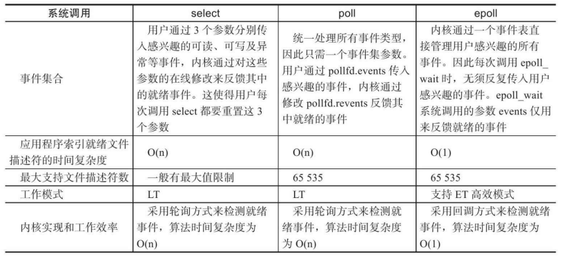

# I/O Multiplexing

<mark>IO多路复用</mark>单独使用一个阻塞线程，专门监听事件的状态，当事件就绪，交由其他非阻塞线程处理；

**主要流程：**

1、向内核注册需要监听的文件描述符

2、阻塞等待内核返回就绪事件；

3、根据返回的就绪事件，采取不同的处理方式；

**什么情况下，socket可读可写？**

1、当socket读写缓冲区的字节数大于设置的<mark>低水位</mark>，则触发为可读可写；

(可由setsockopt系统调用配置)

2、有新的socket连接，则可读；

3、有未处理的错误，则可读可写；

IO多路复用的实现：select、poll、epoll

# select

```c
int select(int nfds,fd_set*readfds,fd_set*writefds,fd_set*exceptfds,
struct timeval*timeout)
```

- nfds:要监听的文件描述符总数；

- fd_set：要监听的文件描述符集合；
  
  分为：readfds、writefds和exceptfds：指可读、可写、异常等事件对应的文件描述符集合
  
  通过这三个参数传入应用程序感兴趣的fd；返回时，内核修改对应的就绪文件描述符来告知应用程序，哪些fd就绪了；

- timeout：超时事件

# poll

```c
int poll(struct pollfd*fds,nfds_t nfds,int timeout)
```

- nfds：要监听的文件描述符总数；

- fds：一个结构体，指定应用程序要监听的文件描述符；包括可读、可写、异常等
  
  与select类似；

- timeout：超时事件

**select、poll基本类似，区别仅在于**：

1、可监听的socket数量不同

- selec使用fd_set，默认1024，可调整，但是有限；（现在好像不限制了）

- poll时使用pollfd，基本无限制，基于内存；

2、fd_set返回后处理机制不同：

- select会返回所有fd，具体是否就绪，什么事件就绪，由用户线程遍历处理；

- poll仅返回就绪事件，直接处理即可；

select/poll缺陷：

1、大量的用户、内核间拷贝；

2、需要对返回结果遍历；

# epoll

参考：[刘丹冰—epoll的API及内部机制](https://www.bilibili.com/video/BV1jK4y1N7ST/?p=3&spm_id_from=pageDriver&vd_source=ce67cf212f4a949cf75348b5404c5e27)

epoll函数为Linux特有的IO复用函数

epoll接口的核心是在内核创建一个epoll数据结构：**一个包含两个列表的容器**；

能够处理的最大请求，取决与系统可打开的文件描述符个数；

> `cat /proc/sys/fs/file-max`查询可得

1、epoll_create

创建epoll实例，返回一个文件描述符指向创建的epoll实例（一颗红黑树）

```c
int epoll_create(int size);
```

- size：需要监听的socket数量；现在已经不需要了，内核会动态调整，但在调用时，仍需要传递大于0的一个数；

此fd用于后续所有对epoll接口的调用，不需要时则删除此fd，内核则会销毁epoll实例，释放所有关联的资源；

2、epoll_ctl

操作已经创建完成的epoll实例中的节点，添加、修改、删除指定fd上的监听事件；

事件触发后，执行回调：将此fd添加到就绪队列，等待epoll_wait返回；

```c
int epoll_ctl(int epfd, int op, int fd, struct epoll_event *event);
```

- epfd：指向epoll实例的fd，由create创建；

- op：需要对fd执行的动作：
  
  - EPOLL_CTL_ADD：将此fd添加进红黑树，并绑定event；
  
  - EPOLL_CTL_MOD：将event绑定到fd上；
  
  - EPOLL_CTL_DEL：注销、删除fd，此时event参数被忽略，可以为null；

- fd：需要执行以上动作的文件描述符（红黑树中的一颗节点）

- epoll_event：想要关联到fd上的事件；
  
  是一个位掩码，可以绑定多个事件：`EPOLLIN | EPOLLOUT`
  
  - EPOLLIN：对fd绑定读事件，可以执行read()系统调用；
  
  - EPOLLOUT：对fd绑写读事件，可以执行write()系统调用；
  
  - .....

3、epoll_wait

等待事件就绪，返回就<mark>绪的文件描述符</mark>的个数；将就绪队列的事件从内核复制到用户空间；

```c
int epoll_wait(int epfd, struct epoll_event *events,
                      int maxevents, int timeout);
```

- epfd：监听等待的epoll实例；

- events：是一个epoll_event空列表，有就绪fd时，内核会将对应就绪的事件，放入数组中，返回后，用户线程进行处理；<mark>只包含就绪事件，效率高</mark>；

- maxevents：大于等于events的大小；

- timeout：超时时间；
  
  - timeout=-1，永久阻塞，直到有时间返回；
  
  - timeout=0，非阻塞，立即返回，无论有无就绪IO；
  
  - timeout>0，阻塞指定时间后返回；

epoll_wait就是在等待epoll实例上的事件发生，如果没有事件，则阻塞；

## epoll实现

```c
// 创建epoll
int epfd = epoll_create(1000);
// 添加事件
epoll_ctl(epfd, EPOLL_CTL_ADD, listen_fd, &listen_event);
// 循环监听
while(1){
    int active_cnt = epoll_wait(epfd, events, 1000, -1);
    for(i=0; i<active_cnt; i++){
        if (event[i].data.fd & EPOLLIN){
            // TODO read
        ) else if (event[i].data.fd & EPOLLOUT) {
            // TODO write
        }
    }
}
```

## 水平触发LT、边沿触发ET

数字电路中由电平、边沿触发

- 电平触发（水平触发）：当处于高电平时，则保持触发，处理完成降为低电平；

- 边沿触发：只有从低电平到高电平变化的瞬间，才会输出，输出完成，不会再次输出；

epoll中则是：

- 水平触发：数据未处理，则下次调用wait，仍然可以返回未处理的数据；
  
  - 容错高；

- 边沿触发：只会返回一次，无论是否处理；
  
  - 效率高；

# 对比select/poll/epoll

select：

- 监听的socket fd数量受限；默认1024，可修改但

- fd_set集合需要不断在用户和内核间复制；调用select和返回，<mark>复制两次</mark>；

- 监听的事件分开处理：readfds、writefds和exceptfds分别对应可读、可写、异常等事件

- select本质是<mark>轮询</mark>，返回<mark>全量集合</mark>(包含就绪、未就绪事件)，需要用户再遍历，找到就绪的fd，进行处理，O(n)复杂度；

- 处理完需要重置fd事件，重新设置需要监听的事件，才能再次select调用；

- 仅工作在水平触发LT模式；未处理的事件，下次依然返回；

poll：

- 监听的socket fd数量不再受限；

- fd_set集合需要不断在用户和内核间复制；调用poll和返回，<mark>复制两次</mark>；

- 监听的事件不再分开，而是统一处理；

- poll本质是<mark>轮询</mark>，仍然返回<mark>全量集合</mark>(包含就绪、未就绪事件)，需要再次遍历；O(n)

- 不再需要重新设置监听事件，处理完就绪事件后，直接调用poll；

- 仅工作在水平触发LT模式；未处理的事件，下次依然返回；

epoll:

- 监听的socket fd数量不再受限；

- 不使用fd_set，而是直接在内核创建epoll红黑树实例，只有事件epoll_wait返回时，将就绪fd从内核复制到用户空间，每次仅<mark>复制一次</mark>；

- 监听事件，统一处理；

- epoll_wait本质是<mark>回调方式</mark>，只返回就绪事件，复杂度O(1)
  
  当socket fd就绪时，就触发回调：将该fd对应的事件插入到就绪队列，因此就绪队列中仅存在就绪事件；

- 不需要重置事件，需要修改时，调用epoll_ctl增量添加、修改；

- 可选边沿触发ET，更高效；



# netpoll

# IO多路复用模型

## 单线程

```java
while(channel=Selector.select()){   // 阻塞
  if(channel.event==accept){
      // accept
  }
  if(channel.event==write){
      // write 非阻塞
  }
  if(channel.event==read){
      // read 非阻塞
  }
}
```
