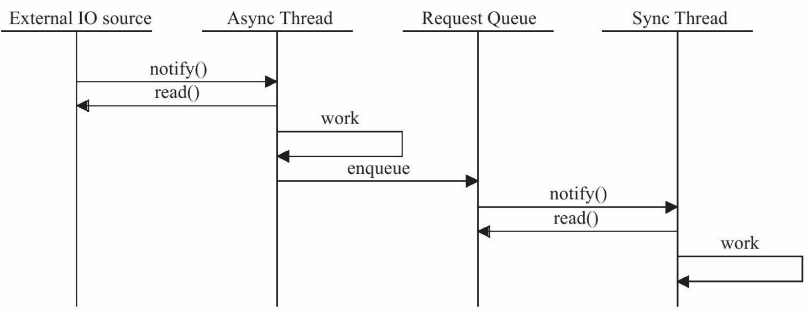
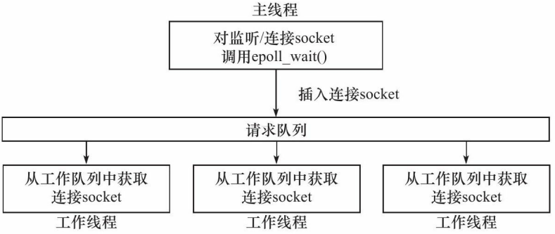
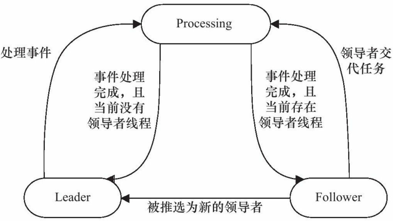

服务器抽象结构分为三个主要模块：

- IO处理单元：IO连接管理模块（IO多路复用、Reactor、异步IO模型等）

- 逻辑单元：业务处理

- 存储单元：服务器数据存储（redis、MySQL等）

上述模型同样适用于集群，在集群中：

IO处理单元可以为负载均衡服务器；逻辑单元可为每一个单节点逻辑服务器；

# 高效IO框架

在基础IO模型之上，逐渐演化出两种高效的事件处理模式：

- Reactor：同步IO模型

- Proactor：异步IO模型

## Reactor

IO读写和业务逻辑处理不分离，逻辑单元需要处理读写事件；

1、主线程(IO处理单元)：仅负责监听事件的发生、调度，当有事件发生交由工作线程处理；通常是放入任务队列中，再唤醒工作线程；

2、工作线程(逻辑单元)：自己负责接受连接、读写、处理业务逻辑；通常被唤醒后，空闲线程之间通过竞争(互斥锁)，获取任务

## Proactor

使用异步IO模型，将读写和业务逻辑彻底分离；

- IO读写操作完全由内核和主线程处理；

- 工作线程只处理业务逻辑；

# 高效并发框架

对于计算密集型，并发编程没有优势，主要针对**IO密集型**；

总体上，分为两种：

- 半同步/半异步 模式：区别于同步异步这里指线程运行方式，非IO处理模式；

- Leader/Followers模式

## 半同步/半异步

同步和异步方式各有优劣，适用于不同场景，从整体考虑应该在合适的场景使用合适的方式；

- 同步方式：适合处理业务逻辑，实时效率相比异步低，但逻辑简单；

- 异步方式：适合处理IO事件，实时性高，但执行方式复杂，调试和扩展困难；

半同步/半异步的基本流程为：

> 异步线程用于处理IO事件，接受到读写完成的事件后，将其加入到队列中，并唤醒同步模式下的工作线程，来获取任务，执行业务逻辑；

半同步/半异步这种抽象的并发模型下，衍生出多种不同的实现：

1、Reactive模式

主线程通常为异步线程，调用epoll_wait()监听IO事件，再将完成的事件加入到共享的请求队列，由工作线程竞争任务，处理业务逻辑；

特点：

- 队列共享，添加、取出任务都需要加锁保护；

- 单个工作线程，只能处理一个客户请求，

## Leader/Followers

不再进行线程分工、派发任务，而是从线程池中选举leader来轮流监听IO事件；

图中主线程可由选举随时切换为工作线程；

1、当IO就绪，当前leader获取IO事件；

2、当前leader从线程池中选出一个新Leader，等待下一个IO事件；

3、选出leader后，当前线程自己处理获得的IO事件；

在这种模式下，线程仅有三种状态：

- Leader：正在等待IO事件；

- Processing：正在处理IO事件、业务逻辑；

- Follower：等待称为新的leader；

# 性能优化点

软硬两个方面考虑，

- 硬件：增加CPU核数、内存大小；

- 软件关注点：池(线程池、连接池)、数据拷贝、上下文切换、锁；

## 池

本质是以空间换时间，硬件资源丰富的前提下，<mark>提前分配资源</mark>，即服务初始化时就创建并初始化运行时需要的资源(线程、连接等)，在运行时则直接从池中获取，<mark>提高运行时效率</mark>，避免创建的开销，

1、提前分配资源，避免运行时创建线程的开销；提高运行时效率；

2、控制线程数，避免动态创建线程，出现线程数不可控的状态；OOM

常见池：

- 线程池

- 连接池：永久的内部连接，常见数据库连接；

## 数据复制

追求高性能，应该避免不必要的数据复制，特别是发生在内核、用户缓冲区的复制；

1、内核能够直接处理socket、文件等中的数据，就不要从用户空间复制；这些数据一般为业务无关数据，业务逻辑不需要处理，就不用复制到用户空间；

如：ftp服务器，客户端请求文件是否存在、权限等，不关心文件内容；此时则可以sendfile零拷贝直接发送给客户端；

如：Kafka使用的零拷贝场景

2、进程间数据传递，大数据量优先考虑共享内存的方式；而非管道或消息队列；

## 上下文切换

主要是不应该使用过多的工作线程，上下文切换将占用大量的CPU时间；

即：不应该一个客户链接就创建一个线程，尽量复用线程：

<mark>什么算是过多？</mark>

## 锁

1、能不用锁，就不用；

2、一定要用锁，尽量考虑更小的锁力度；

如：读写锁本质是：降低锁粒度，只有写操作，才加锁；
