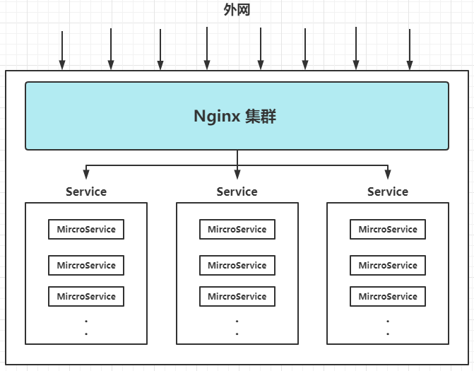

# 命令

启动服务

```shell
./nginx
```

停止服务

```shell
# 优雅停止
./nginx -s quit

# 强制停止
./nginx -s stop
```

重启服务

```shell
# 重新加载配置文件，优雅重启
./nginx -s reload
```

# 配置

```shell
—— 全局配置
—— event：工作模式、连接数
—— http：http全局配置
     |— server：每个server为一个代理服务
          |—location：路由相关配置
     |— upstream：服务负载均衡配置
```

简化配置例子

```roboconf
# 全局配置

# 进程数，对应物理CPU核心数
worker_processes  1;

events {
    # 每一个woker进程 创建的连接数
    worker_connections  1024;
}

http {
    # 引入http全局配置

    # server负载均衡
    upstream my {
        server 172.25.96.1:9999 weight=1;
        server 172.25.96.1:9998 weight=2;
    }

    # 代理服务,一个虚拟主机，监听端口，进行配置、转发等
    server {

        listen       80;        # 绑定的端口号
        server_name  localhost; # 绑定的域名,可配置多个域名 空格分隔，可用正则，最前加上~

        # 此server下的日志记录
        access_log  logs/host.access.log  main;

        # 接收到<域名>:<80>的请求，匹配对应的location路径，进行路由
        location / {
            root   html;        # root根目录，目录名html，放置静态公共资源
            index  index.html index.htm;
        }

        location /admin {
            proxy_pass http://172.25.96.1:9999;
        }

        error_page 500 502 503 504 /50x.html
        location /50x.html {
            root html    # 路由到root目录下，找50下.
        }
    }
}
```

# 负载均衡

## 最常用的策略

轮询、权重

原则：尽量不要造成请求倾斜，ip_hash、第三方插件都容易造成倾斜；

如果有特殊场景，一般使用lua脚本，动态修改负载均衡策略；

## 公共参数

- down：下线，相当于删除
- backup：备用，没有可以server时，才启用
- max_fails：次数达到后，标记为故障状态
- fail_timeout：故障状态后，经过fail_timeout时间，重新标记为正常状态
- proxy_next_upstream_tries：重试次数，超过报错
- proxy_connect_timeout：超时报错

```shell
upstream gin {
 server 172.25.96.1 max_fails=5 fail_timeout=100;
 server 172.25.96.4 proxy_next_upstream_tries=5;
 server 172.25.96.5 back;
}
```

## 轮询(默认)

请求顺序一次转发给所有可用server

无法保持会话

```shell
upstream gin {
 server 172.25.96.1;
 server 172.25.96.4;
}
```

## 权重模式

weight：权重，根据系统配置决策权重；

```shell
upstream gin {
 server 172.25.96.1 weight=1;
 server 172.25.96.4 weight=2;
}
```

## ip_hash

根据ip，对可用server数量，进行hash

服务节点数不变，特定ip落到特定server

```shell
upstream gin {
 ip_hash;
 server 172.25.96.1;
 server 172.25.96.4;
}
```

## 第三方插件

fair、url_hash、less_connet

- 一般不使用
