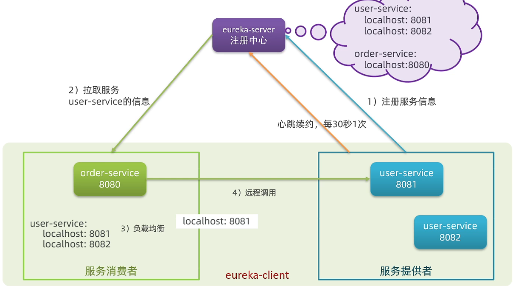

# Eureka

【2.x版本已经停止维护，建议不使用】

服务注册、服务发现

Eureka-Server：注册中心；

Eureka-Client：服务的消费者和提供者；



# Nacos

【Alibaba研发的注册中心，可以替代Eureka】

提供：服务注册、服务发现、环境隔离的配置中心


# Ribbon

客户端的负载均衡

# OpenFeign

声明式的Http客户端：以接口的方式，远程调用；

- feign：Netflix开发的；

- openFeign：SpringCloud自研，支持了SpringMVC注解；

依赖引入：

openfeign

openfeign-httpclient：替换默认的URLConnection，增加连接池功能；

```xml
<dependency>
    <groupId>org.springframework.cloud</groupId>
    <artifactId>spring-cloud-starter-openfeign</artifactId>
</dependency>
<dependency>
    <groupId>io.github.openfeign</groupId>
    <artifactId>feign-httpclient</artifactId>
</dependency>
```

配置：

```yaml
feign:
  client:
    config:
      loggerLevel: BASIC
  httpclient:
    enabled: true
    max-connections: 100
    max-connections-per-route: 10
```

基本使用：

```java
@FeignClient("user-service")
public interface UserClient {
    @GetMapping("/user/{id}")
    User findById(@PathVariable("id") String id);
}
```

最佳实践：抽取FeignClient为独立模块，需要调用的服务直接引入即可；

# Sentinel

服务降级、服务限流
