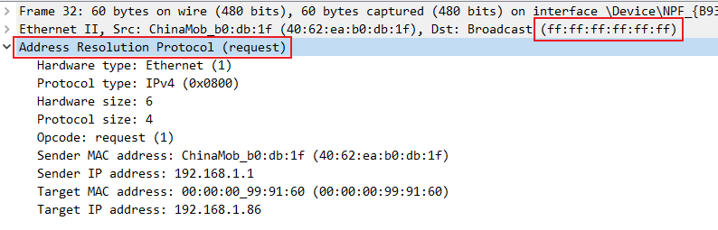
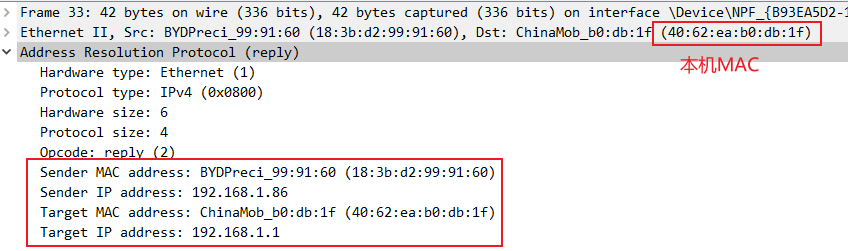
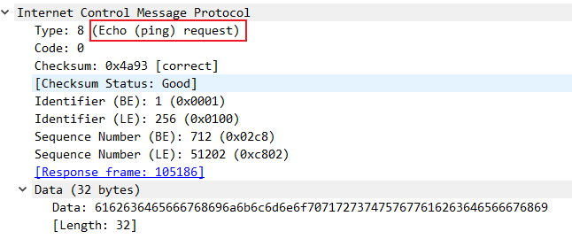
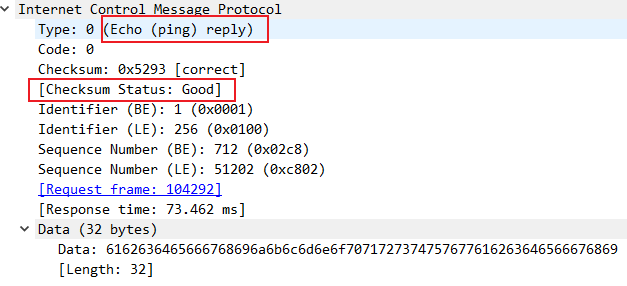
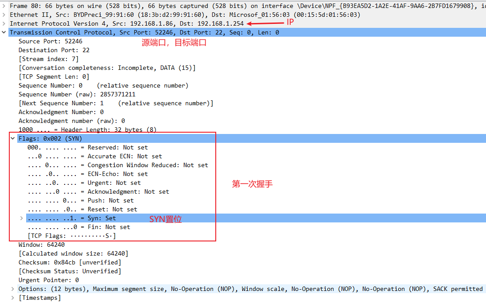
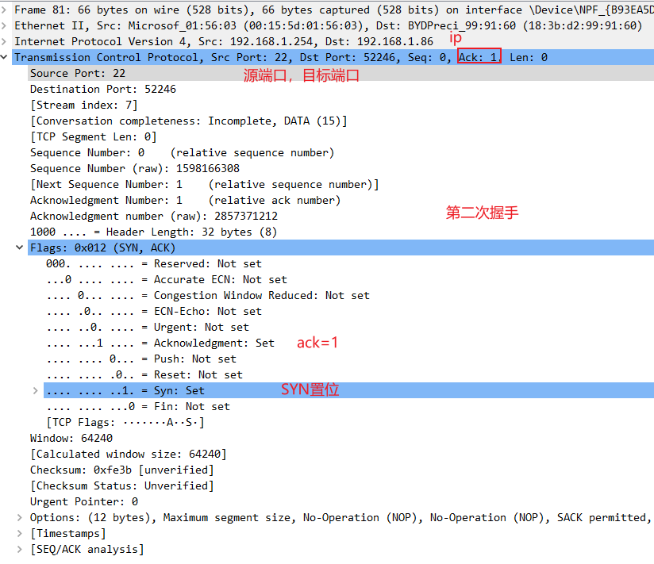
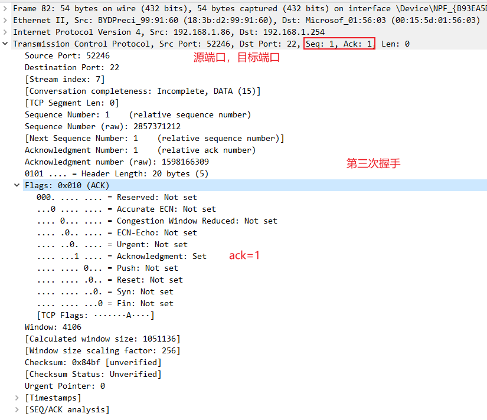

选择抓包的网卡

# 抓包模式

混杂模式：经过本网卡的所有数据，不管是不是发给本机的；

普通模式：只过滤发送给本机的包；

# filter

需要小写

1、直接过滤协议

2、在协议的基础上，过滤标志位

# ARP抓包

linux下可以使用nmap 发送arp广播

request为【opcode 1】

response为【opcode 2】

广播地址为：ff:ff:ff:ff:ff:ff

# ICMP抓包

ping命令发送ICMP报文；

# TCP协议抓包

以ssh连接服务器，抓取三次握手数据包；TCP只会关注端口；

第一次握手 SYN=1,seq=0

第二次握手 SYN=1,Ack=1,seq=0

第三次握手：Ack=1,Seq=1(上一个序号+1)

